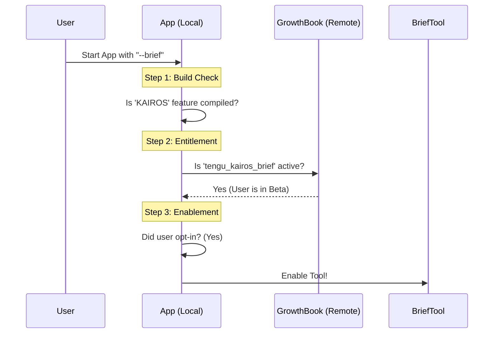

# Chapter 5: Feature Entitlement & Gating

Welcome to the final chapter of our `BriefTool` tutorial series!

In the previous chapter, [Bridge Upload Protocol](04_bridge_upload_protocol.md), we built a sophisticated system to move files securely from a local computer to the cloud. We have now built a "Waiter" that can speak, present menus beautifully, check the food quality, and even deliver takeout to remote locations.

But there is one final, critical question: **Who is actually allowed to sit at this table?**

Not every user should see every feature. Some features are experimental (beta), some are for paid "Pro" users only, and some might be broken and need to be turned off remotely.

This chapter covers **Feature Entitlement & Gating**: the complex decision logic that determines if `BriefTool` should be active or hidden.

## The Problem: The Ignition System

Imagine you get into a high-tech car. You want to start the engine. In a simple world, you just turn a key. But in a complex system, three things must happen:

1.  **Safety Sensors (Build Flags):** The car's computer checks if the engine is actually installed at the factory.
2.  **The Key (Entitlement):** The car checks if your key fob has the correct security code to unlock this specific model.
3.  **The Start Button (User Opt-in):** You, the driver, must actually push the button to say "Go."

If the engine is missing, the key is wrong, or you don't push the button, the car stays silent.

Our software works the same way. We don't want to show `BriefTool` if the code was compiled without it, if the user isn't in the beta group, or if the user explicitly turned it off.

### Central Use Case

**User Intent:** The user types `claude --brief` in their terminal. They want to force the tool to turn on.

**The System's Logic:**
1.  **Check Build:** Was this version of the app built with the `KAIROS` code included?
2.  **Check Cloud:** Does the remote feature flag system (GrowthBook) say this user is allowed to use it?
3.  **Check User:** Did the user ask for it? (Yes, they typed `--brief`).

**Result:** Only if **all three** are true does the tool appear.

---

## Key Concepts: The Three Layers of Defense

We separate the logic into two main functions: `isBriefEntitled` (Am I *allowed*?) and `isBriefEnabled` (Is it *on*?).

### 1. The Build Flag (`feature`)
This is the "Factory Setting." When we compile the code, we can choose to include or exclude entire chunks of logic.
*   **Analogy:** Does the car have an engine?
*   **Code:** `feature('KAIROS')`

### 2. The Entitlement Check (`GrowthBook`)
This is the "License." Even if the code exists, we might want to gate it behind a remote toggle. This allows us to rollout features slowly (e.g., to 10% of users) or kill a feature instantly if it breaks, without users needing to update their app.
*   **Analogy:** Is your key valid?
*   **Code:** `getFeatureValue_CACHED_WITH_REFRESH(...)`

### 3. The User Opt-In
This is the "Switch." Even if a user is allowed to use a feature, they might prefer the old way of working. We respect their choice.
*   **Analogy:** Did you push the start button?
*   **Code:** `getUserMsgOptIn()`

---

## How It Works: The Decision Flow

When the application starts, it runs a specific sequence to decide if `BriefTool` should be added to the AI's toolbox.



---

## Code Deep Dive

Let's look at `BriefTool.ts`. This file contains the logic that acts as the gatekeeper.

### Part 1: Are you Entitled? (`isBriefEntitled`)

This function checks permissions. It doesn't care if you *want* to use the tool, only if you *can*.

```typescript
// From BriefTool.ts (Simplified)
export function isBriefEntitled(): boolean {
  // 1. Build-time check: Is the code here?
  const hasBuildFlag = feature('KAIROS') || feature('KAIROS_BRIEF')

  // If the code isn't even compiled, stop immediately.
  if (!hasBuildFlag) return false

  // 2. Runtime check: Check remote flags (GrowthBook)
  // Or check if the user is a developer (CLAUDE_CODE_BRIEF)
  return (
    getKairosActive() || 
    isEnvTruthy(process.env.CLAUDE_CODE_BRIEF) ||
    getFeatureValue_CACHED_WITH_REFRESH('tengu_kairos_brief', false)
  )
}
```

*Explanation:*
1.  **`feature(...)`**: If this returns false, the compiler might actually delete the code inside this block to save space (Dead Code Elimination).
2.  **`isEnvTruthy(...)`**: A "Master Key" for developers. If I set `CLAUDE_CODE_BRIEF=true` on my laptop, I bypass the remote checks so I can test my work.
3.  **`getFeatureValue...`**: Checks the remote server.

### Part 2: Is it Enabled? (`isBriefEnabled`)

This function combines the permission check (above) with the user's intent.

```typescript
// From BriefTool.ts (Simplified)
export function isBriefEnabled(): boolean {
  // 1. Re-check the build flag (Crucial for code removal)
  if (!feature('KAIROS') && !feature('KAIROS_BRIEF')) {
    return false
  }

  // 2. Check User Intent (OptIn) AND Permission (Entitled)
  const userWantsIt = getKairosActive() || getUserMsgOptIn()
  const userIsAllowed = isBriefEntitled()

  return userWantsIt && userIsAllowed
}
```

*Explanation:*
*   We use logical **AND** (`&&`). Both must be true.
    *   If the user wants it but isn't allowed -> **Disabled**.
    *   If the user is allowed but doesn't want it -> **Disabled**.

### Part 3: The Tool Definition

Finally, we apply this logic to the tool definition itself.

```typescript
// From BriefTool.ts
export const BriefTool = buildTool({
  name: BRIEF_TOOL_NAME,
  
  // This function is called every time the AI is about to run
  isEnabled() {
    return isBriefEnabled()
  },

  // ... rest of tool definition
})
```

*Explanation:* `isEnabled()` is the final barrier. If this returns `false`, the AI model *doesn't even know this tool exists*. It won't see it in the list of available actions.

---

## Conclusion

Congratulations! You have completed the `BriefTool` tutorial series.

We have traced the journey of a single feature from a raw string of text to a secure, gated, production-ready system.

1.  **Communication ([Chapter 1](01_primary_communication_channel__brieftool_.md)):** We learned how the AI distinguishes between internal "muttering" and user-facing speech.
2.  **Rendering ([Chapter 2](02_context_aware_ui_rendering.md)):** We learned how to format that speech differently for Chat vs. Logs.
3.  **Safety ([Chapter 3](03_attachment_resolution_pipeline.md)):** We learned how to validate files to ensure they exist and are safe.
4.  **Connectivity ([Chapter 4](04_bridge_upload_protocol.md)):** We learned how to bridge the gap between local disk and cloud web UI.
5.  **Control ([Chapter 5]):** We learned how to use flags and gates to manage who gets access to the tool.

You now understand the architecture of a modern AI tool: it is not just a function call; it is a pipeline of **Validation**, **UX**, **Security**, and **Access Control**.

Thank you for reading!

---

Generated by [Code IQ](https://github.com/adityasoni99/Code-IQ)