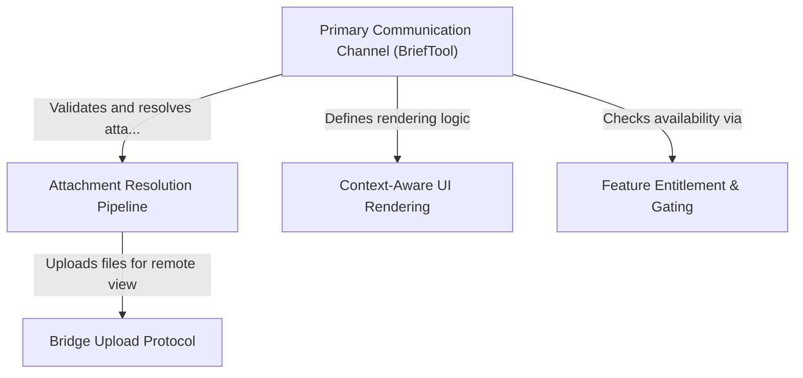

# Tutorial: BriefTool

This project implements a dedicated **communication tool** that serves as the AI assistant's formal "mouth" to the user, distinct from internal logs. It handles the secure delivery of messages and **file attachments**, manages **cloud uploads** for remote viewing, and dynamically adapts the *visual output* to match the user's interface mode.

## Chapters

1. [Primary Communication Channel (BriefTool)](01_primary_communication_channel__brieftool_.md)
2. [Context-Aware UI Rendering](02_context_aware_ui_rendering.md)
3. [Attachment Resolution Pipeline](03_attachment_resolution_pipeline.md)
4. [Bridge Upload Protocol](04_bridge_upload_protocol.md)
5. [Feature Entitlement & Gating](05_feature_entitlement___gating.md)

---

Generated by [Code IQ](https://github.com/adityasoni99/Code-IQ)