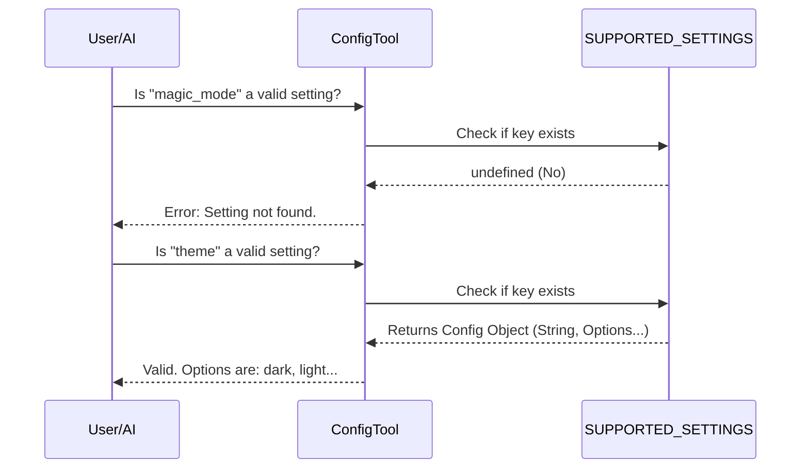

# Chapter 1: Configuration Registry

Welcome to the **ConfigTool** project! 

In this first chapter, we are going to explore the foundation of our configuration system: the **Configuration Registry**. Before we can change settings or save them to files, we need a "map" that tells us exactly what is allowed to be changed.

## The Motivation: The "Restaurant Menu" Analogy

Imagine you walk into a restaurant and order a "Purple Elephant Steak." The waiter looks confused because that dish doesn't exist. Or, you order a "Burger," but you try to pay with "Monopoly money."

In software configuration, we face similar problems:
1.  **Existence:** Users (or AI agents) might try to change a setting that doesn't exist (e.g., `backgrounColor` instead of `theme`).
2.  **Validation:** Users might try to set a number (like `42`) to a setting that requires a Yes/No answer.
3.  **Availability:** Some settings shouldn't be visible if a specific feature (like Voice Control) is disabled.

The **Configuration Registry** acts as the **Restaurant Menu**. It lists every available dish (setting), what it's made of (data type), and valid choices (options). If it's not on the registry, you can't order it!

---

## Key Concepts

The registry is a single JavaScript object called `SUPPORTED_SETTINGS`. Each entry in this object defines a specific setting using a **Schema**.

### 1. The Schema
Every setting needs a definition. Here are the core properties we track:

*   **Type:** Is this a `string` (text) or a `boolean` (true/false switch)?
*   **Source:** Where does this live? (We will cover this in [Dual-Layer Storage Strategy](02_dual_layer_storage_strategy.md)).
*   **Description:** A human-readable explanation of what the setting does.
*   **Options:** If it's a text setting, what specific words are allowed?

### 2. Feature Flagging
Sometimes, the "kitchen" runs out of ingredients. If a feature (like `VOICE_MODE`) is turned off in the build, the related settings (like `voiceEnabled`) vanish from the registry. This prevents the AI from trying to configure tools that don't exist.

---

## How It Works: Defining the Menu

Let's look at how we define settings in `supportedSettings.ts`.

### Example 1: A Simple Toggle
Here is how we define a simple On/Off switch, like "Verbose Mode" (detailed logging).

```typescript
// Inside SUPPORTED_SETTINGS object
verbose: {
  source: 'global', // Lives in global config
  type: 'boolean',  // It's a switch (true/false)
  description: 'Show detailed debug output',
  appStateKey: 'verbose', // Syncs directly to app state
},
```
*Explanation:* If the user sets `verbose` to `true`, the system accepts it because `true` matches the `boolean` type.

### Example 2: A Setting with Options
Here is a setting that forces the user to pick from a specific list, like the Color Theme.

```typescript
theme: {
  source: 'global',
  type: 'string',
  description: 'Color theme for the UI',
  // Only allows specific theme names
  options: ['dark', 'light', 'dracula', 'monokai'],
},
```
*Explanation:* If the user tries to set the theme to `"neon-pizza"`, the registry checks the `options` list, sees it's missing, and rejects it.

### Example 3: Dynamic Feature Flagging
We can hide settings if a feature isn't active.

```typescript
// Spread operator (...) adds this ONLY if VOIDE_MODE is true
...(feature('VOICE_MODE')
  ? {
      voiceEnabled: {
        source: 'settings',
        type: 'boolean',
        description: 'Enable voice dictation',
      },
    }
  : {}), // Otherwise, add nothing
```
*Explanation:* We use `feature()` to check capabilities. If `VOICE_MODE` is off, the `voiceEnabled` key never enters the `SUPPORTED_SETTINGS` object. It effectively ceases to exist.

---

## Internal Implementation: Under the Hood

When the ConfigTool runs, it doesn't blindly accept commands. It consults the Registry first.

### Workflow Sequence

Here is what happens when a request comes in to verify a setting key.



### The Code: Helper Functions

To make the registry easy to use for the rest of the app, we expose simple helper functions.

#### checking Existence
```typescript
import { SUPPORTED_SETTINGS } from './supportedSettings'

// Returns TRUE if the key exists in our "Menu"
export function isSupported(key: string): boolean {
  return key in SUPPORTED_SETTINGS
}
```
*Why this matters:* We use this bouncer at the door. If `isSupported('random')` returns `false`, we stop processing immediately.

#### Retrieving Options
```typescript
export function getOptionsForSetting(key: string): string[] | undefined {
  const config = SUPPORTED_SETTINGS[key]
  
  // If the setting has a fixed list of options, return them
  if (config && config.options) {
    return [...config.options]
  }
  return undefined
}
```
*Why this matters:* This helps the AI discover what it can do. If the AI asks "What themes can I set?", this function hands over the list.

---

## Conclusion

The **Configuration Registry** is the backbone of stability for ConfigTool. By strictly defining types, options, and availability in one central place (`supportedSettings.ts`), we ensure that invalid configurations are caught before they cause errors.

Now that we know *what* settings exist, we need to know *where* to save them. In the next chapter, we will learn why we split settings between a specific project folder and a global user folder.

[Next Chapter: Dual-Layer Storage Strategy](02_dual_layer_storage_strategy.md)

---

Generated by [Code IQ](https://github.com/adityasoni99/Code-IQ)