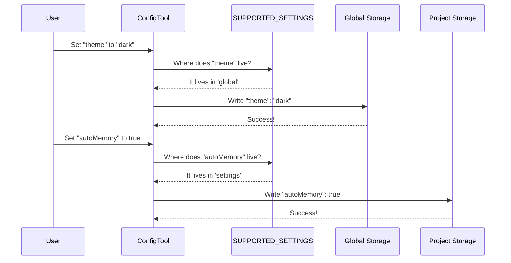

# Chapter 2: Dual-Layer Storage Strategy

Welcome back! In the previous chapter, [Configuration Registry](01_configuration_registry.md), we created a "Menu" of all possible settings. We established **what** can be changed.

Now, we need to decide **where** those changes live. 

## The Motivation: Backpack vs. Filing Cabinet

Imagine you are a contractor working at different office buildings. You have two types of items:

1.  **Your Backpack:** You take this everywhere. It holds your sunglasses, your lunch, and your favorite pen. These are **personal** to you, regardless of which building you are in.
2.  **The Filing Cabinet:** This stays at a specific office. It holds the blueprints and keys for *that specific job*. You wouldn't bring the blueprints for Building A into Building B.

In **ConfigTool**, we face the exact same situation:
*   **Global Settings (Backpack):** Things like your Color Theme or "Verbose Mode" (debugging). You want these to stay the same no matter which project you are coding in.
*   **Project Settings (Filing Cabinet):** Things like "Memory" or specific "Linting Rules." These are specific to the codebase you are working on right now.

This is the **Dual-Layer Storage Strategy**.

---

## Key Concepts

We distinguish between these two layers using a property called `source`.

### 1. Global Scope
*   **Source Name:** `global`
*   **Analogy:** The Backpack.
*   **Location:** Stored in your computer's user folder (e.g., `~/.config/claude/config.json`).
*   **Use Case:** UI preferences, Notification settings.

### 2. Project Scope
*   **Source Name:** `settings`
*   **Analogy:** The Filing Cabinet.
*   **Location:** Stored inside the project folder you are currently working in (e.g., `./.claude.json`).
*   **Use Case:** Enabling AI memory for this specific project, overrides for model permissions.

---

## How It Works: The Registry as the Router

Remember the `SUPPORTED_SETTINGS` object from Chapter 1? That object acts as a traffic controller. When you try to save a setting, the code looks at the `source` property to decide which file to write to.

### Example 1: Defining a Global Setting
Here is how we define the `theme`. Since you want your theme to follow you, we mark it as `global`.

```typescript
// inside supportedSettings.ts
theme: {
  source: 'global', // <--- The "Backpack"
  type: 'string',
  description: 'Color theme for the UI',
  options: ['dark', 'light'],
},
```

### Example 2: Defining a Project Setting
Here is `autoMemoryEnabled`. We might want Memory turned on for a complex project, but off for a simple scratchpad.

```typescript
// inside supportedSettings.ts
autoMemoryEnabled: {
  source: 'settings', // <--- The "Filing Cabinet"
  type: 'boolean',
  description: 'Enable auto-memory',
},
```

---

## Internal Implementation: Reading and Writing

When the `ConfigTool` runs, it performs a lookup to decide how to handle data.

### reading Values
When the tool needs to know the current value of a setting, it calls a helper function. This function checks the source and routes the request.

```typescript
// Simplified logic from ConfigTool.ts
function getValue(source: 'global' | 'settings', path: string[]) {
  // 1. If it's global, open the "Backpack"
  if (source === 'global') {
    return getGlobalConfig()[path[0]]
  }
  
  // 2. Otherwise, open the "Filing Cabinet" (Project settings)
  return getProjectSettings()[path[0]]
}
```
*Explanation:* The code literally switches logic branches based on the `source` string defined in the registry.

### Writing Values
Writing is slightly more critical because we don't want to accidentally save project secrets into your global config file.

```typescript
// Inside ConfigTool.ts -> call() method
if (config.source === 'global') {
    // Save to the user's global file
    saveGlobalConfig(prev => ({ ...prev, [key]: newValue }))
} else {
    // Save to the project-specific file
    updateSettingsForSource('userSettings', { [key]: newValue })
}
```
*Explanation:* We use different saving functions (`saveGlobalConfig` vs `updateSettingsForSource`) to ensure the data lands in the correct physical file on the hard drive.

---

## Visualizing the Flow

Here is what happens when a user tries to change a setting. Note how the **Registry** directs the traffic to the correct storage.



---

## Handling Nested Settings

Sometimes, settings are grouped together, like `permissions.defaultMode`.

The storage strategy handles this by using **Paths**. A key like `permissions.defaultMode` isn't just one simple label; it tells the system to look inside a folder named `permissions` for a file named `defaultMode`.

```typescript
// Helper to read the path from the key
export function getPath(key: string): string[] {
  const config = SUPPORTED_SETTINGS[key]
  // Returns ['permissions', 'defaultMode']
  return config?.path ?? key.split('.')
}
```
*Why this matters:* This allows us to organize the "Filing Cabinet" neatly, rather than throwing every single document into one big pile.

---

## Conclusion

The **Dual-Layer Storage Strategy** ensures that **ConfigTool** is smart about context. It prevents your personal preferences from cluttering up shared project files, and it keeps project-specific rules from messing up your other work.

1.  **Registry:** Defines *where* data goes (`source`).
2.  **Tool Logic:** Reads the source and routes data to **Global** or **Settings**.

Now that we have a Menu (Registry) and a Kitchen (Storage), we need a Chef to actually cook the meal. In the next chapter, we will examine the main engine that processes user commands.

[Next Chapter: Tool Execution Logic](03_tool_execution_logic.md)

---

Generated by [Code IQ](https://github.com/adityasoni99/Code-IQ)