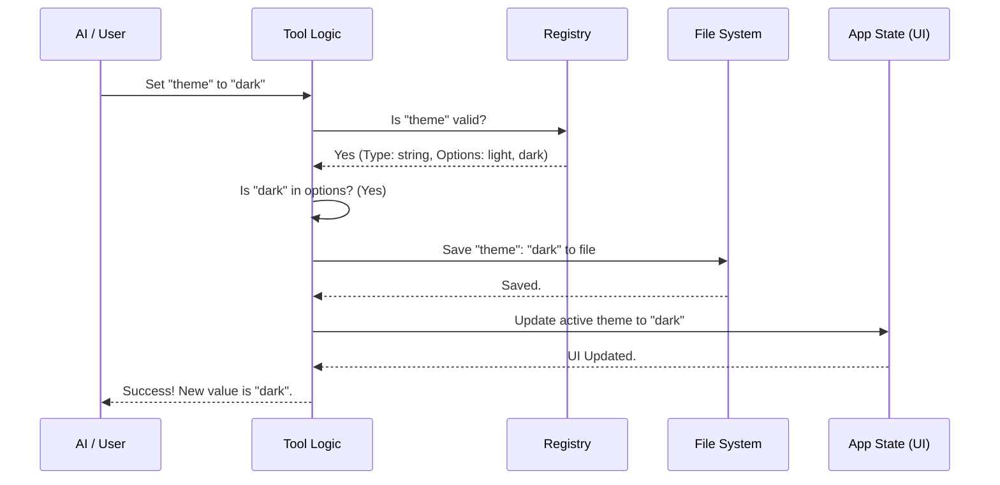

# Chapter 3: Tool Execution Logic

Welcome to Chapter 3! 

*   In [Chapter 1: Configuration Registry](01_configuration_registry.md), we built the **Menu** (defining what settings exist).
*   In [Chapter 2: Dual-Layer Storage Strategy](02_dual_layer_storage_strategy.md), we built the **Kitchen** (deciding where to store the ingredients).

Now, we need the **Head Chef**. We need a logic controller that takes an order (input), checks if the ingredients are fresh (validation), cooks the meal (updates storage), and finally rings the bell to let the waiters know it's ready (updates the app state).

We call this the **Tool Execution Logic**.

## The Motivation: The "Universal Remote" Analogy

Imagine holding a Universal TV Remote. You press the "Volume Up" button.
1.  **Signal:** The remote sends a signal.
2.  **Processing:** The TV receives it. It checks: "Is the TV on? Is the volume already at 100%?"
3.  **Action:** If everything is okay, it increases the volume.
4.  **Feedback:** The volume bar appears on the screen so you *see* the change.

In **ConfigTool**, the AI is the person holding the remote. The **Tool Execution Logic** is the microchip inside the TV. It ensures that when the AI tries to change a setting, it doesn't break the system.

---

## Key Concepts

The execution logic happens inside a main function called `call()`. It follows a strict 4-step process:

1.  **Input Validation (The Bouncer):** Using a library called **Zod**, we ensure the input is formatted correctly.
2.  **Logic Routing:** Are we *reading* (Get) or *writing* (Set)?
3.  **Constraint Checking:** Even if the format is right, is the value allowed? (e.g., checking strict options like `dark` vs `light`).
4.  **Side Effects:** Updating the live application so the user sees the change immediately without restarting.

---

## Step 1: Input Validation (The Bouncer)

Before we do any logic, we define exactly what inputs we accept using a Schema. We use a tool called **Zod** for this.

### The Input Schema
We accept two things:
1.  `setting`: The name of the setting (e.g., "theme").
2.  `value`: (Optional) What to change it to. If this is missing, we assume you just want to *read* the current value.

```typescript
// Inside ConfigTool.ts
const inputSchema = z.strictObject({
  // The key must be a string
  setting: z.string(),
  // The value can be a string, boolean, or number
  // It is optional (for "Get" operations)
  value: z.union([z.string(), z.boolean(), z.number()]).optional(),
})
```
*Explanation:* If the AI tries to send a list or an object as a `value`, Zod blocks it immediately. This protects our code from crashing.

---

## Step 2: The Logic Flow

Once the input passes the "Bouncer," we enter the main `call()` function. Here is the simplified logic:

```typescript
async call({ setting, value }: Input, context) {
  // 1. Check the Registry (Chapter 1)
  if (!isSupported(setting)) {
    return { error: `Unknown setting: "${setting}"` }
  }

  // 2. If no value is provided, it's a GET request
  if (value === undefined) {
    // Read from Storage (Chapter 2)
    const current = getValue(config.source, path)
    return { success: true, operation: 'get', value: current }
  }

  // 3. If value IS provided, proceed to SET logic...
}
```
*Explanation:* This is the traffic cop. It directs "Read" requests one way and "Write" requests another.

---

## Step 3: Writing and Validation (The Safety Check)

Writing data is dangerous. We need to be careful.

### Type Coercion
Sometimes the AI sends the string `"true"` instead of the boolean `true`. Our logic creates a friendly user experience by fixing this automatically.

```typescript
let finalValue = value

// If the registry says this should be a boolean...
if (config.type === 'boolean' && typeof value === 'string') {
  // Convert "true" string to real true
  if (value.toLowerCase() === 'true') finalValue = true
  if (value.toLowerCase() === 'false') finalValue = false
}
```
*Explanation:* This makes the tool "forgiving." It understands intent even if the format isn't perfect.

### Option Validation
If a setting only allows specific words (like "dark" or "light"), we reject anything else.

```typescript
// Get allowed options from Registry
const options = getOptionsForSetting(setting)

// If options exist, and our value isn't one of them...
if (options && !options.includes(String(finalValue))) {
  return {
    error: `Invalid value. Options are: ${options.join(', ')}`
  }
}
```
*Explanation:* This prevents the AI from inventing settings, like setting the theme to "Pizza-Party."

---

## Step 4: Side Effects (Updating the App)

Saving the file to the hard drive is good, but the user wants to see the change *now*. We use `AppState` to update the running application in real-time.

```typescript
// 1. Save to file (Persist)
saveGlobalConfig(prev => ({ ...prev, [key]: finalValue }))

// 2. Update live AppState (Side Effect)
if (config.appStateKey) {
  context.setAppState(prev => ({
    ...prev,
    [config.appStateKey]: finalValue // Updates UI instantly
  }))
}
```
*Explanation:* 
1.  **Persist:** Saves it to the `.json` file so it remembers the setting next time you open the app.
2.  **Side Effect:** Tells the current window to change colors *immediately*, without needing a restart.

---

## Visualizing the Flow

Let's look at the complete journey of a command using a sequence diagram.



---

## Internal Implementation: Handling Complex Dependencies

Sometimes, changing a setting requires checking the outside world. A prime example is **Voice Mode**.

You can't just set `voiceEnabled: true` if the user doesn't have a microphone! The Execution Logic handles these "Gatekeeper" checks.

```typescript
// Inside call() - simplified
if (setting === 'voiceEnabled' && finalValue === true) {
  
  // 1. Check if microphone is available
  const micParams = await checkRecordingAvailability()
  
  if (!micParams.available) {
    return { 
      success: false, 
      error: 'Voice mode not available: No microphone found.' 
    }
  }
  
  // If checks pass, proceed to save...
}
```
*Why this matters:* The logic layer is responsible for sanity-checking the environment. It ensures the configuration matches reality.

---

## Conclusion

The **Tool Execution Logic** is the brain of the operation. 
1.  It uses **Zod** to validate input structure.
2.  It consults the **Registry** to validate data types.
3.  It updates the **Storage** for long-term memory.
4.  It updates the **App State** for immediate visual feedback.

However, for the AI to make smart decisions, it needs to know the *current* state of the system before it even tries to change anything. It needs context.

In the next chapter, we will learn how we feed this information to the AI automatically.

[Next Chapter: Dynamic Context Injection](04_dynamic_context_injection.md)

---

Generated by [Code IQ](https://github.com/adityasoni99/Code-IQ)