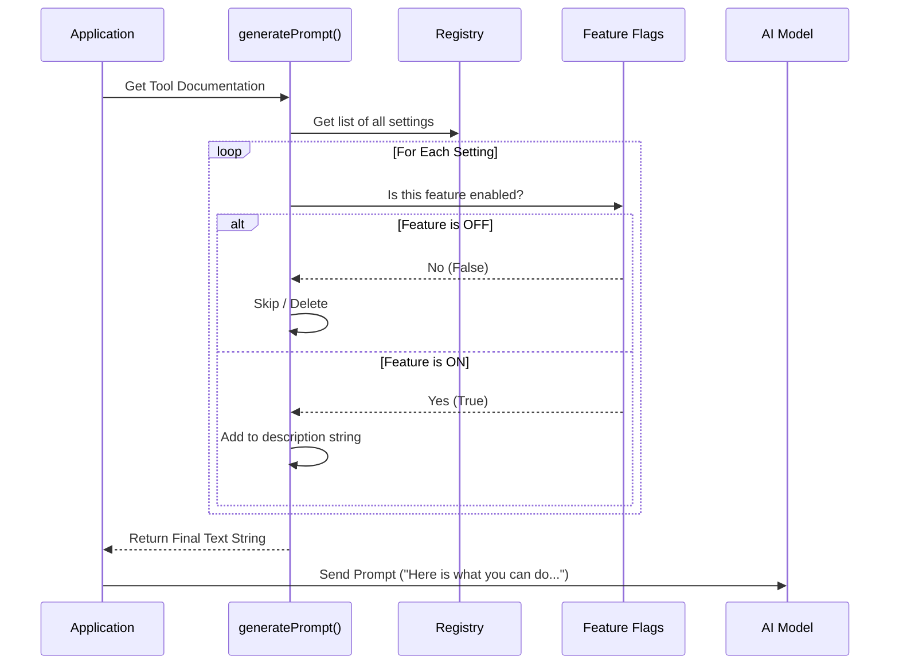

# Chapter 4: Dynamic Context Injection

Welcome to Chapter 4!

*   In [Chapter 1: Configuration Registry](01_configuration_registry.md), we defined the **Menu**.
*   In [Chapter 2: Dual-Layer Storage Strategy](02_dual_layer_storage_strategy.md), we built the **Storage**.
*   In [Chapter 3: Tool Execution Logic](03_tool_execution_logic.md), we built the **Brain** that processes commands.

Now, we face a communication problem. The AI is smart, but it is not psychic. It doesn't know what settings exist in your specific version of the app unless we tell it.

We could just write a static text file listing every possible setting. But what if a feature is turned off? What if you are on an older computer that doesn't support Voice Mode? If the AI reads a static file, it might try to use features that don't exist, leading to errors (or "hallucinations").

We solve this with **Dynamic Context Injection**.

## The Motivation: The "Tour Guide" Analogy

Imagine a museum tour guide who memorizes a script.

1.  **The Static Script:** The script says, "And on your left, see the Dinosaur Exhibit!"
2.  **The Reality:** The Dinosaur Exhibit is closed for renovations today.
3.  **The Result:** The guide promises the exhibit, the tourists get excited, and then they arrive at a locked door. everyone is disappointed.

Now, imagine the guide uses **Dynamic Context Injection**:
1.  **The Morning Check:** Before the tour starts, the guide checks a status board. "Dinosaurs: Closed."
2.  **The Rewrite:** The guide mentally deletes that paragraph from their script.
3.  **The Result:** The guide never mentions the dinosaurs. The tourists enjoy the open exhibits without error.

In **ConfigTool**, we rewrite the AI's "script" (the system prompt) every time the tool runs. We only include settings that are actually available *right now*.

---

## Key Concepts

We achieve this using a function called `generatePrompt()`. It builds the documentation string programmatically.

### 1. The Generator Loop
Instead of typing the documentation manually, we loop through our **Registry** (from Chapter 1). This ensures that if we add a setting to the code, the documentation updates automatically.

### 2. Feature Gating (The Filter)
Some features, like **Voice Mode**, might be hidden behind a "Feature Flag" (a toggle used by developers to test features). If the flag is off, we hide the setting from the AI entirely.

### 3. Dynamic Enumeration
Some settings, like which AI Model to use (Claude Sonnet, Opus, etc.), change frequently. Instead of hard-coding "Opus," we ask the system, "What models are available today?" and list those.

---

## How It Works: Building the Menu

Let's look at how we build this dynamic text in `prompt.ts`.

### Step 1: The Loop
We start with two empty lists. We categorize settings into "Global" (User preferences) and "Project" (Workspace settings) to help the AI understand the scope.

```typescript
// Inside prompt.ts
export function generatePrompt(): string {
  const globalSettings: string[] = []
  const projectSettings: string[] = []

  // Iterate over every setting in the Registry
  for (const [key, config] of Object.entries(SUPPORTED_SETTINGS)) {
     // ... logic continues below
  }
}
```
*Explanation:* We prepare containers to hold our descriptions. We are about to walk through every item in the "Menu" we built in Chapter 1.

### Step 2: The Safety Filter (Voice Mode Example)
This is where the magic happens. We check if a feature is actually allowed.

```typescript
// Inside the loop...
if (key === 'voiceEnabled') {
  // Check 1: Is the code feature flag on?
  // Check 2: Is the remote kill-switch (GrowthBook) active?
  if (feature('VOICE_MODE') && !isVoiceGrowthBookEnabled()) {
    continue // SKIP this iteration. Do not add to list.
  }
}
```
*Explanation:* The `continue` keyword is the bouncer. If Voice Mode is disabled remotely, the loop skips it. The string `"voiceEnabled"` never makes it into the final prompt. To the AI, it effectively doesn't exist.

### Step 3: Formatting the Line
If the setting passes the checks, we format it into a readable string for the AI.

```typescript
// Create a readable line like: "- theme: dark, light - Color theme"
let line = `- ${key}`

// Add available options if they exist
if (options) {
  line += `: ${options.map(o => `"${o}"`).join(', ')}`
}

line += ` - ${config.description}`
```
*Explanation:* We construct a sentence. We are translating code logic (`['dark', 'light']`) into human/AI-readable text (`: "dark", "light"`).

---

## Internal Implementation: The Assembly Line

When the application prepares to talk to the AI, it calls `generatePrompt()`. Here is the flow:



### The Final Output

The function returns a standard string that looks like a Markdown document. This is what is actually sent to the Large Language Model.

```markdown
## Configurable settings list

### Global Settings (stored in ~/.claude.json)
- theme: "dark", "light", "dracula" - Color theme for the UI
- verbose: true/false - Show detailed debug output

### Project Settings (stored in settings.json)
- autoMemoryEnabled: true/false - Enable auto-memory
```

*Note:* If we turned off the "Voice" feature flag, you would notice `voiceEnabled` is missing from the list above. The AI will never try to set it because it doesn't know it exists.

### Dynamic Models Section
We handle the `model` setting specially because the list of available AI models might come from an API or a different file.

```typescript
function generateModelSection(): string {
  const options = getModelOptions() // Fetch currently available models
  
  // Build the string dynamically
  return options.map(o => {
      return `  - "${o.value}": ${o.description}`
  }).join('\n')
}
```
*Why this matters:* If a new model "Claude 3.5" is released tomorrow, we just update `getModelOptions()`. The prompt generator picks it up automatically, and the AI immediately knows it can switch to the new model.

---

## Conclusion

**Dynamic Context Injection** is about honesty and safety.

By programmatically building the tool description in `prompt.ts`, we ensure that:
1.  **Accuracy:** The AI never hallucinates settings that were removed.
2.  **Safety:** Experimental features (like Voice) remain hidden until they are ready.
3.  **Maintenance:** Developers don't have to manually update a text file every time they change a setting in the code.

Now the AI knows exactly what it *can* do. But when it actually *does* something (like changing a setting), how do we confirm to the user that it worked?

In the final chapter, we will look at how we close the loop with the user interface.

[Next Chapter: Visual Feedback Components](05_visual_feedback_components.md)

---

Generated by [Code IQ](https://github.com/adityasoni99/Code-IQ)