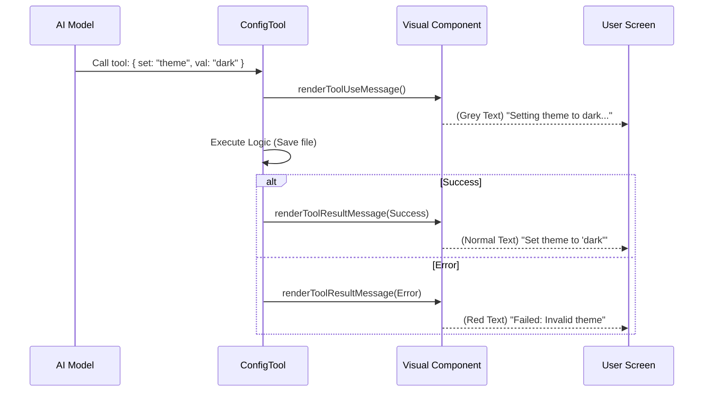

# Chapter 5: Visual Feedback Components

Welcome to the final chapter of our ConfigTool tutorial!

*   In [Chapter 1: Configuration Registry](01_configuration_registry.md), we defined the **Menu**.
*   In [Chapter 2: Dual-Layer Storage Strategy](02_dual_layer_storage_strategy.md), we built the **Storage**.
*   In [Chapter 3: Tool Execution Logic](03_tool_execution_logic.md), we built the **Brain**.
*   In [Chapter 4: Dynamic Context Injection](04_dynamic_context_injection.md), we gave the AI the **Context**.

We have a fully functional tool. It can read, write, validate, and save settings. However, there is one problem: **it is invisible.**

If the AI changes a setting and the tool runs silently, the user (you) won't know if it worked, if it failed, or if it's still thinking. We need to close the loop with **Visual Feedback Components**.

## The Motivation: The Car Dashboard

Imagine driving a modern car. You press the button for "Sport Mode."
1.  **The Logic:** The internal computer adjusts the suspension and throttle response.
2.  **The Feedback:** A little light on the dashboard turns green and says "SPORT."

Without that light, you would have to guess if the button worked.

In **ConfigTool**, the **Visual Feedback Components** act as that dashboard light. They handle the communication between the code (which is invisible) and the Command Line Interface (CLI) that the user sees.

---

## Key Concepts

We use a library called **Ink** (React for the CLI) to render text. We classify feedback into three distinct states:

1.  **Intent (Tool Use):** "I am *trying* to change the theme to dark."
2.  **Result (Success):** "I *successfully* changed the theme."
3.  **Result (Failure):** "I *failed* because that theme doesn't exist."

By splitting these up, the user follows the story of the operation.

---

## How It Works: The Components

We define these visual components in `UI.tsx`. Let's look at how we handle the different stages of a command.

### 1. Showing Intent (The "Loading" State)

When the AI decides to call the tool, we show a message immediately. This tells the user, "Hey, I'm working on this!"

We use `renderToolUseMessage`.

```typescript
// inside UI.tsx
export function renderToolUseMessage(input: Partial<Input>) {
  // 1. If we are just READING a setting
  if (input.value === undefined) {
    return <Text dimColor>Getting {input.setting}</Text>;
  }

  // 2. If we are WRITING a setting
  return <Text dimColor>
      Setting {input.setting} to {jsonStringify(input.value)}
    </Text>;
}
```
*Explanation:* 
*   If the AI sends just a setting name (`theme`), we print "Getting theme".
*   If the AI sends a value (`theme`, `dark`), we print "Setting theme to 'dark'".
*   We use `dimColor` (grey text) because this is background info, not the main result.

### 2. Showing Success (The "Green Light")

Once the logic (from Chapter 3) finishes, we need to report what happened. We use `renderToolResultMessage`.

```typescript
// inside UI.tsx
if (content.operation === 'get') {
  // We just read a value
  return <MessageResponse>
      <Text>
        <Text bold>{content.setting}</Text> = {jsonStringify(content.value)}
      </Text>
    </MessageResponse>;
}
```
*Explanation:* This renders a clean output like **theme** = "dark".

### 3. Showing Changes
If we actually modified a file, the message looks slightly different to emphasize the change.

```typescript
return <MessageResponse>
    <Text>
      Set <Text bold>{content.setting}</Text> to{' '}
      <Text bold>{jsonStringify(content.newValue)}</Text>
    </Text>
  </MessageResponse>;
```
*Explanation:* This renders: Set **theme** to **"dark"**. The bold text helps the user scan the log quickly to see what changed.

### 4. Handling Errors (The "Check Engine" Light)

If the **Registry** or **Validation Logic** rejects the request, we must show it clearly in red.

```typescript
// inside UI.tsx
if (!content.success) {
  return <MessageResponse>
      {/* "error" color usually renders as Red in terminals */}
      <Text color="error">Failed: {content.error}</Text>
    </MessageResponse>;
}
```
*Explanation:* If the AI tries to set the theme to "Pizza", this component catches the `success: false` flag and prints "Failed: Invalid option" in red text.

---

## Internal Implementation: The Lifecycle

How do these components fit into the actual flow of the application? Let's visualize the lifecycle of a single command.



### Formatting Values

You might have noticed `jsonStringify` in the code examples. Why do we need that?

In programming, `true` (boolean) and `"true"` (string) are different.
*   Without formatting: `Set verbose to true` vs `Set theme to true` (hard to tell the type).
*   With formatting: `Set verbose to true` (boolean) vs `Set theme to "true"` (string).

```typescript
import { jsonStringify } from '../../utils/slowOperations.js';

// It wraps strings in quotes, but keeps numbers/booleans raw
// Example: "dark" -> '"dark"'
// Example: true -> 'true'
```
*Why this matters:* It reduces confusion. The user knows exactly what data type was saved to the configuration file.

---

## Putting It All Together

We have now built the entire **ConfigTool** system!

1.  **Registry:** We defined the rules (`supportedSettings.ts`).
2.  **Storage:** We decided where files live (`global` vs `settings`).
3.  **Logic:** We built the engine to process commands safely.
4.  **Context:** We taught the AI to read the manual dynamically.
5.  **Visuals:** We gave the user a dashboard to see the results.

### Example: The Full Experience

Here is what the final output looks like in the terminal when an AI Agent uses our tool.

**User:** "Please turn on verbose mode."

**Terminal Output:**
```text
(dim) Setting verbose to true...
Set verbose to true
```

**User:** "Set the theme to neon-green."

**Terminal Output:**
```text
(dim) Setting theme to "neon-green"...
(red) Failed: Invalid value. Options are: dark, light, dracula
```

---

## Conclusion

**Visual Feedback Components** are the bridge between machine logic and human understanding. By providing clear "Intent" messages (what I'm doing) and "Result" messages (what I did), we build trust with the user. They never have to wonder if the AI actually clicked the button.

Congratulations! You have completed the **ConfigTool** tutorial series. You now understand how to build a robust, safe, and user-friendly configuration management tool for AI agents.

---

Generated by [Code IQ](https://github.com/adityasoni99/Code-IQ)