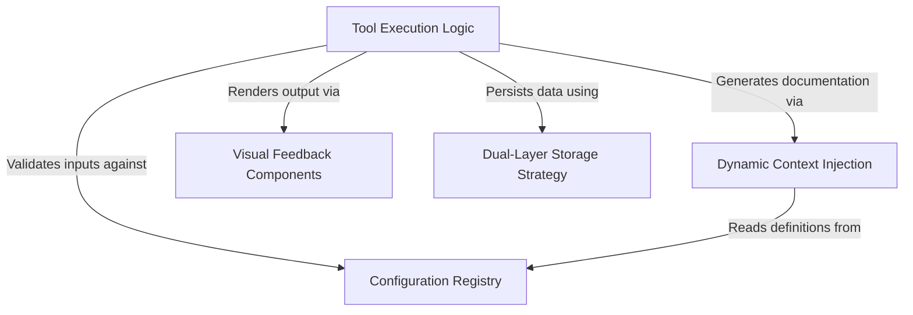

# Tutorial: ConfigTool

This project implements a **configuration management tool** that empowers an AI agent to inspect and modify application settings. It uses a **central registry** to define schemas and validation rules, orchestrates a **dual-layer storage strategy** to separate *global* preferences from *project-specific* data, and delivers **visual feedback** to the user upon execution.

## Chapters

1. [Configuration Registry](01_configuration_registry.md)
2. [Dual-Layer Storage Strategy](02_dual_layer_storage_strategy.md)
3. [Tool Execution Logic](03_tool_execution_logic.md)
4. [Dynamic Context Injection](04_dynamic_context_injection.md)
5. [Visual Feedback Components](05_visual_feedback_components.md)

---

Generated by [Code IQ](https://github.com/adityasoni99/Code-IQ)