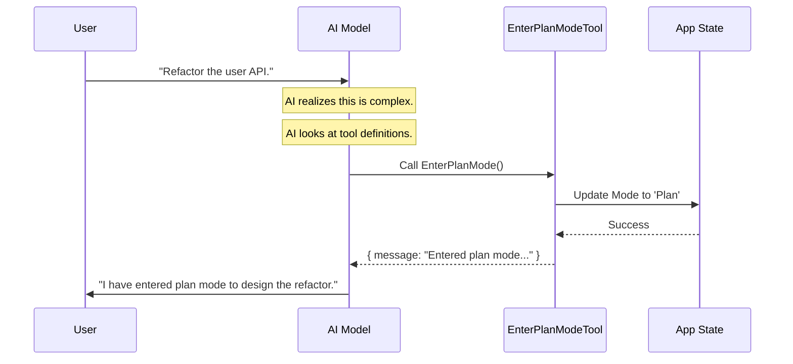

# Chapter 1: Tool Definition

Welcome to the **EnterPlanMode** project tutorial! In this series, we will build a mechanism that allows an AI coding assistant to switch gears from "coding mode" to "planning mode."

We start at the very beginning: defining the tool itself.

## The Motivation: Why do we need this?

Imagine you ask an AI assistant to "Refactor the entire database layer of my application."

If the AI immediately starts writing code, it will likely make mistakes because it doesn't understand the full picture yet. It needs to **stop**, **explore**, and **plan** first.

We need a way for the AI to say: *"I need to enter a planning phase."*

To do this, we create the `EnterPlanMode` tool. Think of this tool as a specific command or "button" we give the AI. The **Tool Definition** is the instruction manual that tells the AI:
1.  What this tool is called.
2.  When to use it.
3.  How to use it (inputs and outputs).

## Key Concept: The Tool Contract

In our application, a "Tool" is a contract between the AI model and our code. We must define the shape of that contract strictly so the AI knows exactly how to interact with it.

### 1. Defining Inputs and Outputs

Every tool needs a schema (a structure definition).

For `EnterPlanMode`, the AI doesn't need to provide any arguments. It's like a toggle switch.
*   **Input:** Nothing (Empty object).
*   **Output:** A simple confirmation message.

We use a library called `zod` to define these shapes.

```typescript
// File: EnterPlanModeTool.ts
import { z } from 'zod/v4'
import { lazySchema } from '../../utils/lazySchema.js'

// The AI sends us an empty object {}
const inputSchema = lazySchema(() =>
  z.strictObject({})
)

type InputSchema = ReturnType<typeof inputSchema>
```

The output is just as simple. The tool returns a text message confirming the action succeeded.

```typescript
// The tool returns a message string
const outputSchema = lazySchema(() =>
  z.object({
    message: z.string().describe('Confirmation that plan mode was entered'),
  })
)

type OutputSchema = ReturnType<typeof outputSchema>
```

### 2. Describing the Tool to the AI

Now that we have the structure, we need to describe the tool's purpose. The AI uses semantic matching to decide which tool to pick. If our description is good, the AI will use the tool at the right time.

We use `buildTool` to wrap everything together.

```typescript
// File: EnterPlanModeTool.ts
import { buildTool } from '../../Tool.js'
import { ENTER_PLAN_MODE_TOOL_NAME } from './constants.js'

export const EnterPlanModeTool = buildTool({
  name: ENTER_PLAN_MODE_TOOL_NAME, // 'EnterPlanMode'
  
  // This helps the AI search for this tool
  searchHint: 'switch to plan mode to design an approach before coding',
  
  // The official description the AI reads
  async description() {
    return 'Requests permission to enter plan mode for complex tasks requiring exploration and design'
  },
// ...
```

**Why is this important?**
The `searchHint` and `description` are the most critical parts for the AI. If you asked "Design a new login page," the AI sees "design an approach" in the hint and realizes, *"Aha! I should use EnterPlanMode."*

## The Execution Logic

When the AI actually calls the tool, the `call` function is executed. This is where the magic happens.

For this specific tool, the action is changing the state of the application.

```typescript
// inside EnterPlanModeTool ...
  async call(_input, context) {
    // 1. Get the current application state
    const appState = context.getAppState()

    // 2. We will handle state updates here
    // (We will cover the logic inside here in Chapter 3!)
    
    // 3. Return the result to the AI
    return {
      data: {
        message: 'Entered plan mode. Focus on exploring and designing.',
      },
    }
  },
```

*Note: The actual logic updates permissions and modes, which we will discuss in detail in [Permission State Management](03_permission_state_management.md).*

## How It Works: Under the Hood

Let's visualize what happens when a user asks a complex question.



### Implementation Details

The `EnterPlanModeTool` variable exports a fully formed object that the application registers. It combines the **Schema** (what it looks like) with the **Behavior** (what it does).

Here is how the configuration properties come together:

```typescript
// File: EnterPlanModeTool.ts

export const EnterPlanModeTool = buildTool({
  // ... name and description ...

  // Connect the schemas we defined earlier
  get inputSchema(): InputSchema {
    return inputSchema()
  },
  get outputSchema(): OutputSchema {
    return outputSchema()
  },

  // Metadata
  isConcurrencySafe() { return true }, // Can run alongside other things?
  isReadOnly() { return true },        // Does it modify files directly? No.
  
  // ... call function ...
})
```

By setting `isReadOnly()`, we tell the system that this tool itself doesn't edit user code files; it only changes the *internal state* of the assistant.

## Summary

In this chapter, we defined the **EnterPlanMode** tool. We learned:

1.  **Tool Definition** serves as a contract between the AI and the application.
2.  **Input/Output Schemas** define strictly what data is passed around (in this case, empty inputs).
3.  **Descriptions** guide the AI on *when* to use the tool.
4.  The `call` method performs the actual work.

However, simply defining a tool isn't enough. Sometimes features shouldn't be available to everyone, or under certain conditions. How do we control that?

In the next chapter, we will learn how to enable or disable this tool dynamically.

[Next Chapter: Feature Gating](02_feature_gating.md)

---

Generated by [Code IQ](https://github.com/adityasoni99/Code-IQ)