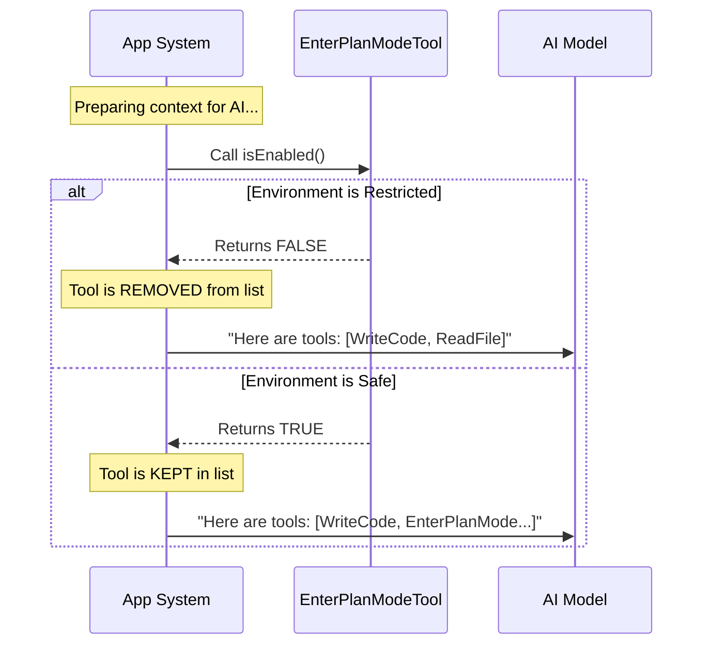

# Chapter 2: Feature Gating

In [Chapter 1: Tool Definition](01_tool_definition.md), we created the contract for the `EnterPlanMode` tool. We defined *what* it is and *how* it talks to the AI.

But simply creating a tool doesn't mean it should always be available.

## The Motivation: Preventing the "Trap"

Imagine you are using a simplified terminal interface or a specific chat channel that doesn't support complex pop-up dialogs.

The **ExitPlanMode** tool (the opposite of what we are building) requires a user approval dialog to work. If that dialog isn't supported in your current environment, the AI can enter Plan Mode but never leave it.

The AI becomes stuck in a "trap."

**Feature Gating** solves this. It acts as a safety guard. It checks the environment *before* showing the tool to the AI. If the environment is risky, we hide the tool completely.

## Key Concept: The `isEnabled` Method

To control visibility, our tool definition includes a method called `isEnabled()`.

Think of this as a gatekeeper. Before the AI even generates a response, the system asks every tool: *"Are you allowed to be used right now?"*

*   If `isEnabled()` returns `true`: The AI sees the tool in its list.
*   If `isEnabled()` returns `false`: The tool is invisible. The AI doesn't even know it exists.

## Implementing the Gate

Let's look at how we implement this inside our `EnterPlanModeTool`.

### 1. The Basic State

By default, most tools are always enabled. A simple implementation looks like this:

```typescript
// Simple version (no checks)
isEnabled() {
  return true
}
```

### 2. Checking Feature Flags

We often use "Feature Flags" to toggle behavior. Here, we check for a flag named `KAIROS`. If this feature is active, we might need to be careful.

```typescript
import { feature } from 'bun:bundle'

// Inside buildTool...
isEnabled() {
  // Check if the KAIROS feature flag is active
  const isKairosActive = feature('KAIROS')
  
  // Logic continues...
}
```

### 3. Checking for Restricted Channels

The specific condition where the "trap" occurs is when we are in `KAIROS` mode *AND* we are restricted to specific "Channels".

We use `getAllowedChannels()` to check this.

```typescript
import { getAllowedChannels } from '../../bootstrap/state.js'

// Inside isEnabled...
const hasChannels = getAllowedChannels().length > 0
```

### 4. The Safety Logic

Now we combine them. If we are in the restricted environment (`KAIROS` + `Channels`), we return `false` to disable the tool.

```typescript
isEnabled() {
  // If specific feature flags are on...
  if (feature('KAIROS') || feature('KAIROS_CHANNELS')) {
    
    // ...and we are in a restricted channel
    if (getAllowedChannels().length > 0) {
      // Disable the tool to prevent getting stuck!
      return false 
    }
  }
  return true
}
```

## How It Works: Under the Hood

Let's visualize the flow when the AI is deciding what to do.



### Why hide it instead of blocking it?

You might wonder: *"Why not let the AI try to call it, and then throw an error saying 'Not Allowed'?"*

If the AI sees the tool, it assumes it can use it. If it tries to use it and gets an error, it might try again or get confused. By returning `false` in `isEnabled()`, the tool is removed from the system prompt entirely. To the AI, the capability simply doesn't exist. This reduces hallucinations and frustration.

## Implementation Detail

Here is the actual code block from `EnterPlanModeTool.ts` where this logic lives.

```typescript
// File: EnterPlanModeTool.ts

// ... imports ...

export const EnterPlanModeTool = buildTool({
  // ... name, description ...

  isEnabled() {
    // Check flags. If KAIROS is active...
    if (feature('KAIROS') || feature('KAIROS_CHANNELS')) {
      
      // ...and we are operating within specific channels
      if (getAllowedChannels().length > 0) {
        
        // Disable the tool.
        // Reason: ExitPlanMode (the way out) isn't supported here.
        return false
      }
    }
    // Otherwise, the tool is available.
    return true
  },

  // ... rest of the tool ...
})
```

By ensuring `EnterPlanMode` is disabled when `ExitPlanMode` cannot function, we ensure the stability of the conversation flow.

## Summary

In this chapter, we added a safety layer to our tool.

1.  **Feature Gating** controls tool availability.
2.  **`isEnabled()`** is the method that determines visibility.
3.  We hide the tool in environments where it might cause the AI to get stuck (the "Trap").

Now that our tool is defined and safe to use, what happens when the AI actually clicks the button? It needs to change the internal state of the application.

In the next chapter, we will look at how to manage these permissions.

[Next Chapter: Permission State Management](03_permission_state_management.md)

---

Generated by [Code IQ](https://github.com/adityasoni99/Code-IQ)