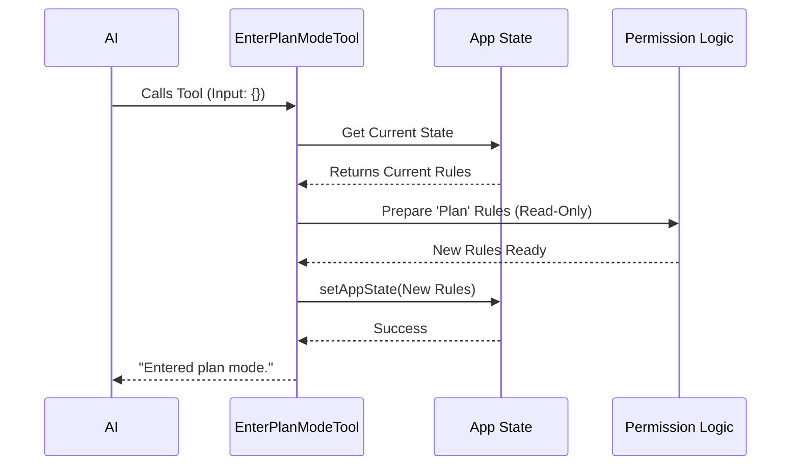

# Chapter 3: Permission State Management

In [Chapter 2: Feature Gating](02_feature_gating.md), we learned how to safely hide the `EnterPlanMode` tool when the environment isn't ready for it. We built the "safety cover" for our button.

Now, we are ready to push that button.

In this chapter, we will implement the actual logic that happens inside the `call` function. This is known as **Permission State Management**.

## The Motivation: Shifting Gears

Think of your AI assistant like a car.
*   **Coding Mode** is like "Drive." The car is moving, changing lanes, and editing files. It's powerful but risky.
*   **Plan Mode** is like "Park." You stop moving so you can look at the map, check the GPS, and decide where to go next.

If you tell the AI "I want to plan," but you don't actually shift the gears, the AI might accidentally "step on the gas" and start writing code when it should just be thinking.

**Permission State Management** is the gearbox. It forces the application to switch from "Implementation Rules" (write access allowed) to "Planning Rules" (read-only).

## Key Concept: Application State

In our application, there is a central object called `appState`. It remembers everything about the current conversation. Inside it, there is a specific section called `toolPermissionContext`.

This context holds the rules of the road:
1.  **Mode:** Are we in 'code' or 'plan' mode?
2.  **Permissions:** Are we allowed to write files right now?

Our goal is to update this object safely.

## Implementing the Logic

All of this happens inside the `call` method of our tool. Let's break down the code step-by-step.

### Step 1: Who is driving?

First, we ensure that only the main assistant can enter Plan Mode. Sub-agents (specialized helpers) shouldn't change the global mode.

```typescript
async call(_input, context) {
  // Check if a sub-agent is trying to call this
  if (context.agentId) {
    throw new Error('EnterPlanMode tool cannot be used in agent contexts')
  }
  // ...
```

### Step 2: Logging the Transition

Before we change anything, we grab the current state and log that a transition is happening. This is helpful for analytics and debugging.

```typescript
  // Get the current state of the app
  const appState = context.getAppState()

  // Log that we are moving from current mode -> 'plan'
  handlePlanModeTransition(appState.toolPermissionContext.mode, 'plan')
```

### Step 3: Changing the State

This is the most important part. We use `context.setAppState` to update the global memory.

We need to do two things simultaneously:
1.  **Prepare** the new rules (Read-only, etc.).
2.  **Apply** the mode change (Set label to 'plan').

We use a functional update pattern (`prev => ...`) to ensure we don't overwrite other updates happening at the same time.

```typescript
  context.setAppState(prev => ({
    // Keep everything else in the state exactly the same
    ...prev,

    // Only update the permission context
    toolPermissionContext: applyPermissionUpdate(
      prepareContextForPlanMode(prev.toolPermissionContext),
      { type: 'setMode', mode: 'plan', destination: 'session' },
    ),
  }))
```

**What just happened?**
*   `prepareContextForPlanMode`: Calculates the new restrictions (e.g., "Files are now Read-Only").
*   `applyPermissionUpdate`: Officially stamps the state as "Plan Mode".

### Step 4: Returning the Message

Finally, we tell the AI that the shift was successful.

```typescript
  return {
    data: {
      message:
        'Entered plan mode. You should now focus on exploring the codebase and designing an approach.',
    },
  }
} // End of call function
```

## How It Works: Under the Hood

Let's visualize the flow of data when the tool is called.



## Deep Dive: The Helper Functions

You noticed we used two helper functions in Step 3. You don't need to write these inside the tool, but it is important to understand what they do.

1.  **`prepareContextForPlanMode(currentContext)`**:
    This function acts like a filter. It takes the current permissions and strips away the ability to modify files. It turns "Write Access" into "Read Access." This ensures that even if the AI *tries* to write code in Plan Mode, the system blocks it.

2.  **`applyPermissionUpdate(context, updateAction)`**:
    This is the committer. It takes the prepared context and the specific action (`setMode: 'plan'`) and merges them into the final state object that gets saved.

## Putting It All Together

Here is the complete, simplified `call` method context:

```typescript
async call(_input, context) {
  // 1. Safety Check
  if (context.agentId) throw new Error('No agents allowed');

  // 2. Logging
  const appState = context.getAppState();
  handlePlanModeTransition(appState.toolPermissionContext.mode, 'plan');

  // 3. Update Global State
  context.setAppState(prev => ({
    ...prev,
    toolPermissionContext: applyPermissionUpdate(
      prepareContextForPlanMode(prev.toolPermissionContext),
      { type: 'setMode', mode: 'plan', destination: 'session' },
    ),
  }));

  // 4. Respond
  return { data: { message: 'Entered plan mode.' } };
},
```

## Summary

In this chapter, we implemented the mechanics of switching modes.

1.  We learned that **State Management** acts like a car's gearbox.
2.  We accessed the `appState` to understand where we are.
3.  We used `setAppState` to safely transition into a restricted, read-only "Plan Mode."

Now the application knows internally that we are in Plan Mode. But does the AI know *how* to behave in this new mode? We've changed the gears, but we haven't changed the driver's instructions yet.

In the next chapter, we will learn how to change the instructions the AI sees based on this new state.

[Next Chapter: Dynamic Prompt Generation](04_dynamic_prompt_generation.md)

---

Generated by [Code IQ](https://github.com/adityasoni99/Code-IQ)