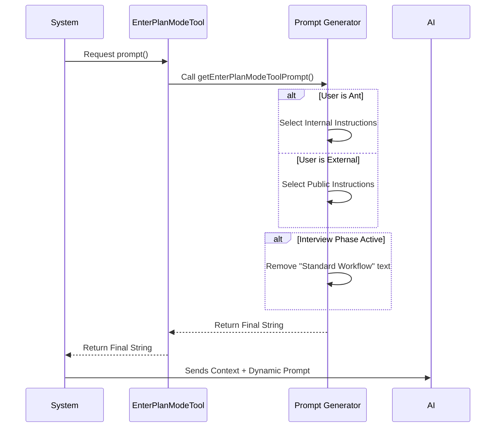

# Chapter 4: Dynamic Prompt Generation

Welcome back! In [Chapter 3: Permission State Management](03_permission_state_management.md), we built the gearbox for our application. We learned how to mechanically shift the system from "Coding Mode" to "Plan Mode."

However, shifting gears physically isn't enough. We also need to tell the driver (the AI) *how* to drive in this new gear.

This brings us to **Dynamic Prompt Generation**.

## The Motivation: Why not just use a static string?

In many simple AI tools, the description is a static sentence: *"Use this tool to add two numbers."*

But `EnterPlanMode` is complex. The instructions needed might change depending on:
1.  **Who is using it?** (An internal employee might need different rules than a public user).
2.  **What is the current context?** (Are we in a specific "Interview Phase" where the AI needs to ask questions instead of writing a plan?)

If we used a single static string, we would have to write a generic, vague instruction set that fits everyone poorly. Instead, we act like a **Dynamic Scriptwriter**, rewriting the instruction manual on the fly right before the AI reads it.

## Key Concept: The Prompt Function

In our tool definition, the `prompt` field isn't a text string—it is a **function**.

```typescript
// File: EnterPlanModeTool.ts
import { getEnterPlanModeToolPrompt } from './prompt.js'

export const EnterPlanModeTool = buildTool({
  // ... other config ...
  
  // This is a function, not a string!
  async prompt() {
    return getEnterPlanModeToolPrompt()
  },
})
```

Because it is a function, we can run logic inside it. Every time the system prepares to send data to the AI, it runs this function to get the freshest version of the instructions.

## Solving the Use Case: Handling Different Users

Let's say we have two types of users:
1.  **"Ants"** (Internal employees): They need technical, concise instructions.
2.  **External Users**: They need more guidance and examples.

We solve this by checking an environment variable `USER_TYPE`.

### Step 1: The Switcher

We create a main function that acts as a traffic controller.

```typescript
// File: prompt.ts

export function getEnterPlanModeToolPrompt(): string {
  // Check if the user is an internal "ant"
  if (process.env.USER_TYPE === 'ant') {
    return getEnterPlanModeToolPromptAnt()
  }
  
  // Otherwise, return the standard external prompt
  return getEnterPlanModeToolPromptExternal()
}
```

### Step 2: Customizing the Content

Now we can write specific instructions for each group without cluttering the other.

For **External Users**, we focus on explaining *why* they should use it.

```typescript
function getEnterPlanModeToolPromptExternal(): string {
  return `Use this tool proactively when you're about to start a non-trivial task. 
  
  ## When to Use This Tool
  1. New Feature Implementation
  2. Multiple Valid Approaches exist
  3. Unclear Requirements
  
  (Detailed examples follows...)`
}
```

For **Ants**, we might emphasize different criteria, like "Significant Architectural Ambiguity."

## Handling "Interview Mode"

Sometimes, the application enters a special state called "Interview Phase." In this state, the AI shouldn't just start planning; it should interview the user to gather requirements.

We need to dynamically inject (or remove) text based on this state.

```typescript
// File: prompt.ts
import { isPlanModeInterviewPhaseEnabled } from '../../utils/planModeV2.js'

// Inside our prompt generation function...
const whatHappens = isPlanModeInterviewPhaseEnabled()
  ? '' // If interviewing, don't show the standard workflow!
  : `## What Happens in Plan Mode
     1. Explore codebase
     2. Design approach...`

return `...standard text... ${whatHappens}`
```

By adding logic here, we prevent the AI from hallucinating a workflow that doesn't exist in the current mode.

## How It Works: Under the Hood

When the system needs to send the "System Prompt" to the Large Language Model (LLM), the following sequence occurs:



## Post-Execution Instructions

Dynamic prompting isn't just for *before* the tool is used. It is also for *after*.

When the AI calls `EnterPlanMode`, the tool returns a result. This result is a message the AI reads immediately after clicking the button. We use this moment to reinforce the new rules.

In `EnterPlanModeTool.ts`, we look at `mapToolResultToToolResultBlockParam`.

### 1. The Result Logic

We check the interview phase again to decide what to tell the AI immediately after it enters the mode.

```typescript
// File: EnterPlanModeTool.ts

mapToolResultToToolResultBlockParam({ message }, toolUseID) {
  // Are we in an interview?
  const isInterview = isPlanModeInterviewPhaseEnabled()
  
  // Choose the right instruction block
  const instructions = isInterview
    ? `${message}\nDO NOT write files. Wait for instructions.`
    : `${message}\n1. Explore codebase\n2. Design strategy...`

  // Return the formatted result
  return {
    type: 'tool_result',
    content: instructions,
    tool_use_id: toolUseID,
  }
}
```

### 2. Why is this necessary?

Even though we changed the internal state in [Permission State Management](03_permission_state_management.md), LLMs have short attention spans.

By explicitly returning a text result that says: **"DO NOT write or edit any files yet,"** we drastically reduce the chance that the AI will ignore our read-only mode and try to write code anyway.

## Summary

In this chapter, we learned how to be a **Dynamic Scriptwriter** for our AI.

1.  We moved from static strings to **Prompt Functions**.
2.  We used **User Detection** to tailor instructions for employees vs. the public.
3.  We used **State Detection** to hide or show instructions based on the "Interview Phase."
4.  We reinforced these rules in the **Tool Result** to ensure the AI behaves correctly immediately after switching modes.

We have defined the tool, gated it for safety, managed its internal state, and given the AI dynamic instructions on how to use it.

There is one final piece to the puzzle. When the user interacts with this tool, what do they actually *see* on their screen?

[Next Chapter: User Interface Rendering](05_user_interface_rendering.md)

---

Generated by [Code IQ](https://github.com/adityasoni99/Code-IQ)