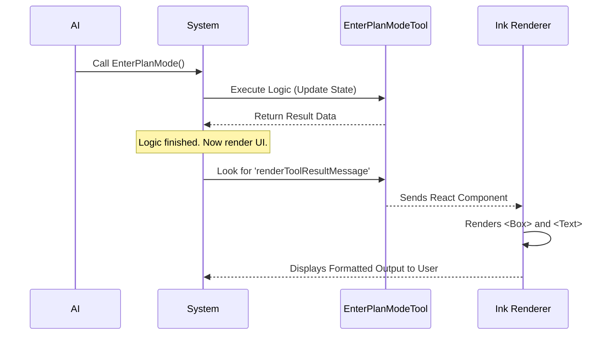

# Chapter 5: User Interface Rendering

Welcome to the final chapter of our series!

In [Chapter 4: Dynamic Prompt Generation](04_dynamic_prompt_generation.md), we taught the AI how to behave internally when switching modes. We gave the "driver" (the AI) a new instruction manual.

Now, we need to focus on the **passenger** (the human user).

When the AI switches gears into "Plan Mode," how does the human know? We need to display a clear, formatted message in the terminal. This is **User Interface (UI) Rendering**.

## The Motivation: Why do we need a UI?

Imagine you ask the AI to "Plan a refactor."
Without a UI, the AI might just output a raw text log:

```text
Tool call: EnterPlanMode({}) -> { message: "Success" }
```

This is functional, but it is ugly and hard to scan. It doesn't look like a modern application.

We want a nice, visual indicator—like a dashboard light turning on—that tells the user: **"The system is now in Plan Mode."**

## Key Concept: React in the Terminal

You might know **React** as a library for building websites using HTML tags like `<div>` and `<span>`.

In this project, we use a library called **Ink**. It allows us to use React components to render text inside the Command Line Interface (CLI).
*   Instead of `<div>`, we use `<Box>`.
*   Instead of `<span>`, we use `<Text>`.

## Solving the Use Case: The "Dashboard Light"

We need to create two visual states for our tool:
1.  **Success:** The tool worked, and we entered Plan Mode.
2.  **Rejection:** The user (or system) said "No."

Let's build the visual component for the **Success** state.

### 1. Importing the Basics

First, we need to import our building blocks. We use `Box` for layout (like a Flexbox container) and `Text` for styling strings.

```tsx
// File: UI.tsx
import * as React from 'react'
import { Box, Text } from '../../ink.js' // Our terminal UI library
import { BLACK_CIRCLE } from 'src/constants/figures.js'
import { getModeColor } from 'src/utils/permissions/PermissionMode.js'

// ... code continues ...
```

### 2. Designing the Success Message

We want to show a colored dot (the "light") and a message. We use `getModeColor('plan')` to automatically fetch the specific color associated with Plan Mode (usually a distinct color like pink or purple).

```tsx
export function renderToolResultMessage(_output) {
  return (
    <Box flexDirection="column" marginTop={1}>
      <Box flexDirection="row">
        {/* The Colored Dot */}
        <Text color={getModeColor('plan')}>{BLACK_CIRCLE}</Text>
        <Text> Entered plan mode</Text>
      </Box>
      {/* ... subtitle goes here ... */}
    </Box>
  )
}
```

This code creates a row containing a colored dot and the text "Entered plan mode."

### 3. Adding the Subtitle

Underneath the main headline, we add a subtitle to explain *what* is happening. We use `dimColor` to make it look like secondary text.

```tsx
      {/* Continuing inside the Box... */}
      <Box paddingLeft={2}>
        <Text dimColor>
          Claude is now exploring and designing an implementation approach.
        </Text>
      </Box>
    </Box> // Closing the main container
  )
}
```

### 4. Handling Rejection

If the user declines the action (or if it fails), we render a different message. We typically use the 'default' color (grey/white) to show that the mode didn't change.

```tsx
export function renderToolUseRejectedMessage() {
  return (
    <Box flexDirection="row" marginTop={1}>
      <Text color={getModeColor('default')}>{BLACK_CIRCLE}</Text>
      <Text> User declined to enter plan mode</Text>
    </Box>
  )
}
```

## How It Works: Under the Hood

How does the system know when to run these functions?

In [Chapter 1: Tool Definition](01_tool_definition.md), we created the `EnterPlanModeTool` object. We attach these UI functions directly to that object.

When the tool runs, the system orchestrator looks at the tool definition.



## Integrating with the Tool Definition

Finally, we go back to our main file, `EnterPlanModeTool.ts`, and import these functions. This connects the logic to the visuals.

```typescript
// File: EnterPlanModeTool.ts
import { 
  renderToolResultMessage, 
  renderToolUseRejectedMessage 
} from './UI.js'

export const EnterPlanModeTool = buildTool({
  name: ENTER_PLAN_MODE_TOOL_NAME,
  
  // ... other configuration ...

  // We attach the UI functions here:
  renderToolResultMessage,
  renderToolUseRejectedMessage,
  
  // ... call function ...
})
```

By adding these lines, we tell the system: *"When this tool finishes successfully, use `renderToolResultMessage` to draw the output."*

## Tutorial Conclusion

Congratulations! You have successfully built the **EnterPlanMode** tool from scratch.

Let's review our journey:

1.  **[Tool Definition](01_tool_definition.md):** We created the contract (Input/Output schemas) so the AI knows how to call the tool.
2.  **[Feature Gating](02_feature_gating.md):** We added safety checks (`isEnabled`) to hide the tool when the environment is risky.
3.  **[Permission State Management](03_permission_state_management.md):** We built the "gearbox" to securely switch the application state to Read-Only.
4.  **[Dynamic Prompt Generation](04_dynamic_prompt_generation.md):** We wrote dynamic instructions so the AI knows how to behave in the new mode.
5.  **[User Interface Rendering](05_user_interface_rendering.md):** We created a polished visual interface so the user knows exactly what is happening.

You now have a fully functional, safe, and user-friendly AI capability. This pattern of **Definition -> Gating -> State -> Prompt -> UI** is the gold standard for building robust AI tools.

Thank you for following along!

---

Generated by [Code IQ](https://github.com/adityasoni99/Code-IQ)