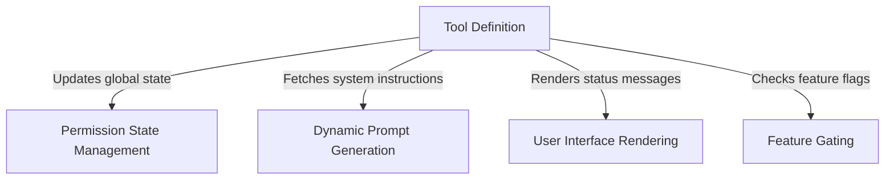

# Tutorial: EnterPlanModeTool

The **EnterPlanModeTool** acts as a bridge that transitions the AI agent into a dedicated *planning phase* for complex tasks. It orchestrates this process by validating availability through **Feature Gating**, updating the global **Permission State** to enforce exploration rules, and delivering context-aware instructions via **Dynamic Prompt Generation**, while keeping the user informed with formatted **User Interface** feedback.

## Chapters

1. [Tool Definition](01_tool_definition.md)
2. [Feature Gating](02_feature_gating.md)
3. [Permission State Management](03_permission_state_management.md)
4. [Dynamic Prompt Generation](04_dynamic_prompt_generation.md)
5. [User Interface Rendering](05_user_interface_rendering.md)

---

Generated by [Code IQ](https://github.com/adityasoni99/Code-IQ)