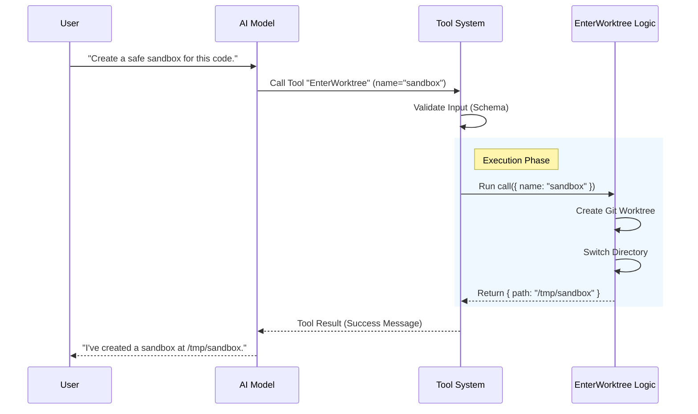

# Chapter 1: Tool Definition

Welcome to the **EnterWorktreeTool** project! In this tutorial series, we will build a robust tool that allows an AI agent to safely create and switch into isolated Git worktrees.

We start with the most fundamental building block: the **Tool Definition**.

## Why do we need a Tool Definition?

Imagine your AI agent is a brilliant chef (the "Brain"), but it is stuck in a glass box. It can read recipes and plan menus, but it can't actually chop carrots or stir the pot.

To interact with the real world—or in our case, your computer's file system—the AI needs **Tools**.

A **Tool Definition** is like an API contract or a "Skill Card" you hand to the AI. It tells the agent:
1.  **"I exist"** (Name)
2.  **"This is what I do"** (Description)
3.  **"This is what I need from you"** (Input Schema)
4.  **"This is what happens when you call me"** (Execution Logic)

### Central Use Case
Let's say a user tells the AI: *"I want to try a risky refactor, but don't mess up my current branch."*

The AI analyzes this request and looks at its list of available tools. It finds `EnterWorktree`, reads the definition, and realizes: *"Aha! This tool allows me to create an isolated environment. I should use this."*

## Core Concepts

The `Tool` abstraction bundles everything the AI needs into one object. Let's break down the key ingredients.

1.  **Metadata**: The unique name and user-friendly description.
2.  **Input Schema**: Defines strictly what data the AI must provide (e.g., a name for the worktree).
3.  **The `call` Method**: The actual TypeScript code that runs when the tool is invoked.
4.  **Output**: Structured data returned to the AI so it knows if the operation succeeded.

## How to Define a Tool

We use a helper function called `buildTool` to create our definition. This ensures we don't forget any required parts.

### 1. The Basic Skeleton

At its simplest, a tool looks like this:

```typescript
import { buildTool } from '../../Tool.js'
import { ENTER_WORKTREE_TOOL_NAME } from './constants.js'

export const EnterWorktreeTool = buildTool({
  name: ENTER_WORKTREE_TOOL_NAME,
  // Detailed explanation for the AI
  async description() {
    return 'Creates an isolated worktree and switches the session into it'
  },
  // ... input/output configuration goes here
})
```
*Explanation: We import `buildTool` and provide the basic identity. The `description` is crucial because the AI reads it to decide **if** it should use the tool.*

### 2. Defining Inputs and Outputs

We need to tell the system what data goes in and what comes out. We use `zod` schemas for this (we will cover the details in [Input Validation Schema](03_input_validation_schema.md)).

```typescript
// Define what the AI sends us (Input)
get inputSchema() {
  return inputSchema() // defined elsewhere
},

// Define what we send back (Output)
get outputSchema() {
  return outputSchema() // defined elsewhere
},
```
*Explanation: By linking schemas here, the system automatically handles validation. If the AI tries to send a number instead of a string, the tool rejects it before running any logic.*

### 3. The Execution Logic (`call`)

This is where the magic happens. When the AI invokes the tool, this function runs.

```typescript
async call(input) {
  // 1. Validate state
  if (getCurrentWorktreeSession()) {
    throw new Error('Already in a worktree session')
  }

  // 2. Perform the action (create the worktree)
  // ... (Worktree creation logic hidden for brevity)

  // 3. Return the result
  return {
    data: { message: 'Success!' /* ... */ }
  }
},
```
*Explanation: The `call` method receives the validated `input`. It performs checks, executes the logic, and returns a result object matching the `outputSchema`.*

## Internal Implementation: Under the Hood

What actually happens when the AI decides to use this tool? Let's visualize the flow.



### Code Walkthrough

Let's look at how `EnterWorktreeTool.ts` implements this in the real project.

#### Step 1: Configuration

```typescript
export const EnterWorktreeTool: Tool<InputSchema, Output> = buildTool({
  name: ENTER_WORKTREE_TOOL_NAME,
  searchHint: 'create an isolated git worktree and switch into it',
  userFacingName() {
    return 'Creating worktree'
  },
  // ...
```
*Explanation: We provide a `searchHint` to help the system index this tool, and a `userFacingName` which might be shown in a UI while the tool is loading.*

#### Step 2: Prompt Strategy

The tool needs to know *how* to prompt the user or the AI.

```typescript
  async prompt() {
    return getEnterWorktreeToolPrompt()
  },
```
*Explanation: This links to a specific prompting strategy. We will explore how to craft effective prompts in [Prompt Strategy](04_prompt_strategy.md).*

#### Step 3: The `call` Implementation

This performs the heavy lifting. Notice how it interacts with the file system and session state.

```typescript
  async call(input) {
    const slug = input.name ?? getPlanSlug()
    
    // Create the actual worktree on disk
    const worktreeSession = await createWorktreeForSession(getSessionId(), slug)

    // Switch the process to the new directory
    process.chdir(worktreeSession.worktreePath)
    setCwd(worktreeSession.worktreePath)
    
    // ...
```
*Explanation: The tool grabs the requested name (`slug`), creates the folder via `createWorktreeForSession`, and physically changes the current working directory (`process.chdir`). This logic is covered deeply in [Worktree Session Logic](02_worktree_session_logic.md).*

#### Step 4: Formatting the Result

Finally, the tool tells the UI how to display the result.

```typescript
  renderToolUseMessage,    // How it looks when running
  renderToolResultMessage, // How it looks when finished

  mapToolResultToToolResultBlockParam({ message }, toolUseID) {
    return {
      type: 'tool_result',
      content: message,
      tool_use_id: toolUseID,
    }
  },
```
*Explanation: `mapToolResultToToolResultBlockParam` converts our internal data into the specific JSON format the AI API expects. The UI rendering functions are discussed in [UI Presentation](05_ui_presentation.md).*

## Summary

In this chapter, we learned that a **Tool Definition** is the bridge between the AI's intent and actual code execution. It requires:
1.  **Identity** (Name/Description)
2.  **Validation** (Input Schema)
3.  **Action** (The `call` function)

Now that we have defined the container for our tool, we need to fill it with the actual logic to handle git operations and directory switching.

[Next Chapter: Worktree Session Logic](02_worktree_session_logic.md)

---

Generated by [Code IQ](https://github.com/adityasoni99/Code-IQ)