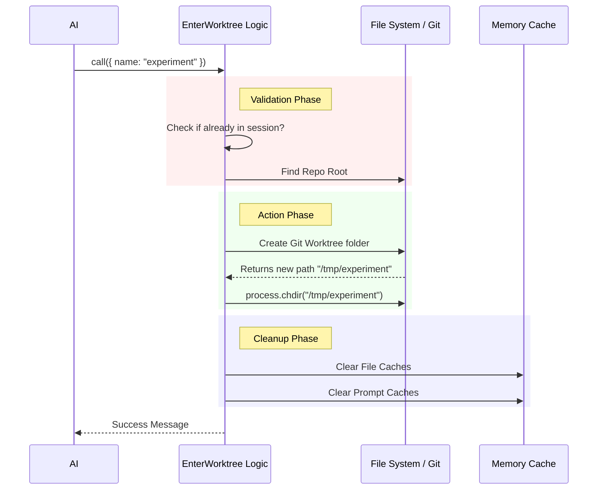

# Chapter 2: Worktree Session Logic

In the previous chapter, [Tool Definition](01_tool_definition.md), we built the "outer shell" of our tool. We defined its name, description, and the interface for the AI.

Now, we are going to open the hood and build the engine. Welcome to the **Worktree Session Logic**.

## What is Worktree Session Logic?

Imagine you are a painter working on a masterpiece (your main code branch). Someone asks you to quickly sketch a rough idea, but you don't want to mess up your canvas. You need a separate easel in a separate room to experiment safely.

**Worktree Session Logic** is the machinery that:
1.  **Checks** if you are already in a separate room.
2.  **Builds** the new room (the Git Worktree).
3.  **Teleports** you into that room (switches the directory).
4.  **Remembers** where you are (manages state).

### Central Use Case

**The Scenario:** The user says, *"I want to rewrite the database layer, but keep it experimental."*
**The Goal:** The tool must create a folder named `rewrite-db-layer` (backed by Git) and move the AI's execution context into that folder.

## Key Concepts

Before we look at the code, let's understand the three pillars of this logic.

### 1. The Safety Check
You cannot create a sandbox inside a sandbox. The logic must ensure the AI isn't already inside a temporary worktree. If it is, we stop the operation to prevent confusion.

### 2. The Context Switch (`chdir`)
When a computer program runs, it has a "Current Working Directory" (CWD). It's like the program's "feet." If the AI needs to edit files in the new worktree, we must physically move its feet to the new path using `process.chdir`.

### 3. State Cleanup
The AI has "caches" (memory) of the files it has read. When we switch directories, that memory becomes stale. We must wipe the cache so the AI sees the new files, not the old ones.

## Implementing the Logic

Let's look at how the `call` method in `EnterWorktreeTool.ts` handles this, step-by-step.

### Step 1: Pre-flight Checks

First, we verify we aren't already in a session. Then, we ensure we are anchoring our worktree from the true root of the repository, not a random subfolder.

```typescript
// Check if we are already in a worktree
if (getCurrentWorktreeSession()) {
  throw new Error('Already in a worktree session')
}

// Find the true 'main' folder of the project
const mainRepoRoot = findCanonicalGitRoot(getCwd())

// Move to the root before starting
if (mainRepoRoot && mainRepoRoot !== getCwd()) {
  process.chdir(mainRepoRoot)
  setCwd(mainRepoRoot)
}
```
*Explanation: We use helper functions (like `findCanonicalGitRoot`) to orient ourselves. We don't want to create a worktree inside a nested folder `src/components/`, so we move to the root first.*

### Step 2: Creating the Worktree

We determine the name for our folder. If the AI provided a name (validated in [Input Validation Schema](03_input_validation_schema.md)), we use it. Otherwise, we generate a default one.

```typescript
// 'slug' is the folder name (e.g., "rewrite-db-layer")
const slug = input.name ?? getPlanSlug()

// This function performs the heavy Git operations
const worktreeSession = await createWorktreeForSession(
  getSessionId(), 
  slug
)
```
*Explanation: `createWorktreeForSession` is a utility that runs the actual `git worktree add` commands. It returns an object containing the path to the new directory.*

### Step 3: Moving In (The Context Switch)

This is the most critical part. We physically move the process and save the state.

```typescript
// 1. Change the Node.js process directory
process.chdir(worktreeSession.worktreePath)

// 2. Update the internal application state
setCwd(worktreeSession.worktreePath)

// 3. Save the original location so we can go back later
setOriginalCwd(getCwd())

// 4. Persist this session to disk
saveWorktreeState(worktreeSession)
```
*Explanation: `process.chdir` moves us. `saveWorktreeState` ensures that if the application crashes and restarts, it knows it's currently inside a worktree.*

### Step 4: Refreshing the AI's Vision

Now that we are in a new folder, the AI's previous knowledge of the file system is wrong. We need to clear it.

```typescript
// Re-calculate the system prompt (env_info) for the new folder
clearSystemPromptSections()

// Forget contents of files read in the old folder
clearMemoryFileCaches()

// Clear other caches related to plans
getPlansDirectory.cache.clear?.()
```
*Explanation: If we don't do this, the AI might hallucinate files from the main branch that don't exist in the new worktree, or vice versa.*

## Internal Implementation: Under the Hood

Let's visualize the flow of data and control when this logic runs.



### Returning the Result

Finally, the logic packages the result to send back to the AI. This uses the schema we will define in [Input Validation Schema](03_input_validation_schema.md) and formats the output.

```typescript
// Construct a helpful message explaining what happened
const branchInfo = worktreeSession.worktreeBranch
  ? ` on branch ${worktreeSession.worktreeBranch}`
  : ''

return {
  data: {
    worktreePath: worktreeSession.worktreePath,
    worktreeBranch: worktreeSession.worktreeBranch,
    message: `Created worktree at ${worktreeSession.worktreePath}${branchInfo}.`,
  },
}
```
*Explanation: The `message` is crucial because the AI reads it to understand its new reality. It explicitly tells the AI: "You are now working in the worktree."*

## Summary

In this chapter, we explored the **Worktree Session Logic**, the engine that powers our tool. We learned how to:
1.  **Check** that it's safe to create a worktree.
2.  **Switch** the operating directory (`process.chdir`) so the AI acts on the correct files.
3.  **Clean** the AI's memory caches so it doesn't get confused by old file data.

However, we have been assuming the `input.name` provided by the AI is always correct. But what if the AI tries to name the worktree `../../dangerous-folder`? We need to validate inputs rigorously.

[Next Chapter: Input Validation Schema](03_input_validation_schema.md)

---

Generated by [Code IQ](https://github.com/adityasoni99/Code-IQ)