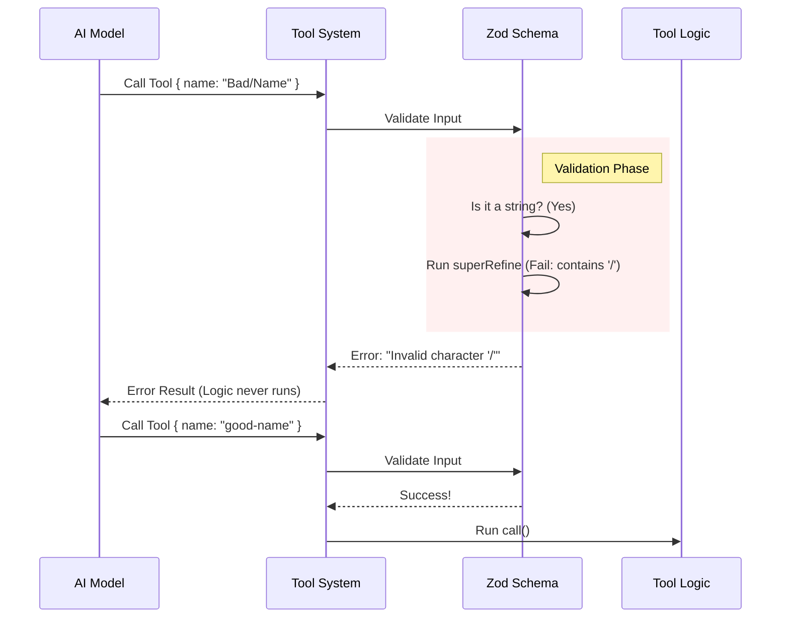

# Chapter 3: Input Validation Schema

In the previous chapter, [Worktree Session Logic](02_worktree_session_logic.md), we built the engine that creates directories and switches contexts. However, an engine is dangerous if you pour the wrong fuel into it.

Welcome to **Input Validation Schema**.

## The Problem: "Garbage In, Garbage Out"

Imagine your AI agent decides to name a new worktree `../../system_files`. If we pass that string directly to our logic, the tool might try to overwrite critical system folders. Or, the AI might send a number `123` when we expect a text name.

We need a **Bouncer**.

The **Input Validation Schema** is the bouncer at the door of our tool. It checks the ID (data) of every request. If the data doesn't look right, the bouncer kicks it out before the code in [Worktree Session Logic](02_worktree_session_logic.md) ever sees it.

### Central Use Case

**The Scenario:** The AI, trying to be helpful, suggests: *"I'll create a worktree named 'New Feature / Update #1'."*
**The Issue:** Git worktrees and file systems generally hate spaces, slashes (`/`), and hash symbols (`#`) in folder names.
**The Solution:** Our schema detects these forbidden characters and rejects the request immediately with a helpful error message.

## Key Concepts

We use a library called `zod` to build our bouncer. Here are the core concepts:

### 1. The Schema (`z.object`)
A schema is a blueprint. It describes the "shape" of the data we expect. For our tool, we expect an object (a JSON package) containing specific fields.

### 2. The Type Check (`z.string`)
This ensures the data is the correct format. If we expect a name, it must be a string of text, not a number or a boolean (true/false).

### 3. Refinement (`superRefine`)
Sometimes, checking for "String" isn't enough. We need custom rules. "Refining" allows us to write a small function that returns `true` or `false` to validate complex rules (like "must not contain spaces").

## Solving the Use Case

Let's look at how we define this in code. We are building the `inputSchema`.

### Step 1: Defining the Basic Shape

We start by saying: "We expect an object with an optional property called `name`."

```typescript
import { z } from 'zod/v4'

// Define the shape
const basicSchema = z.strictObject({
  // It's a string, but it is optional
  name: z.string().optional()
})
```
*Explanation: `strictObject` means "only accept what is defined here, nothing extra." `optional()` means the AI doesn't *have* to provide a name; if it doesn't, we'll generate one later.*

### Step 2: Adding the Bouncer (Refinement)

Now we add the strict rules. We don't just want *any* string; we want a safe filename.

```typescript
import { validateWorktreeSlug } from '../../utils/worktree.js'

// Add the custom check
name: z.string()
  .superRefine((val, ctx) => {
    try {
      // Run our custom logic
      validateWorktreeSlug(val) 
    } catch (e) {
      // If it fails, report the error
      ctx.addIssue({ code: 'custom', message: e.message })
    }
  })
```
*Explanation: `superRefine` takes the input `val` (the name) and runs `validateWorktreeSlug`. If that function throws an error (e.g., "Name contains spaces"), we catch it and tell Zod to report an issue.*

### Step 3: Describing it to the AI

Finally, we attach a description. This is meta-data that the AI actually reads. It tells the AI the rules *before* it tries to call the tool.

```typescript
.describe(
  'Optional name. Segments may contain letters, digits, dots, ' +
  'underscores, dashes. Max 64 chars.'
)
```
*Explanation: By describing the rules clearly, the AI is smart enough to often self-correct. For example, it might convert "My Feature" to "My_Feature" because it read this description.*

## Internal Implementation: Under the Hood

What happens when a request comes in? Let's trace the flow.



### The Code Implementation

In `EnterWorktreeTool.ts`, we wrap the schema in a helper called `lazySchema`. This is a performance optimization. It ensures we don't load the validation logic until the tool is actually used.

Here is the simplified implementation from the project file:

```typescript
const inputSchema = lazySchema(() =>
  z.strictObject({
    name: z
      .string()
      .superRefine((s, ctx) => {
        try {
          // Verify filesystem safety
          validateWorktreeSlug(s)
        } catch (e) {
          ctx.addIssue({ code: 'custom', message: (e as Error).message })
        }
      })
      .optional()
      // ... .describe(...)
  }),
)
```
*Explanation: We define the validator inside `lazySchema`. The `superRefine` block acts as our safety net. If `validateWorktreeSlug` passes, the data is handed over to the logic defined in [Worktree Session Logic](02_worktree_session_logic.md).*

### Defining the Output Schema

Just as we validate inputs, we also define what the tool *returns*. This helps the system format the result for the AI.

```typescript
const outputSchema = lazySchema(() =>
  z.object({
    worktreePath: z.string(),
    worktreeBranch: z.string().optional(),
    message: z.string(),
  }),
)
```
*Explanation: We promise to return an object with a path and a message. This matches the return value we wrote in the `call` function in the previous chapter.*

### Connecting it to the Tool

Finally, we link these schemas to the tool definition we started in [Tool Definition](01_tool_definition.md).

```typescript
export const EnterWorktreeTool = buildTool({
  // ... name and description
  get inputSchema() {
    return inputSchema()
  },
  get outputSchema() {
    return outputSchema()
  },
  // ... call function
})
```
*Explanation: We use getters (`get inputSchema`) to return the lazy schemas. This completes the contract between the AI and our code.*

## Summary

In this chapter, we secured our tool. We learned that:
1.  **Trust no one:** Even AI agents make formatting mistakes.
2.  **Schema is the Bouncer:** It stops bad data at the door.
3.  **Refinements:** We can add custom logic to check for specific constraints (like file system safety).

Now that our tool is defined, safe, and capable of doing work, we need to teach the AI *when* and *how* to use it effectively. We do this through prompting.

[Next Chapter: Prompt Strategy](04_prompt_strategy.md)

---

Generated by [Code IQ](https://github.com/adityasoni99/Code-IQ)