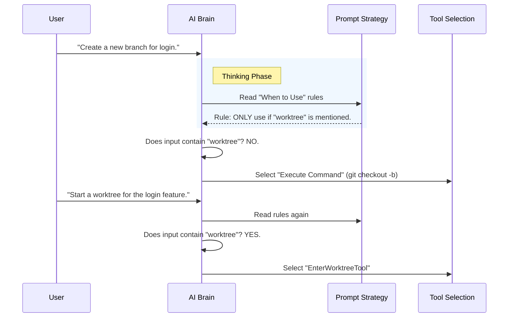

# Chapter 4: Prompt Strategy

In the previous chapter, [Input Validation Schema](03_input_validation_schema.md), we built a "bouncer" to ensure only valid data enters our tool.

We now have a tool that works (Logic), is safe (Validation), and has a name (Definition). But there is one problem: **The AI doesn't know *when* to use it.**

Welcome to **Prompt Strategy**.

## Why do we need a Prompt Strategy?

Imagine you hire a new employee. You give them a powerful industrial shredder (the Tool). If you don't give them clear instructions, they might shred important contracts thinking they are helping clean up.

You need **Standing Orders**:
*   "Only shred paper from the blue bin."
*   "Never shred documents with a red stamp."

For an AI, the **Prompt Strategy** is this set of standing orders. It prevents the AI from using the "heavy duty" Worktree tool when a simple Git command would suffice.

### Central Use Case

**The Scenario:** A user says, *"Fix the typo in the README."*
**The Risk:** The AI sees `EnterWorktreeTool` and thinks, *"I should create a whole new isolated environment just for this typo!"* This is overkill and annoying for the user.
**The Solution:** We write a prompt that tells the AI: *"Use this tool ONLY when the user explicitly asks for a 'worktree'."*

## Key Concepts

We communicate with the AI using natural language. We structure this language into three specific categories:

### 1. The Trigger ("When to Use")
These are the strict conditions required to activate the tool. We usually look for specific keywords in the user's request.

### 2. The Guardrails ("When NOT to Use")
This is a list of negative constraints. We explicitly list scenarios where the AI might be tempted to use the tool but shouldn't.

### 3. The Behavior Model ("What will happen")
We explain to the AI what the tool does to the file system (e.g., "switches the directory"). This helps the AI predict the outcome and update its mental model of the session.

## Implementing the Strategy

Let's look at how we write these instructions in the `prompt.ts` file.

### Step 1: The Strict Trigger

We start by setting a very high bar for entry.

```typescript
export function getEnterWorktreeToolPrompt(): string {
  return `Use this tool ONLY when the user explicitly asks to work in a worktree.
  
  ## When to Use
  - The user explicitly says "worktree"
  - Examples: "start a worktree", "create a worktree"
  `
  // ... continued
}
```
*Explanation: We use capitalization ("ONLY") to emphasize strictness. We give concrete examples of what the user must say.*

### Step 2: The Guardrails

Next, we list the "Anti-Patterns."

```typescript
/* ... inside the string ... */
`
## When NOT to Use
- The user asks to create/switch branches -> use git commands
- The user asks to fix a bug -> use normal git workflow
- Never use this unless "worktree" is mentioned
`
```
*Explanation: The AI knows standard Git. We must tell it: "Standard Git is the default. This tool is the exception."*

### Step 3: Explaining Behavior

Finally, we tell the AI what physically happens.

```typescript
/* ... inside the string ... */
`
## Behavior
- Creates a new git worktree inside .claude/worktrees/
- Switches the session's working directory to the new worktree
- Use ExitWorktree to leave the worktree mid-session
`
```
*Explanation: By saying "Switches the session's working directory," the AI understands that after this tool runs, it will be looking at a different folder.*

## Internal Implementation: Under the Hood

How does the system use this text? It injects it into the AI's "context window" just before it decides which tool to use.



### Hooking it up

In our tool definition file (`EnterWorktreeTool.ts`), we connect this text to the tool object.

```typescript
import { getEnterWorktreeToolPrompt } from './prompt.js'

export const EnterWorktreeTool = buildTool({
  // ... other settings
  
  // This method provides the strategy to the AI
  async prompt() {
    return getEnterWorktreeToolPrompt()
  },
  
  // ... call function
})
```
*Explanation: The `buildTool` function expects a `prompt()` method. We simply return the string we crafted in the helper file.*

### Why is this separate from `description`?

In [Tool Definition](01_tool_definition.md), we defined a `description`.
*   **Description:** A short summary (1-2 sentences) used for *indexing*. It helps the AI find the tool in a long list.
*   **Prompt Strategy:** A detailed manual (several paragraphs). The AI reads this *after* it has shortlisted the tool, to confirm it's the right choice and know how to use it.

## Summary

In this chapter, we learned that code isn't enough; we need to teach the AI how to behave.
1.  **Triggers:** We set strict keywords ("worktree") to prevent accidental use.
2.  **Guardrails:** We explicitly told the AI when *not* to use the tool.
3.  **Behavior:** We described the physical side effects (directory switching).

Now the AI knows *when* to use the tool, *how* to validate inputs, and *what* logic to run. The final piece of the puzzle is the human user. How do we show the user what is happening?

[Next Chapter: UI Presentation](05_ui_presentation.md)

---

Generated by [Code IQ](https://github.com/adityasoni99/Code-IQ)