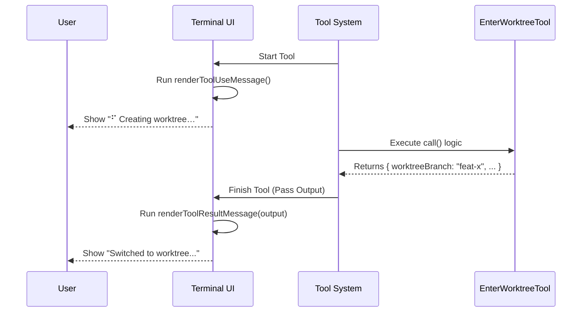

# Chapter 5: UI Presentation

In the previous chapter, [Prompt Strategy](04_prompt_strategy.md), we taught the AI **when** and **how** to use our tool. We gave it the logic to create worktrees and the rules to do so safely.

But there is one person we haven't talked to yet: **You** (the human user).

Welcome to **UI Presentation**.

## Why do we need UI Presentation?

Imagine you order a coffee at a cafe.
1.  **The Order:** You tell the cashier what you want (The Prompt).
2.  **The Kitchen:** The baristas make the coffee (The Logic).
3.  **The Problem:** If the cashier stares at you in total silence for 5 minutes while the coffee is being made, you might think, *"Did they hear me? Is the machine broken?"*

We need a display board. We need to tell the user:
*   *"I am working on it..."* (Progress)
*   *"Here is your coffee!"* (Result)

### Central Use Case

**The Scenario:** The AI decides to run `EnterWorktree`. This might take a few seconds to run `git` commands and switch directories.
**The Goal:**
1.  Immediately show a **"Creating worktree…"** message so the user knows the tool is active.
2.  Once finished, display a clean summary showing the **Branch Name** and the **File Path**.

## Key Concepts

We use a library called **Ink**. It allows us to build user interfaces for the command line using **React**. If you have ever built a website with components (like `<div>` or `<span>`), this will feel very familiar.

### 1. The "In-Progress" View
This is a simple message displayed while the `call()` function from [Worktree Session Logic](02_worktree_session_logic.md) is running. It should be short and active.

### 2. The "Result" View
This runs after the tool finishes successfully. It receives the data defined in our [Input Validation Schema](03_input_validation_schema.md) output (path, branch, etc.) and formats it into a pretty status box.

## Building the UI

Let's look at `UI.tsx`. This file contains two specific functions that our tool system looks for.

### Step 1: The Loading Message

When the AI starts the tool, we want immediate feedback.

```typescript
import * as React from 'react';

// This function renders while the tool is running
export function renderToolUseMessage(): React.ReactNode {
  return 'Creating worktree…';
}
```
*Explanation: We return a simple string. The system automatically adds a spinner icon next to this text, so the user sees "⠋ Creating worktree…".*

### Step 2: The Success Message

When the tool finishes, we want to show the details. We use `Box` (like a layout container) and `Text` (for styling words) from the `ink` library.

```typescript
import { Box, Text } from '../../ink.js';
import type { Output } from './EnterWorktreeTool.js';

// This function renders when the tool finishes successfully
export function renderToolResultMessage(output: Output) {
  return (
    <Box flexDirection="column">
      {/* Content goes here */}
    </Box>
  );
}
```
*Explanation: `output` contains the data returned by our logic (path and branch). `Box` acts like a `<div>` in HTML. `flexDirection="column"` stacks items on top of each other.*

### Step 3: Styling the Details

Now, let's put the actual data inside that Box. We want the branch name to pop out, and the path to be subtle.

```typescript
<Box flexDirection="column">
  <Text>
    Switched to worktree on branch{' '}
    <Text bold>{output.worktreeBranch}</Text>
  </Text>
  
  <Text dimColor>{output.worktreePath}</Text>
</Box>
```
*Explanation:*
*   `<Text bold>` makes the branch name bright and heavy.
*   `<Text dimColor>` makes the file path grey/subtle, so it's readable but doesn't distract from the main success message.

## Internal Implementation: Under the Hood

How does the system know when to switch from "Loading" to "Success"? Let's watch the flow.



### Connecting the UI to the Tool Definition

Finally, we need to link these functions back to our main definition file, `EnterWorktreeTool.ts`, which we created in [Tool Definition](01_tool_definition.md).

```typescript
// In EnterWorktreeTool.ts
import { 
  renderToolUseMessage, 
  renderToolResultMessage 
} from './UI.js'

export const EnterWorktreeTool = buildTool({
  name: ENTER_WORKTREE_TOOL_NAME,
  // ...
  renderToolUseMessage,
  renderToolResultMessage,
});
```
*Explanation: By importing and assigning these functions to the tool object, we tell the system: "Use these React components to represent this tool."*

## Summary

In this final chapter, we gave our tool a face. We learned:
1.  **Feedback is crucial:** Users need to know the tool is working.
2.  **React in Terminal:** We can use components like `Box` and `Text` to create pretty CLI outputs.
3.  **Visual Hierarchy:** We used `bold` for important info (Branch) and `dimColor` for technical info (Path).

### Project Completion!

Congratulations! You have built a complete, safe, and user-friendly AI tool.
1.  **[Tool Definition](01_tool_definition.md):** You created the identity.
2.  **[Worktree Session Logic](02_worktree_session_logic.md):** You built the engine.
3.  **[Input Validation Schema](03_input_validation_schema.md):** You added the security bouncer.
4.  **[Prompt Strategy](04_prompt_strategy.md):** You taught the AI the rules.
5.  **[UI Presentation](05_ui_presentation.md):** You made it look good for the user.

Your AI agent can now safely create isolated sandboxes to experiment with code, keeping your main branch clean and secure. Happy coding!

---

Generated by [Code IQ](https://github.com/adityasoni99/Code-IQ)