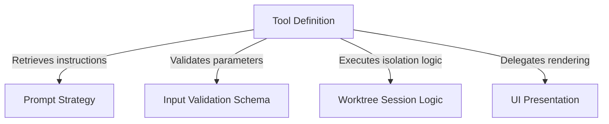

# Tutorial: EnterWorktreeTool

This project implements a tool that allows an AI agent to create and switch into an isolated **Git worktree** for safe, separate task execution. It orchestrates the process by validating user inputs, managing the filesystem state via specialized *session logic*, and displaying **bold** status updates to the user, ensuring the main working environment remains untouched.

## Chapters

1. [Tool Definition](01_tool_definition.md)
2. [Worktree Session Logic](02_worktree_session_logic.md)
3. [Input Validation Schema](03_input_validation_schema.md)
4. [Prompt Strategy](04_prompt_strategy.md)
5. [UI Presentation](05_ui_presentation.md)

---

Generated by [Code IQ](https://github.com/adityasoni99/Code-IQ)