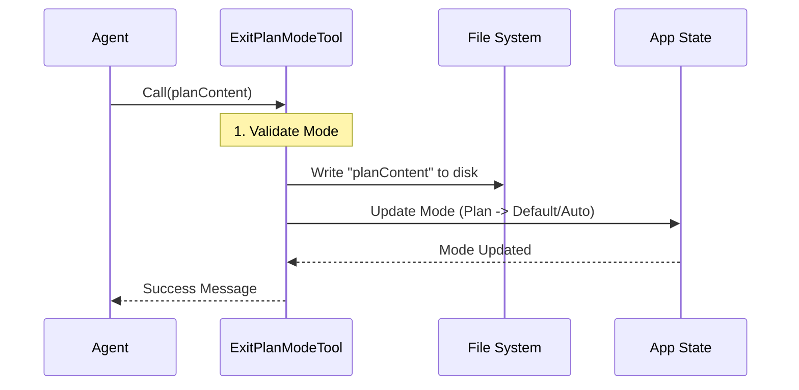

# Chapter 1: Tool Definition & Lifecycle

Welcome to the first chapter of the **ExitPlanMode** tutorial!

In this series, we will explore how an AI agent transitions from "thinking" to "doing." Specifically, we will look at the **ExitPlanModeTool**, a specific capability that allows the agent to finalize a plan and start writing code.

## The Problem: How does the Agent know when to stop planning?

Imagine you are brainstorming a project with a friend. You talk for hours about features and architecture. Eventually, one of you needs to say, **"Okay, we have a plan. Let's start building."**

Without a specific signal, an AI agent might stay in the "brainstorming" phase forever. We need a concrete mechanism—a specific tool—that the Agent can "pick up" and use to trigger this transition.

## The Solution: The "Skill Card" Analogy

Think of the **ExitPlanModeTool** like a **Skill Card** in a Role-Playing Game (RPG).

To create this card in our code, we use a concept called **Tool Definition**. A tool definition establishes:
1.  **Identity:** The name of the card (e.g., "Exit Plan Mode").
2.  **Cost:** What is required to play the card (Input Schema).
3.  **Rules:** When can this card be played? (Validators).
4.  **Effect:** What happens when the card is played? (Execution).

## 1. Establishing Identity (The Builder Pattern)

We don't create a messy class from scratch. Instead, we use a helper function called `buildTool`. This is a **Builder Pattern**—it takes a configuration object and constructs a standardized tool that the Agent knows how to use.

Here is how we define the tool's identity:

```typescript
// ExitPlanModeV2Tool.ts
import { buildTool } from '../../Tool.js'
import { EXIT_PLAN_MODE_V2_TOOL_NAME } from './constants.js'

export const ExitPlanModeV2Tool = buildTool({
  name: EXIT_PLAN_MODE_V2_TOOL_NAME,
  description: async () => 'Prompts the user to exit plan mode and start coding',
  // ... other properties
})
```
*   **Explanation:** We allow the `buildTool` function to do the heavy lifting. We just provide the `name` (which the AI sees) and a `description` (so the AI knows what the tool does).

## 2. Defining Inputs (The Zod Schema)

Every tool needs inputs. Think of this as a form the Agent must fill out to use the tool. We use a library called **Zod** to define the shape of this data.

For exiting plan mode, the Agent needs to submit the **plan** it just created.

```typescript
import { z } from 'zod/v4'
import { lazySchema } from '../../utils/lazySchema.js'

const inputSchema = lazySchema(() =>
  z.strictObject({
    // The agent usually reads the plan from disk, 
    // but the SDK sees this structure.
    plan: z.string().optional(),
    planFilePath: z.string().optional()
  })
)
```
*   **Explanation:** `z.strictObject` creates a validator. It ensures that if the Agent sends data, it matches exactly what we expect. `lazySchema` delays the creation of this rule until the tool is actually used, which improves startup performance.

## 3. The Lifecycle: Validation & Permissions

A tool isn't just about running code; it's about running code *safely* and at the *right time*. This is the **Tool Lifecycle**.

### Step A: The "Is Enabled" Check
Before the Agent even sees the tool, we check if it should exist in the current context.

```typescript
isEnabled() {
  // If the user is on Telegram/Discord (Channels), 
  // complex UI dialogs won't work, so we disable this tool.
  if (isChannelsActive()) {
    return false
  }
  return true
},
```

### Step B: The "Validate Input" Check
Once the Agent tries to use the tool, we check the rules. **You cannot exit Plan Mode if you aren't in Plan Mode.**

```typescript
async validateInput(_input, { getAppState }) {
  const mode = getAppState().toolPermissionContext.mode
  
  // If we are not in 'plan' mode, reject the tool use.
  if (mode !== 'plan') {
    return {
      result: false,
      message: 'You are not in plan mode.',
      errorCode: 1,
    }
  }
  return { result: true }
}
```

## 4. Execution: The `call` Method

If the identity is established, the inputs are valid, and the permissions are granted, the `call` method is executed. This is the "Effect" of our Skill Card.

Here is a high-level view of what happens when the Agent calls this tool:



### Writing the Plan to Disk
First, the tool saves the Agent's plan to a file so the user can read it later.

```typescript
async call(input, context) {
  const filePath = getPlanFilePath(context.agentId)
  const plan = input.plan || getPlan(context.agentId)

  if (plan && filePath) {
    // Save the plan text to a markdown file
    await writeFile(filePath, plan, 'utf-8')
  }
  // ... continued below
```

### Changing the State
Next, the tool performs the most critical action: switching the state.

```typescript
  // Update the application state to exit 'plan' mode
  context.setAppState(prev => {
    setHasExitedPlanMode(true) 
    
    // Logic to calculate the next mode (Default vs Auto)
    // is handled here.
    return {
      ...prev,
      toolPermissionContext: { ...prev.toolPermissionContext, mode: 'default' }
    }
  })
```
*   **Note:** The logic for exactly *how* the state transitions is complex. We will cover the details of restoring permissions and switching modes in [Plan Mode State Transition](02_plan_mode_state_transition.md).

## Summary

In this chapter, we learned that **ExitPlanModeTool** is defined using a builder pattern. It acts as a bridge between the planning phase and the coding phase.

1.  **Builder:** We use `buildTool` to define the "Skill Card."
2.  **Schema:** We use Zod to define valid inputs.
3.  **Lifecycle:** We use `validateInput` to ensure the tool is only used when appropriate (inside Plan Mode).
4.  **Execution:** We write the plan to disk and update the global state.

Now that we understand *how* the tool is defined, we need to understand the complex logic of changing the Agent's "mental state" from Planner to Coder.

[Next Chapter: Plan Mode State Transition](02_plan_mode_state_transition.md)

---

Generated by [Code IQ](https://github.com/adityasoni99/Code-IQ)