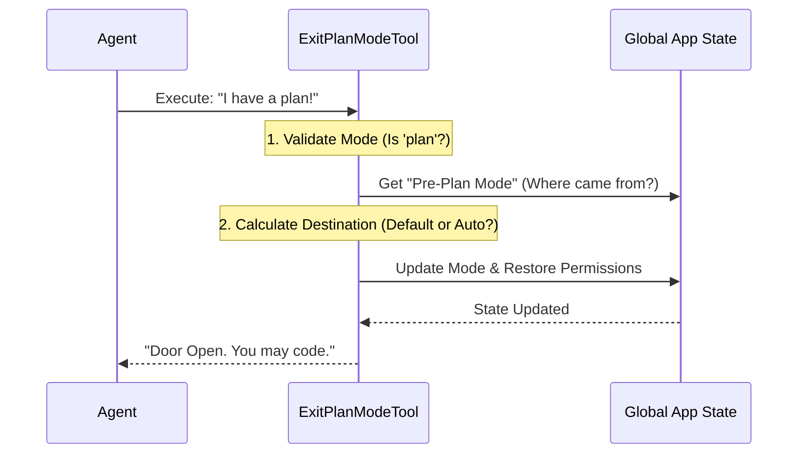

# Chapter 2: Plan Mode State Transition

Welcome back! In [Chapter 1: Tool Definition & Lifecycle](01_tool_definition___lifecycle.md), we built the "Skill Card" for our tool. We defined its name, its inputs, and when it is allowed to appear.

Now, we need to program the logic for the most critical moment: **The Transition.**

## The Concept: The Secure Airlock

Imagine your AI Agent is an astronaut on a spaceship.
1.  **Plan Mode** is the **Decontamination Chamber**. It is safe, isolated, and you are mostly just talking and thinking. You cannot touch the ship's engine (execute code) from here.
2.  **Coding Mode** (Default/Auto) is the **Laboratory**. Here, you can run commands, edit files, and build things.

The **ExitPlanModeTool** is the green button on the wall of the Decontamination Chamber.

When the Agent presses this button, two things must happen:
1.  **Validation:** The system checks, "Are you actually in the chamber?"
2.  **Transition:** The system opens the door, updates the Agent's location status, and unlocks the tools available in the Laboratory.

## 1. The Guard (Validation)

Before we change anything, we must verify the Agent is in the correct state. It makes no sense to "Exit Plan Mode" if you aren't in Plan Mode to begin with.

In the `call` method of our tool (or `validateInput`), we perform this check.

```typescript
// Inside ExitPlanModeV2Tool.ts
async validateInput(_input, { getAppState }) {
  // Get the current "mental state" of the application
  const mode = getAppState().toolPermissionContext.mode
  
  // The Guard Logic
  if (mode !== 'plan') {
    return {
      result: false,
      message: 'You are not in plan mode.',
      errorCode: 1,
    }
  }
  return { result: true }
}
```
*   **Why is this needed?** If an Agent is confused and tries to "Exit Plan Mode" while it is already coding, this prevents the logic from breaking or resetting permissions unexpectedly.

## 2. The Logic Flow

Before we look at the code, let's visualize what happens when the button is pressed.



## 3. Calculating the Destination

When the Agent exits the "Decontamination Chamber," where do they go? Usually, they go back to where they came from.

The application remembers the **Pre-Plan Mode**.
*   If the user was manually chatting, they return to **Default Mode**.
*   If the user was in **Auto Mode** (autonomous coding loop), they usually return to **Auto Mode**.

### The "Circuit Breaker"
There is a catch! If the user was in **Auto Mode**, but something dangerous happened (like a security trigger), the system might have engaged a "Circuit Breaker" (Gate).

Even if the Agent wants to go back to Auto Mode, the tool checks if the gate is locked. If it is, it forces a safe landing into Default Mode.

```typescript
// Simplified logic inside the tool
let restoreMode = prev.toolPermissionContext.prePlanMode ?? 'default'

// If trying to go back to Auto Mode, check the safety gate
if (restoreMode === 'auto' && !isAutoModeGateEnabled()) {
  // Safety Gate is closed! Force manual mode.
  restoreMode = 'default'
  
  // Notify the user why we downgraded them
  context.addNotification({ 
    text: 'Falling back to default mode for safety' 
  })
}
```

## 4. The Transition (Updating State)

This is the code that actually "opens the door." We use `context.setAppState` to atomically update the global state of the application.

This block looks intimidating in the source file, so let's break it down into its simplest parts.

### Step A: Marking the Exit
First, we tell the system the planning phase is officially over.

```typescript
context.setAppState(prev => {
  // Double check we are in plan mode to avoid race conditions
  if (prev.toolPermissionContext.mode !== 'plan') return prev
  
  // Set global flags used by the UI and other tools
  setHasExitedPlanMode(true)
  setNeedsPlanModeExitAttachment(true)
  
  // ... continued below
```

### Step B: Restoring Permissions
When you enter Plan Mode, "Dangerous Permissions" (like executing shell commands) are stripped away. Now, we must give them back.

```typescript
  // ... continued from above
  
  // Calculate which permissions to give back
  let baseContext = prev.toolPermissionContext

  // If we are NOT going to auto mode, give back the dangerous tools
  if (restoreMode !== 'auto' && prev.toolPermissionContext.strippedDangerousRules) {
     baseContext = restoreDangerousPermissions(baseContext)
  }
  
  // ... continued below
```

### Step C: Setting the New Mode
Finally, we return the new state object. This effectively teleports the Agent from "Plan" to "Default" (or "Auto").

```typescript
  // ... continued from above

  return {
    ...prev,
    toolPermissionContext: {
      ...baseContext,
      mode: restoreMode, // The new destination (e.g., 'default')
      prePlanMode: undefined, // Clear the history
    },
  }
})
```

## 5. What the Agent Sees

Once the state transition is complete, the tool returns a `tool_result`. This is the text the Agent reads to know it succeeded.

If the transition works, the Agent sees:
> "User has approved your plan. You can now start coding."

If the transition fails (validation error), the Agent sees:
> "You are not in plan mode."

## Summary

In this chapter, we learned how the **ExitPlanModeTool** acts as a secure airlock between the "Planning" and "Coding" phases.

1.  **Validation:** We ensure the Agent is currently in Plan Mode.
2.  **Calculation:** We determine if the Agent should return to Manual or Auto mode, checking safety gates along the way.
3.  **Execution:** We use `setAppState` to update the global mode and restore dangerous permissions.

However, sometimes you aren't working alone. What if you are a junior Agent and you need your Team Lead to approve the plan *before* you can open the airlock?

That brings us to the **Teammate Approval Protocol**.

[Next Chapter: Teammate Approval Protocol](03_teammate_approval_protocol.md)

---

Generated by [Code IQ](https://github.com/adityasoni99/Code-IQ)