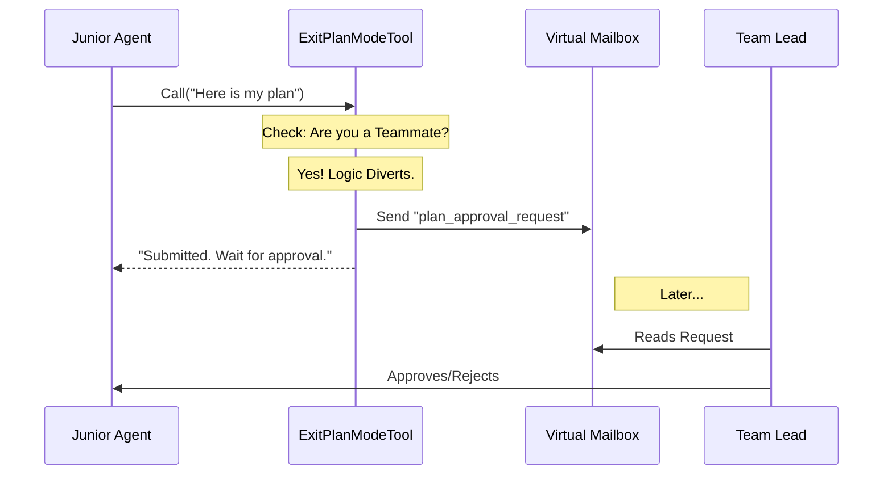

# Chapter 3: Teammate Approval Protocol

Welcome back! In the previous chapter, [Chapter 2: Plan Mode State Transition](02_plan_mode_state_transition.md), we learned how a solo Agent uses the **ExitPlanModeTool** to open the "airlock" and switch from planning to coding.

But what if the Agent isn't the captain of the ship?

## The Motivation: Freelancer vs. Corporate Employee

Let's use an analogy to understand the problem.

1.  **The Solo User (Freelancer):** You are your own boss. You write a plan, you like it, you start working immediately.
2.  **The Teammate (Corporate Employee):** You have a manager (the **Team Lead**). You write a plan, but you **cannot** break ground until your manager signs off on it.

If a Junior Developer Agent tries to start coding without approval, it might break the project. We need a protocol that intercepts the "Exit Plan Mode" request and redirects it to the manager instead of changing the state immediately.

This is the **Teammate Approval Protocol**.

## 1. The Workflow: "Put it in my Inbox"

When a Teammate calls `ExitPlanModeTool`, the tool detects their role. Instead of unlocking the "Coding Laboratory" (changing the mode), it packages the plan into a digital envelope and slides it into the Team Lead's virtual mailbox.

Here is the high-level flow:



## 2. The Check: `isTeammate()`

The first thing the tool does when called is check the identity of the caller. We use a helper function called `isTeammate()`.

If the Agent is working alone, we skip this entire chapter's logic. If they are a teammate, we enter the protocol.

```typescript
// Inside ExitPlanModeV2Tool.ts -> call()

// Check if this is a teammate that requires leader approval
if (isTeammate() && isPlanModeRequired()) {
  
  // STOP! Do not change mode yet.
  // Execute the approval protocol instead.
  return handleTeammateProtocol(context, plan, filePath)
}
```
*   **Explanation:** `isPlanModeRequired()` checks if the specific task configuration demands supervision. If yes, we divert the flow.

## 3. Creating the "Ticket" (Request ID)

In a bureaucracy, everything needs a tracking number. We generate a unique **Request ID**. This allows the Team Lead to say "Approved Ticket #123" later.

```typescript
const agentName = getAgentName()
const teamName = getTeamName()

// Generate a unique ticket number
const requestId = generateRequestId(
  'plan_approval', 
  formatAgentId(agentName, teamName)
)
```
*   **Explanation:** This ID links the specific plan file on disk to the message sitting in the Team Lead's inbox.

## 4. Packaging the Request

Next, we create the JSON object that represents the formal request. This is the "form" the employee submits.

```typescript
const approvalRequest = {
  type: 'plan_approval_request',
  from: agentName,
  timestamp: new Date().toISOString(),
  planFilePath: filePath, // Where the plan is on disk
  planContent: plan,      // The text of the plan
  requestId,
}
```
*   **Explanation:** We include the `planFilePath` so the Team Lead knows exactly which file to review.

## 5. Sending the Mail

Now we use the `writeToMailbox` utility. This is an internal communication bus that allows agents to send messages to each other without speaking out loud in the main chat.

```typescript
await writeToMailbox(
  'team-lead', // The recipient
  {
    from: agentName,
    text: jsonStringify(approvalRequest), // The payload
    timestamp: new Date().toISOString(),
  },
  teamName
)
```
*   **Explanation:** We address the message to `'team-lead'`. The system ensures this message appears in the Lead Agent's context.

## 6. The "Waiting Room" State

The Junior Agent has submitted the plan. Now what? They must wait.

We update the internal task state to `awaitingPlanApproval`. This is a special flag that prevents the agent from doing other major tasks until the block is removed.

```typescript
// Update task state to show awaiting approval
const agentTaskId = findInProcessTeammateTaskId(agentName, appState)

if (agentTaskId) {
  // Flag the agent as "Waiting"
  setAwaitingPlanApproval(agentTaskId, context.setAppState, true)
}
```

## 7. Informing the Agent (The Tool Result)

Finally, we must tell the Junior Agent what just happened. If we just returned "Success", they might try to start coding immediately.

We override the default output message to be very clear: **STOP AND WAIT.**

```typescript
// Inside mapToolResultToToolResultBlockParam

if (awaitingLeaderApproval) {
  return {
    type: 'tool_result',
    content: `Your plan has been submitted to the team lead.

    **What happens next:**
    1. Wait for the team lead to review your plan.
    2. Do NOT proceed until you receive approval.
    
    Request ID: ${requestId}`,
    tool_use_id: toolUseID,
  }
}
```
*   **Why is this important?** LLMs (Large Language Models) are eager to please. Unless you explicitly tell them "Stop and wait," they will often hallucinate an approval and keep working.

## Summary

In this chapter, we added a layer of bureaucracy—which is actually a good thing for safety!

1.  **Detection:** We checked if the user is a `Teammate`.
2.  **Packaging:** We bundled the plan into a `plan_approval_request`.
3.  **Delivery:** We sent it to the `team-lead` via a virtual mailbox.
4.  **Pause:** We told the agent to wait for a signature.

This concludes the logic and implementation of the tool. But how does the AI actually know *how* to use this tool properly? How do we ensure it writes a good plan before calling the tool?

That is the art of **Prompt Engineering**.

[Next Chapter: Prompt Engineering](04_prompt_engineering.md)

---

Generated by [Code IQ](https://github.com/adityasoni99/Code-IQ)