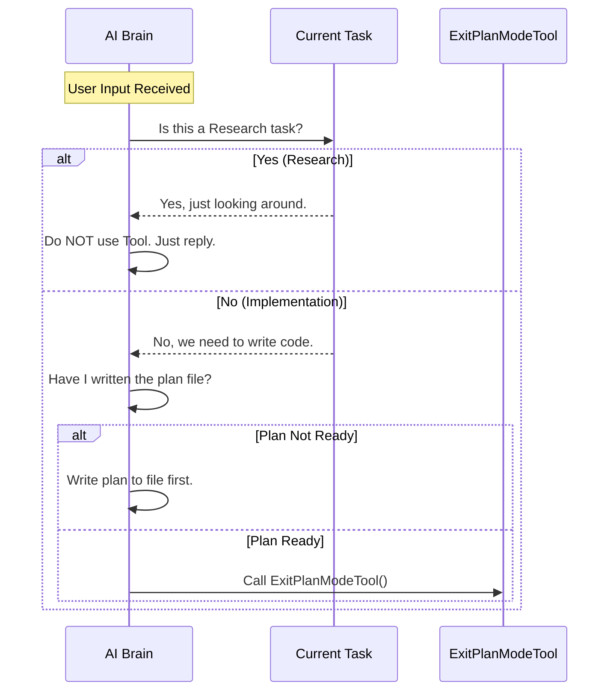

# Chapter 4: Prompt Engineering

Welcome back! In the previous chapter, [Chapter 3: Teammate Approval Protocol](03_teammate_approval_protocol.md), we added a layer of bureaucracy to ensure plans are approved by a human or a team lead.

We have built the **Tool** (the code), the **Logic** (the state transition), and the **Safety** (the approval protocol). But we are missing one critical piece: **Instruction.**

Just because a tool exists doesn't mean the AI knows *when* or *how* to use it. We need to teach it.

## The Motivation: The Director's Notes

Imagine you are a movie director. You hand an actor a script that says:
> **Action:** Walk through the door.

If you don't give context, the actor might walk through the door while the cameras are off, or while the set is still being built. You need to give them **Director's Notes**:
> "Only walk through this door when the scene is set, the lights are on, and you are ready to face the villain. Do not walk through it if you are just rehearsing."

In AI development, these notes are called **Prompt Engineering**. We write natural language instructions to tell the AI the "motivation" behind the tool.

## 1. Defining the Purpose

The `ExitPlanModeTool` is a signal. It signifies that the "Thinking Phase" is over and the "Coding Phase" is beginning.

If we don't explain this clearly, the AI might get confused. It might try to use this tool when:
*   It is just reading files (Research).
*   It wants to ask a question (Clarification).
*   It hasn't actually written a plan yet.

We need to set strict boundaries.

## 2. The Anatomy of a Tool Prompt

A good tool prompt usually has three parts:
1.  **Usage Instructions:** What does this tool actually do?
2.  **Constraints:** When should you *never* use this tool?
3.  **Examples (Few-Shot):** Concrete scenarios of correct and incorrect usage.

Let's look at how we build this string in our code.

### Part 1: Usage Instructions

First, we tell the AI exactly what the tool expects.

```typescript
// Inside prompt.ts
export const EXIT_PLAN_MODE_V2_TOOL_PROMPT = `
Use this tool when you are in plan mode and have finished writing your plan.

## How This Tool Works
- You should have already written your plan to the plan file
- This tool does NOT take the plan content as a parameter
- It signals that you're done planning and ready for review
`
```
*   **Explanation:** We clarify that the tool is a *trigger*. The AI doesn't need to copy-paste the plan into this tool; it just needs to push the button.

### Part 2: The "Research vs. Coding" Constraint

This is the most important instruction. We must distinguish between **Research** (looking around) and **Implementation** (building things).

```typescript
// Continued in prompt.ts...
`
## When to Use This Tool
IMPORTANT: Only use this tool when the task requires planning implementation steps.

For research tasks where you're gathering information, searching files, 
or trying to understand the codebase - do NOT use this tool.
`
```
*   **Why?** If the user asks, "How does the login system work?", the AI should just answer the question. It shouldn't create a coding plan and try to "Exit Plan Mode."

### Part 3: The "Don't Ask to Ask" Rule

A common mistake AI models make is being too polite. They might try to use a generic "Ask Question" tool to say, "I have finished my plan, is it okay?"

We need to tell the AI that `ExitPlanModeTool` **IS** the question.

```typescript
// Continued in prompt.ts...
`
## Before Using This Tool
Ensure your plan is complete and unambiguous.

**Important:** Do NOT use AskUserQuestion to ask "Is this plan okay?"
That is exactly what THIS tool does. 
ExitPlanMode inherently requests user approval.
`
```

## 3. Decision Logic (The AI's Internal Monologue)

When the AI reads these instructions, it forms a decision tree. Here is what we want the AI's internal thought process to look like:



## 4. Teaching by Example (Few-Shot Prompting)

The most effective way to teach an AI is by showing, not just telling. We provide specific examples of user inputs and whether the tool should be used.

### Example A: Research (Don't Use)

```typescript
// Continued in prompt.ts...
`
## Examples

1. Initial task: "Search for and understand the vim mode implementation"
   - Do not use the exit plan mode tool.
   - Reason: You are not planning implementation steps.
`
```

### Example B: Implementation (Do Use)

```typescript
// Continued in prompt.ts...
`
2. Initial task: "Help me implement yank mode for vim"
   - Use the exit plan mode tool.
   - Reason: You have finished planning the implementation steps.
`
```

## 5. Implementation Strategy

In our codebase, we don't hardcode this massive string inside the tool definition file ([Chapter 1](01_tool_definition___lifecycle.md)). That would make the code hard to read.

Instead, we keep prompts in a dedicated file (`prompt.ts`) and import them.

```typescript
// ExitPlanModeV2Tool.ts (The Definition)
import { EXIT_PLAN_MODE_V2_TOOL_PROMPT } from './prompt.js'

export const ExitPlanModeV2Tool = buildTool({
  name: 'exit_plan_mode_v2',
  // We inject the instructions into the description
  description: async () => EXIT_PLAN_MODE_V2_TOOL_PROMPT,
  // ... rest of the tool definition
})
```

## Summary

In this chapter, we learned that code logic isn't enough. We must use **Prompt Engineering** to give the AI the context it needs to behave correctly.

1.  **Direct:** We told the AI exactly what the tool does (signals completion).
2.  **Constrain:** We forbade the use of the tool during research tasks.
3.  **Clarify:** We explained that this tool *replaces* asking "Is this plan okay?"
4.  **Demonstrate:** We provided examples of "Do" and "Don't".

Now the Agent knows *how* (Code), *when* (State), and *why* (Prompt) to use the tool.

The final piece of the puzzle is the human user. When the Agent exits plan mode, how does the user see what is happening? It shouldn't just be a wall of text.

[Next Chapter: CLI UI Rendering](05_cli_ui_rendering.md)

---

Generated by [Code IQ](https://github.com/adityasoni99/Code-IQ)