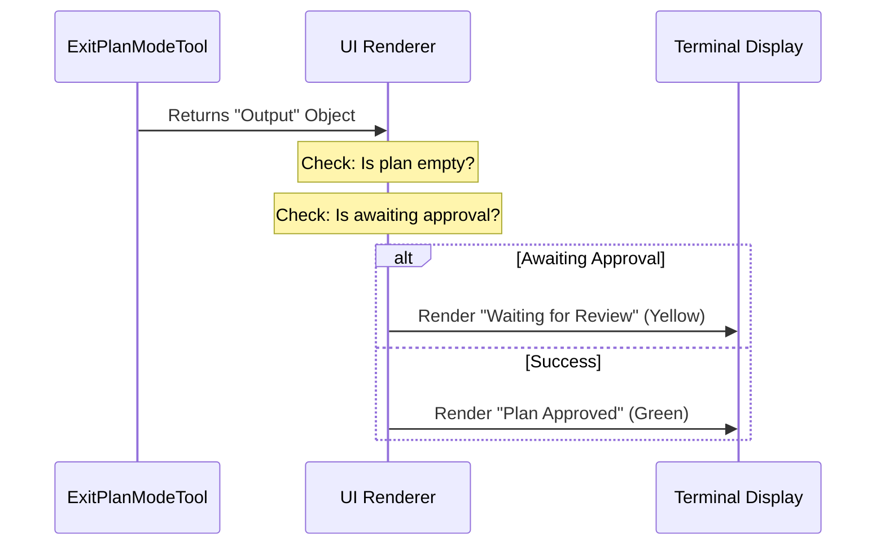

# Chapter 5: CLI UI Rendering

Welcome to the final chapter of the **ExitPlanModeTool** tutorial!

In the previous chapter, [Chapter 4: Prompt Engineering](04_prompt_engineering.md), we taught the AI exactly how and when to use the tool using natural language instructions.

Now, we have a fully functional tool. The AI can write a plan, submit it, and change its internal state. But there is one problem: **The User Experience.**

When the AI "presses the button," what does the human user actually see in their terminal?

## The Problem: The "Black Box"

Imagine driving a car where the dashboard is covered with duct tape. You press the "Sport Mode" button. The engine might have changed, but without a light on the dashboard, you aren't sure.

In our CLI (Command Line Interface), we don't want to just dump raw JSON text like `{ "success": true }`. We want a beautiful, readable status update.

## The Solution: The "Dashboard" Analogy

This chapter is about building the **Dashboard**. We use a library called **Ink** (which is React for the terminal) to render different visual components based on what happened inside the tool.

We need to display two distinct states:
1.  **Green Light (Success):** "Plan Approved. I am starting to code."
2.  **Yellow Light (Waiting):** "Plan Submitted. Waiting for Team Lead."

## 1. React in the Terminal?

Usually, React is used for websites. However, we use it to render text in the terminal.
*   Instead of `<div />`, we use `<Box />`.
*   Instead of `<span />`, we use `<Text />`.

This allows us to create structured, colored, and dynamic layouts inside the black command prompt window.

## 2. The Logic Flow

Before we look at the code, let's look at how the data flows from the tool to the screen.



## 3. Implementation: The `renderToolResultMessage`

We define a function that takes the `output` from our tool and decides what to show.

### Step A: Handling Empty Plans
Sometimes, things go wrong, or the plan is empty. We want a simple, quiet message.

```typescript
// UI.tsx
const { plan, filePath } = output
const isEmpty = !plan || plan.trim() === ''

if (isEmpty) {
  return (
    <Box flexDirection="column" marginTop={1}>
      <Box flexDirection="row">
        <Text color={getModeColor('plan')}>{BLACK_CIRCLE}</Text>
        <Text> Exited plan mode</Text>
      </Box>
    </Box>
  )
}
```
*   **Explanation:** We check `isEmpty`. If true, we return a simple `<Box>` with a colored circle and the text "Exited plan mode". This confirms the action without clutter.

### Step B: The "Waiting" State (Teammate Protocol)
Remember [Chapter 3: Teammate Approval Protocol](03_teammate_approval_protocol.md)? If the user is a junior agent, they might be waiting for approval. We need to clearly show this status.

```typescript
// UI.tsx
const awaitingLeaderApproval = output.awaitingLeaderApproval

if (awaitingLeaderApproval) {
  return (
    <Box flexDirection="column" marginTop={1}>
        <Box flexDirection="row">
          <Text color={getModeColor('plan')}>{BLACK_CIRCLE}</Text>
          <Text> Plan submitted for team lead approval</Text>
        </Box>
        {/* ... See next block for details ... */}
    </Box>
  )
}
```
*   **Explanation:** We check the flag `awaitingLeaderApproval`. If true, the headline changes to "Plan submitted..." instead of "Approved".

### Step C: Adding Detail to the Waiting State
Inside that previous `if` block, we add more details so the user knows *why* nothing is happening.

```typescript
// Inside the waiting block...
<MessageResponse>
  <Box flexDirection="column">
    {filePath && <Text dimColor>Plan file: {displayPath}</Text>}
    <Text dimColor>Waiting for team lead to review and approve...</Text>
  </Box>
</MessageResponse>
```
*   **Explanation:** We use `dimColor` (grey text) to show secondary information. This tells the user, "Sit tight, your manager has the file."

### Step D: The "Success" State (Green Light)
If the plan wasn't empty, and we aren't waiting for a boss, then the user (or the tool) has successfully approved the plan. This is the default return.

```typescript
// UI.tsx (The default return)
return (
  <Box flexDirection="column" marginTop={1}>
    <Box flexDirection="row">
      <Text color={getModeColor('plan')}>{BLACK_CIRCLE}</Text>
      <Text> User approved Claude&apos;s plan</Text>
    </Box>
    {/* ... Plan details below ... */}
  </Box>
)
```
*   **Explanation:** This is the happy path! The text confirms that the plan is approved.

### Step E: Rendering the Plan Content
Finally, strictly for the Success state, we show the user the plan that was just finalized, so they have a record of it.

```typescript
// Inside the success block...
<MessageResponse>
  <Box flexDirection="column">
    {filePath && (
       <Text dimColor>Plan saved to: {displayPath}</Text>
    )}
    <Markdown>{plan}</Markdown>
  </Box>
</MessageResponse>
```
*   **Explanation:** We use a `<Markdown>` component to render the actual text of the plan. This makes headers bold and lists bulleted, right inside the terminal.

## Summary

In this final chapter, we learned how to visualize the result of our tool.

1.  **Ink:** We used React components to build a UI in the terminal.
2.  **Conditional Rendering:** We checked flags like `isEmpty` and `awaitingLeaderApproval` to decide which "Dashboard Light" to turn on.
3.  **User Feedback:** We ensured the user always knows the state of the Agent—whether it's working, waiting, or done.

## Series Conclusion

Congratulations! You have walked through the entire lifecycle of creating a complex AI capability.

1.  **[Tool Definition](01_tool_definition___lifecycle.md):** You created the "Skill Card."
2.  **[State Transition](02_plan_mode_state_transition.md):** You managed the logic of switching from "Thinking" to "Coding."
3.  **[Teammate Protocol](03_teammate_approval_protocol.md):** You added safety checks for team environments.
4.  **[Prompt Engineering](04_prompt_engineering.md):** You taught the AI how to use your tool.
5.  **[CLI UI Rendering](05_cli_ui_rendering.md):** You built a beautiful interface for the user.

You now understand the anatomy of an advanced AI Agent tool!

---

Generated by [Code IQ](https://github.com/adityasoni99/Code-IQ)