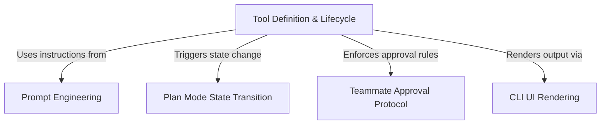

# Tutorial: ExitPlanModeTool

The **ExitPlanModeTool** acts as a formal checkpoint in the agent's workflow, signaling the transition from a **Planning** phase to a **Coding** phase. It ensures a plan is saved to disk and orchestrates the workflow based on the agent's role: solo users exit immediately, while *Teammate* agents must submit their plan for a **Team Lead's** approval. The tool integrates strict prompt instructions and dynamic UI feedback to manage this critical lifecycle event.

## Chapters

1. [Tool Definition & Lifecycle](01_tool_definition___lifecycle.md)
2. [Plan Mode State Transition](02_plan_mode_state_transition.md)
3. [Teammate Approval Protocol](03_teammate_approval_protocol.md)
4. [Prompt Engineering](04_prompt_engineering.md)
5. [CLI UI Rendering](05_cli_ui_rendering.md)

---

Generated by [Code IQ](https://github.com/adityasoni99/Code-IQ)