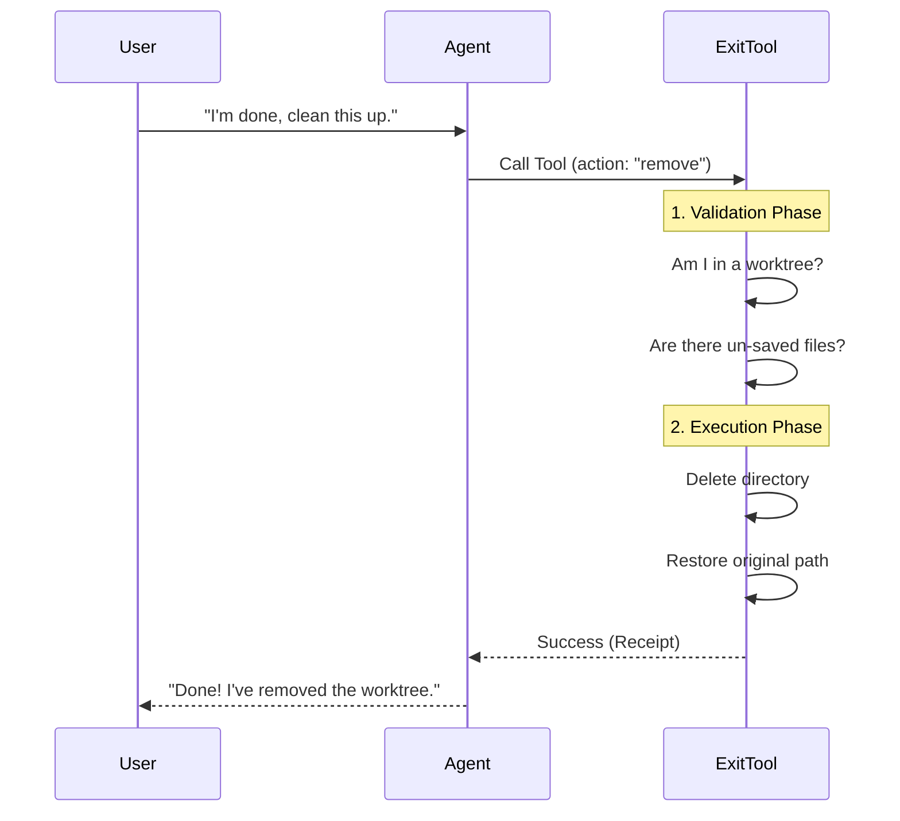

# Chapter 1: Tool Definition & Interface

Welcome to the **ExitWorktreeTool** tutorial! This is the first chapter in our journey to build a robust tool that helps AI agents manage temporary coding environments.

## The Problem: Leaving the Sandbox
Imagine you check into a hotel room (a temporary worktree) to get some work done. You unpack your bags, rearrange the furniture, and write some code. When you are finished, you can't just teleport out; you need a formal process to check out.

If you just "leave" (change directories):
1.  The room (files) is still there, cluttering the hotel.
2.  You might have left valuable items (uncommitted code) behind.
3.  The front desk (the system state) thinks you are still in the room.

**ExitWorktree** is the "Check Out" button. It handles the logistics of leaving a temporary workspace safely and restoring the original environment.

## Central Use Case
**User:** "I've fixed the bug. Please delete this temporary environment and go back to the main project."

**AI's Goal:**
1.  Verify it is actually *in* a temporary environment.
2.  Ensure no work is lost (unless explicitly told to discard it).
3.  Delete the temporary directory.
4.  Switch the "brain" (context) back to the main project.

## The Instruction Manual (System Prompt)
Before the AI can use a tool, it needs to know **what** the tool does and **when** to use it. We define this in a prompt string.

Think of this as the API documentation written specifically for the AI.

```typescript
// prompt.ts
export function getExitWorktreeToolPrompt(): string {
  return `Exit a worktree session created by EnterWorktree...
  
  ## When to Use
  - The user explicitly asks to "exit", "go back", or end the session.
  - Do NOT call this proactively — only when the user asks.
  
  ## Behavior
  - Restores the session's working directory to the original one.
  - Clears caches so the session state reflects the original directory.`
}
```
*Explanation:* This text tells the AI: "Don't press this button unless the user tells you to. When you do press it, I will take you back to where you started."

## The Controls (Input Schema)
To use the tool, the AI must fill out a specific "form" (the parameters). We define this using `zod`.

There are two main knobs the AI can turn:

1.  **Action:** Do we `keep` the files or `remove` them?
2.  **Discard Changes:** If we `remove`, are we allowed to delete unsaved work?

```typescript
// ExitWorktreeTool.ts (Simplified)
const inputSchema = lazySchema(() =>
  z.strictObject({
    // The main switch: Keep the folder or delete it?
    action: z.enum(['keep', 'remove']), 
    
    // The safety override key
    discard_changes: z.boolean().optional()
  })
)
```

**Example Inputs:**

1.  **Safe Cleanup:** `{ "action": "remove" }`
    *   *Effect:* Tries to delete the folder. If you have uncommitted work, it fails (safety first!).
2.  **Force Cleanup:** `{ "action": "remove", "discard_changes": true }`
    *   *Effect:* Deletes the folder even if you have unsaved changes.
3.  **Save for Later:** `{ "action": "keep" }`
    *   *Effect:* Leaves the folder on the disk but switches the AI back to the main project.

## The Receipt (Output Schema)
After the tool runs, it hands a "receipt" back to the AI. This helps the AI confirm to the user that the job is done.

```typescript
// ExitWorktreeTool.ts (Simplified)
const outputSchema = lazySchema(() =>
  z.object({
    action: z.enum(['keep', 'remove']),
    originalCwd: z.string(), // Where we ended up
    worktreePath: z.string(), // What we just left
    message: z.string(), // A human-readable summary
  })
)
```

## How It Works: The Flow
Here is a high-level view of what happens when the AI presses the button.



## Implementation Walkthrough

We wrap all this logic in a `Tool` definition. This bundles the name, description, schemas, and the executable code into one package.

### 1. Defining the Tool
We use a builder function to create the tool object.

```typescript
// ExitWorktreeTool.ts
export const ExitWorktreeTool = buildTool({
  name: 'ExitWorktree', 
  userFacingName: () => 'Exiting worktree',
  
  // Hooking up the parts we defined earlier
  inputSchema: inputSchema,
  outputSchema: outputSchema,
  async prompt() { return getExitWorktreeToolPrompt() },
  
  // ... continued below
```
*Explanation:* This registers the tool with the system, attaching the "Manual" (prompt) and the "Form" (schemas).

### 2. Validation (The Bouncer)
Before doing any real work, we check if the request is valid. This prevents the tool from crashing or deleting the wrong things.

```typescript
  // Inside buildTool ...
  async validateInput(input) {
    const session = getCurrentWorktreeSession()
    
    // Guard: Are we actually in a worktree session?
    if (!session) {
      return { result: false, message: 'No active worktree session.' }
    }
    
    // We will cover safety checks in Chapter 2!
    return { result: true }
  },
```
*Explanation:* If `getCurrentWorktreeSession()` returns null, it means we aren't in a temporary mode. The tool effectively says, "I can't exit a room I haven't entered."

### 3. Execution (The Action)
This is where the magic happens. The `call` function is triggered only if validation passes.

```typescript
  // Inside buildTool ...
  async call(input) {
    const session = getCurrentWorktreeSession()
    
    // Case 1: Keep the files, just leave the room
    if (input.action === 'keep') {
      await keepWorktree() // Helper to update state
      restoreSessionToOriginalCwd(session.originalCwd, ...)
      return { data: { /* ... success receipt ... */ } }
    }

    // Case 2: Remove everything (Action: remove)
    await cleanupWorktree() // Helper to delete files
    restoreSessionToOriginalCwd(session.originalCwd, ...)
    
    return { data: { /* ... success receipt ... */ } }
  }
});
```
*Explanation:* 
1.  It checks the `action` input.
2.  It calls helper functions (`keepWorktree` or `cleanupWorktree`) to handle the file system.
3.  It calls `restoreSessionToOriginalCwd` to reset the AI's internal state (like its current working directory).

## Summary
We have created the **Interface** for our tool.
1.  **Prompt:** Teaches the AI it's for leaving sessions.
2.  **Input:** Allows choosing between `keep` or `remove`.
3.  **Output:** Confirms the location change.
4.  **Logic:** Simple switching between keeping or deleting files.

However, there is a dangerous gap in our logic above. **What if the user asks to "remove", but they forgot to save their code?** Our current simple logic might delete it all!

In the next chapter, we will build the protection mechanism to prevent this data loss.

[Next Chapter: Safety Gates (Change Detection)](02_safety_gates__change_detection_.md)

---

Generated by [Code IQ](https://github.com/adityasoni99/Code-IQ)