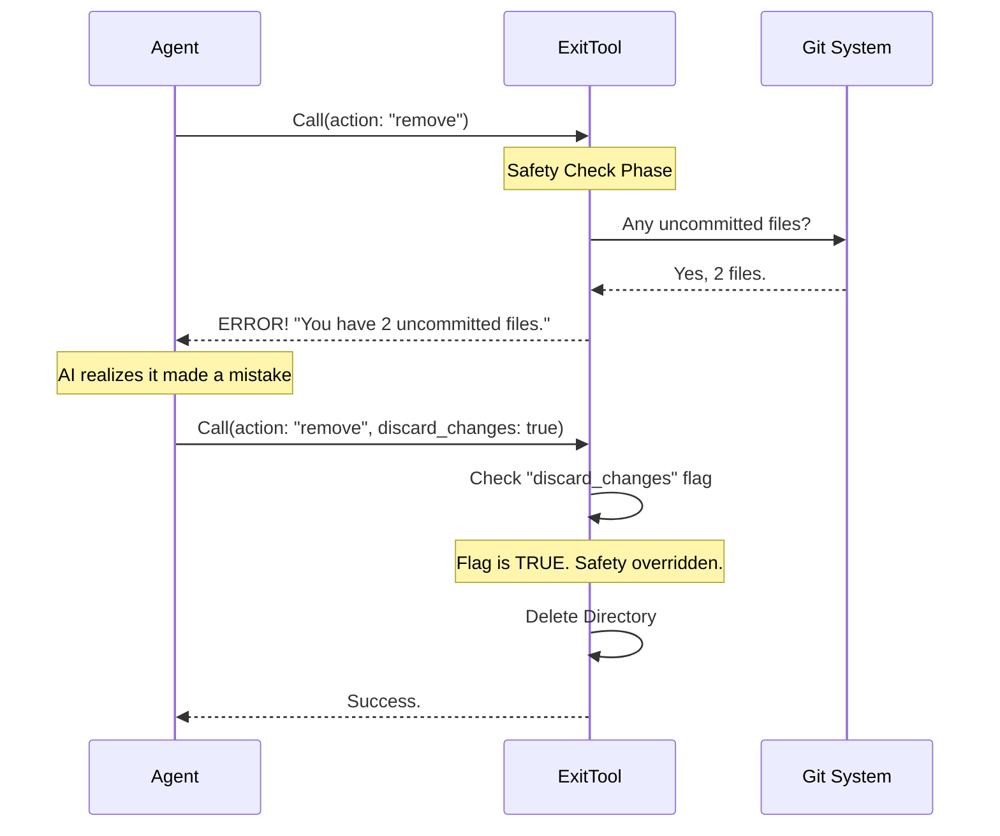

# Chapter 2: Safety Gates (Change Detection)

In [Chapter 1: Tool Definition & Interface](01_tool_definition___interface.md), we built the basic structure of the `ExitWorktreeTool`. We created a switch that lets an AI agent deciding between keeping a workspace or deleting it.

However, we ended with a cliffhanger: **What happens if the AI tries to delete a workspace that contains unsaved code?**

In this chapter, we will build the "Safety Gate." This is the logic that screams, *"Wait! You haven't saved your work!"* before allowing a deletion to happen.

## The Problem: Accidental Data Loss
Imagine you are writing an essay in a word processor. You type for three hours, then accidentally click the "Close" button.

*   **Bad Software:** Closes immediately. Your work is gone.
*   **Good Software:** Shows a popup: *"You have unsaved changes. Do you want to save them?"*

Our AI tool needs to be "Good Software." Since `ExitWorktreeTool` has the power to delete files (using `action: "remove"`), we must ensure it doesn't delete valuable, uncommitted work by accident.

## Central Use Case
**User:** "I'm done with this task. Clean up."
**AI:** *Checks the folder.* "Wait, I wrote a file called `fix.ts` but I forgot to commit it to Git. I shouldn't delete this yet."

**Goal:**
1.  Check if there are modified files (Dirty State).
2.  Check if there are new commits that haven't been merged (Unmerged State).
3.  Block the removal and warn the user.

## Concept 1: "Git Status" (The File Check)
To know if files have been changed, we ask Git. Specifically, we use the command `git status`.

If you run `git status` in a terminal, it gives you a human-readable message. For our tool, we use `git status --porcelain`. This gives us a simple, machine-readable list of changed files.

**Example Code:**
```typescript
// Helper: Check for uncommitted files
const status = await execFileNoThrow('git', [
  '-C', worktreePath, 
  'status', 
  '--porcelain' // Output is simple text, one line per file
])

// If the output isn't empty, we have "dirty" files
const changedFilesCount = count(
  status.stdout.split('\n'), 
  line => line.trim() !== ''
)
```
*Explanation:* We run the command. If `changedFilesCount` is greater than 0, the user has "unsaved changes."

## Concept 2: "Rev List" (The Commit Check)
Sometimes the AI *has* committed the files, but those commits are stuck in the temporary branch. If we delete the branch now, those commits are lost.

We compare the current state (`HEAD`) against where we started (`originalHeadCommit`).

**Example Code:**
```typescript
// Helper: Check for new commits since we started
const revList = await execFileNoThrow('git', [
  '-C', worktreePath,
  'rev-list', 
  '--count', 
  `${originalHeadCommit}..HEAD` // Count commits between Start and Now
])

const newCommitsCount = parseInt(revList.stdout.trim(), 10) || 0
```
*Explanation:* If `newCommitsCount` is greater than 0, it means the AI made progress but hasn't pushed or merged it yet.

## The Logic Flow
Here is how the tool decides whether to allow the `remove` action.



## Implementation: The `validateInput` Method

In the `Tool` definition, we use the `validateInput` function to act as the gatekeeper. This runs *before* the tool actually executes any deletion.

We will look at the implementation in `ExitWorktreeTool.ts`.

### Step 1: Establish the Session
First, we ensure we are actually inside a worktree session. We can't exit a session that doesn't exist.

```typescript
// ExitWorktreeTool.ts
async validateInput(input) {
  const session = getCurrentWorktreeSession()
  
  if (!session) {
    return { 
      result: false, 
      message: 'No active worktree session.' 
    }
  }
  // ... continued below
```

### Step 2: The Safety Gate
This is the core logic. If the user wants to `remove` the worktree, but has **not** explicitly said `discard_changes: true`, we must run our checks.

```typescript
  // ... inside validateInput
  if (input.action === 'remove' && !input.discard_changes) {
    
    // Use our helper to count files and commits
    const summary = await countWorktreeChanges(
      session.worktreePath,
      session.originalHeadCommit
    )

    // ... continued below
```
*Explanation:* We only check if `discard_changes` is false. If it's true, the AI is effectively saying "I know what I'm doing, delete it anyway."

### Step 3: Blocking the Exit
If our helper returns a number greater than zero, we block the tool execution.

```typescript
    // ... inside validateInput
    const { changedFiles, commits } = summary

    if (changedFiles > 0 || commits > 0) {
      return {
        result: false, // STOP! Do not proceed.
        message: `Worktree has ${changedFiles} files and ${commits} commits. Refusing to remove.`,
        errorCode: 2,
      }
    }
  } // End if
  
  return { result: true } // Safe to proceed
}
```
*Explanation:* By returning `result: false`, the tool fails gracefully. It sends the `message` back to the AI. The AI can then read this message and decide what to do (e.g., commit the files, or ask the user for permission to discard).

## Handling the "Force Quit"
So, how does the user actually delete the worktree if they *want* to throw away the files?

They use the optional parameter we defined in Chapter 1:
`{ "action": "remove", "discard_changes": true }`

When `discard_changes` is `true`, our code in `validateInput` skips the safety checks entirely.

## Summary
In this chapter, we added a critical layer of defense:
1.  **Detection:** We used Git to count uncommitted files and unmerged commits.
2.  **Protection:** We used `validateInput` to block the `remove` action if changes exist.
3.  **Override:** We honored the `discard_changes` flag to allow intentional cleanup.

Now that our tool is safe to use, we can move on to the actual mechanics of "cleaning up." How do we actually delete the directory and—more importantly—how do we put the AI back where it started?

[Next Chapter: Worktree Lifecycle Actions](03_worktree_lifecycle_actions.md)

---

Generated by [Code IQ](https://github.com/adityasoni99/Code-IQ)