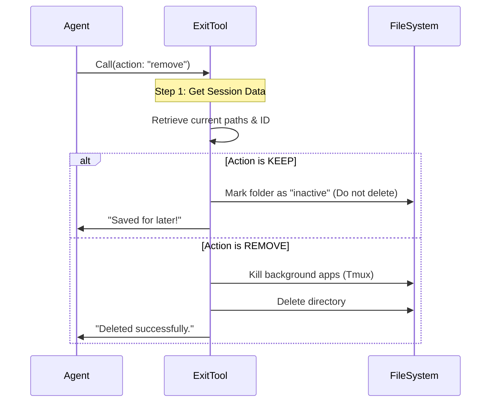

# Chapter 3: Worktree Lifecycle Actions

In [Chapter 2: Safety Gates (Change Detection)](02_safety_gates__change_detection_.md), we built the security guard for our tool. We ensured that if the user tries to delete unsaved work, the tool yells "Stop!" and refuses to proceed.

Now that we have passed the security checks, we are ready to actually execute the command. This brings us to the **Worktree Lifecycle Actions**.

## The Fork in the Road

The `ExitWorktreeTool` isn't just a "Delete" button. It is a decision point. When you finish a temporary coding session, you generally want to do one of two things:

1.  **Throw it away:** You fixed the bug, merged the code, and you want the temporary folder gone.
2.  **Save it for later:** You are halfway done, but you need to switch tasks. You want the folder to stay on the disk so you can come back later.

### Analogy: Closing a Draft Email
Think of this like closing an email composer window:
*   **Action: Remove** is like clicking **"Delete Draft"**. The text is gone, the window closes.
*   **Action: Keep** is like clicking **"Save as Draft"**. The window closes, but the email is saved in your "Drafts" folder to finish later.

## Central Use Case
**User:** "I've finished the hotfix. Delete the temporary environment."
**AI Input:** `{ "action": "remove", "discard_changes": true }`

**Goal:**
1.  Identify the current temporary session.
2.  Delete the physical directory (since the action is `remove`).
3.  Kill any background processes (like Tmux) running in that folder.
4.  Return a success message.

## Logic Flow
Here is how the code decides which path to take inside the tool's `call` method.



## Implementation Walkthrough

We implement this logic inside the `call` function of our tool. Let's break it down into three simple steps.

### Step 1: Grabbing the Context
Before we can delete or keep anything, we need to know *what* we are dealing with. We grab the current session object.

```typescript
// Inside ExitWorktreeTool.ts -> call()

const session = getCurrentWorktreeSession()

// We need to know where we started (originalCwd)
// and where we are now (worktreePath)
const {
  originalCwd,
  worktreePath,
  tmuxSessionName
} = session
```
*Explanation:* We pull the details of the "Hotel Room" (the worktree) we are currently staying in.

### Step 2: Path A - The "Keep" Action
If the AI sent `{ "action": "keep" }`, we want to detach from the session but leave the files alone.

```typescript
if (input.action === 'keep') {
  // 1. Mark the session as inactive in our internal database
  await keepWorktree()
  
  // 2. Switch the AI's internal state back to the main project
  restoreSessionToOriginalCwd(originalCwd, ...)

  // 3. Send the receipt
  return { 
    data: { 
      message: `Exited. Work preserved at ${worktreePath}.` 
    } 
  }
}
```
*Explanation:*
*   `keepWorktree()`: This helper function tells the system, "The user is no longer *in* this worktree, but don't delete the folder."
*   `restoreSessionToOriginalCwd`: We will cover this in detail in the next chapter, but essentially, it teleports the AI's "brain" back to the main project.

### Step 3: Path B - The "Remove" Action
If the AI sent `{ "action": "remove" }`, we want to destroy the temporary environment.

```typescript
// Action is 'remove'

// 1. Kill any background terminal sessions (Tmux)
if (tmuxSessionName) {
  await killTmuxSession(tmuxSessionName)
}

// 2. Physically delete the directory and the git branch
await cleanupWorktree()

// 3. Switch the AI's internal state back
restoreSessionToOriginalCwd(originalCwd, ...)

return { 
  data: { 
    message: `Exited and removed worktree at ${worktreePath}.` 
  } 
}
```
*Explanation:*
*   `killTmuxSession`: If the AI opened a terminal window inside the worktree, we close it so it doesn't get stuck in a "zombie" state.
*   `cleanupWorktree()`: This is the destructive command. It runs `rm -rf` on the folder and `git worktree remove` on the branch.

## Internal Implementation: The Helper Functions
You might notice we called `cleanupWorktree()` and `keepWorktree()`. These are imported helper functions. While we won't show their full code here, it is helpful to know what they do conceptually:

1.  **`cleanupWorktree()`**:
    *   Runs `git worktree remove <path> --force`.
    *   This deletes the folder and tells Git to forget about that temporary branch.
2.  **`keepWorktree()`**:
    *   Does **not** touch the file system.
    *   It only updates the tool's internal memory (`sessionStorage`) to say `currentSession = null`.

## Reporting the Results (The Output)
Finally, after taking action, the tool returns a detailed object (a "Receipt"). This helps the AI understand what just happened so it can tell the user.

**Example Output for "Remove":**
```json
{
  "action": "remove",
  "originalCwd": "/Users/me/main-project",
  "discardedFiles": 2,
  "message": "Exited and removed worktree. Discarded 2 uncommitted files. Session is now back in /Users/me/main-project."
}
```

This message is critical. It confirms to the user that the cleanup they requested actually happened.

## Summary
In this chapter, we implemented the physical actions of the tool:
1.  **Keep:** We detach from the session but leave files on the disk.
2.  **Remove:** We kill background processes and delete the directory.

We have successfully managed the **Filesystem** (the physical files). However, the AI Agent has an internal "Brain" (memory caches, prompt context, and file history) that still thinks it is working inside the temporary folder.

If we don't reset the AI's brain, it might try to read files that no longer exist!

In the next chapter, we will learn how to perform "Context Restoration" to safely transport the AI's mind back to the original project.

[Next Chapter: Session Context Restoration](04_session_context_restoration.md)

---

Generated by [Code IQ](https://github.com/adityasoni99/Code-IQ)