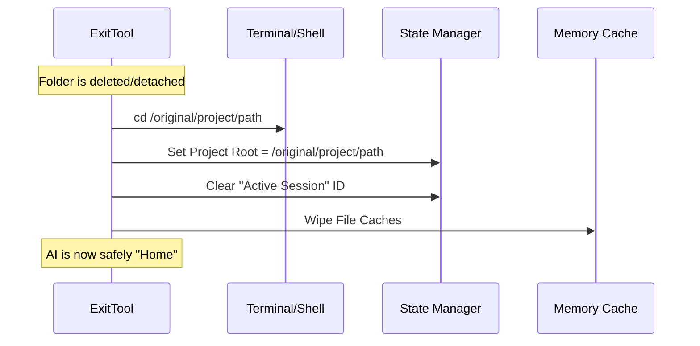

# Chapter 4: Session Context Restoration

In the previous chapter, [Chapter 3: Worktree Lifecycle Actions](03_worktree_lifecycle_actions.md), we learned how to physically delete or preserve the temporary folder on the hard drive.

However, we have created a dangerous situation. Imagine this scenario:
1.  The AI is standing in a room (the worktree).
2.  The AI presses a button to blow up the room (delete the folder).
3.  The room vanishes.
4.  **The AI is now floating in a void.**

If the AI tries to run a command like `ls` (list files) immediately after deleting the folder, the system will crash because the directory it thinks it is in no longer exists.

In this chapter, we will build the **Session Context Restoration** logic. This acts like a "teleport" button that instantly transports the AI's mind back to the original project *after* the temporary work is done.

## The Problem: The Phantom Limb
When our AI works in a temporary environment, it builds up "state" (memory):
1.  **Location:** "I am currently in `/tmp/fix-bug-123`."
2.  **Cache:** "I remember the contents of `file.ts` in this folder."
3.  **Plans:** "I have a plan file specifically for this bug fix."

If we simply delete the folder but don't wipe this memory, the AI might hallucinate. It might try to read a file it remembers, only to find it gone.

## Central Use Case
**User:** "Exit the session and go back to main."
**Action:** The tool deletes the folder.
**Goal:**
1.  Change the terminal's directory back to the original project.
2.  Reset the "Project Root" variable.
3.  Wipe the short-term memory (caches) so the AI sees the fresh state of the original project.

## The Restoration Flow
This process happens automatically right after the folder is handled.



## Implementation: The `restoreSessionToOriginalCwd` Function

We encapsulate all this cleanup logic in a single helper function. Let's build it step-by-step.

### Step 1: Teleporting the Shell (CWD)
The most urgent task is to move the current working directory (CWD).

```typescript
// ExitWorktreeTool.ts
function restoreSessionToOriginalCwd(originalCwd: string, ...) {
  // 1. Physically change the process directory
  setCwd(originalCwd)
  
  // 2. Update the internal tracker for "Original CWD"
  setOriginalCwd(originalCwd)
  
  // ... continued below
}
```
*Explanation:* `setCwd` performs the actual `cd` command. `setOriginalCwd` updates the variable that tracks where the user started the application.

### Step 2: Resetting the Project Root
The "Project Root" is the main folder of the repository. When entering a worktree, the root changes to the temporary folder. We must change it back.

```typescript
// ... inside restoreSessionToOriginalCwd
  if (projectRootIsWorktree) {
    // Restore the root to the main project
    setProjectRoot(originalCwd)
    
    // Reload configuration hooks (like pre-commit hooks)
    // from the main project
    updateHooksConfigSnapshot()
  }
```
*Explanation:* We check `projectRootIsWorktree` (a boolean passed in). If the root was indeed pointing to the temp folder, we reset it. We also reload any project-specific settings (Hooks).

### Step 3: Wiping the Memory
Finally, we clear the AI's caches. This forces the AI to re-read files from the disk the next time it needs them, ensuring it sees the *original* project files, not the *temporary* ones.

```typescript
// ... inside restoreSessionToOriginalCwd
  // 1. Forget the active session ID
  saveWorktreeState(null)
  
  // 2. Clear prompt sections specific to the session
  clearSystemPromptSections()
  
  // 3. Clear file content caches and plan caches
  clearMemoryFileCaches()
  getPlansDirectory.cache.clear?.()
}
```
*Explanation:* 
*   `saveWorktreeState(null)`: Tells the system "We are no longer in a session."
*   `clearMemoryFileCaches()`: Discards all "remembered" file contents.

## Using the Function
Now, let's look at how we call this function from the main tool logic (which we built in [Chapter 3](03_worktree_lifecycle_actions.md)).

We need to calculate `projectRootIsWorktree` before we run the restoration.

```typescript
// Inside call() method

// Did the "Project Root" point to our worktree?
// If getProjectRoot() == getOriginalCwd(), usually yes.
const projectRootIsWorktree = getProjectRoot() === getOriginalCwd()

// ... perform delete or keep action ...

// Now run the restoration
restoreSessionToOriginalCwd(originalCwd, projectRootIsWorktree)
```

## Why is `projectRootIsWorktree` needed?
You might ask: *Why don't we always just set the project root to the original CWD?*

**The Edge Case:**
Imagine the user started the tool in `/Users/me/projects/my-app`.
Then, *before* entering the worktree, they `cd`'d into `/Users/me/Desktop`.
Then they entered a worktree.

When they exit, we want to put them back in `/Users/me/projects/my-app` (where the tool started), but we don't want to accidentally mess up the "Project Root" if it was set to something complex.

The boolean check ensures we only reset the root if the root *was* the temporary session. It preserves "Stable Project Identity."

## Summary
In this chapter, we handled the invisible but critical part of exiting a session: **State Management.**

1.  **CWD:** We moved the AI's feet back to the original folder.
2.  **Root:** We reset the project definition.
3.  **Cache:** We wiped the memory to prevent "ghost" file reads.

At this point, the tool has fully executed. The files are handled, and the AI is back home. The only thing left to do is tell the user (and the AI) that we succeeded.

How do we format a nice message that explains exactly what happened?

[Next Chapter: UI Rendering](05_ui_rendering.md)

---

Generated by [Code IQ](https://github.com/adityasoni99/Code-IQ)