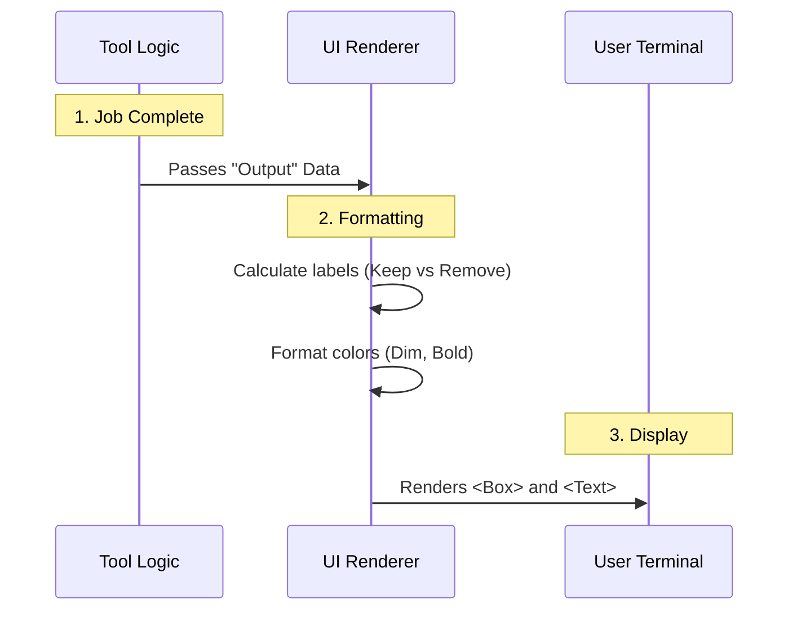

# Chapter 5: UI Rendering

In [Chapter 4: Session Context Restoration](04_session_context_restoration.md), we successfully "teleported" the AI agent back to its home directory after deleting the temporary workspace.

The hard work is done. The files are gone, and the system state is clean. But there is one problem: **The user is staring at a blank screen.**

Did it work? Did it fail? Where are we now?

In this final chapter, we will build the **UI Rendering** layer. This is the "face" of our tool—the part that tells the human user exactly what happened in a nice, readable format.

## The Problem: Raw Data vs. Human Information
The internal logic of our tool produces raw data (JSON objects).

**What the Tool sees:**
```json
{
  "action": "remove",
  "worktreeBranch": "fix-login-bug",
  "originalCwd": "/Users/alice/projects/main-app"
}
```

**What the User wants to see:**
> Removed worktree (branch **fix-login-bug**)
> Returned to /Users/alice/projects/main-app

We need a translator to turn that raw JSON into that formatted text.

## Central Use Case
**Scenario:** The tool has just finished running `cleanupWorktree()`.
**Input:** The `Output` object containing the results.
**Goal:** Display a green success message indicating the worktree was removed and the specific branch name associated with it.

## Concept: React in the Terminal (Ink)
To build our UI, we use a library called **Ink**.

If you have used **React** for building websites, you know it uses HTML tags like `<div>` and `<span>`.
**Ink** is React for the command line. Instead of `<div>`, we use `<Box>`. Instead of `<span>`, we use `<Text>`.

It allows us to build terminal interfaces using components!

## The Flow: From Data to Pixels

Here is how the data travels from the tool's logic to the user's screen.



## Implementation: The `UI.tsx` File

We separate our UI code into a specific file, usually `UI.tsx`. Let's walk through how we build the success message.

### Step 1: Importing the Building Blocks
First, we need the components from Ink to build our layout.

```typescript
import * as React from 'react';
import { Box, Text } from '../../ink.js';
import type { Output } from './ExitWorktreeTool.js';
```
*Explanation:* We import `Box` (for layout/containers) and `Text` (for styling words) from our internal Ink wrapper. We also import the `Output` type so we know what data to expect.

### Step 2: The "Loading" Message
Before the tool finishes, it runs for a few seconds. We need a simple message to tell the user "I'm working on it."

```typescript
export function renderToolUseMessage(): React.ReactNode {
  return 'Exiting worktree…';
}
```
*Explanation:* When the tool starts, the system calls this function. It simply prints "Exiting worktree..." to the console so the user knows the AI hasn't frozen.

### Step 3: The "Result" Message
This is the main event. This function receives the `output` data from our tool (the return value we defined in Chapter 3).

We define a function called `renderToolResultMessage`.

#### Part A: Deciding the Label
First, we check what action we performed. Did we delete the folder or save it?

```typescript
export function renderToolResultMessage(output: Output) {
  // logic...
  const actionLabel = output.action === 'keep' 
    ? 'Kept worktree' 
    : 'Removed worktree';
    
  // ... continued below
```
*Explanation:* If `action` is "keep", we prepare the text "Kept worktree". Otherwise, "Removed worktree".

#### Part B: Rendering the Component
Now we return the "JSX" (the UI structure). We use a `<Box>` to stack lines of text vertically.

```typescript
  return (
    <Box flexDirection="column">
      <Text>
        {actionLabel}
        {/* Branch name logic goes here */}
      </Text>
      <Text dimColor>Returned to {output.originalCwd}</Text>
    </Box>
  );
}
```
*Explanation:*
1.  `<Box flexDirection="column">`: Creates a container that stacks items top-to-bottom.
2.  `<Text>{actionLabel}</Text>`: Prints "Removed worktree".
3.  `<Text dimColor>`: Prints the path where we landed, but makes it gray (dim) so it doesn't distract from the main message.

#### Part C: Conditional Formatting (The Branch Name)
Sometimes, we know the name of the git branch we just left. If we know it, we want to show it. If we don't, we should hide that part.

```typescript
// Inside the first <Text> tag...
{output.worktreeBranch ? (
  <>
    {' '}
    (branch <Text bold>{output.worktreeBranch}</Text>)
  </>
) : null}
```
*Explanation:*
*   `output.worktreeBranch ? ... : null`: This is a conditional check. "Do we have a branch name?"
*   If **Yes**: Render `(branch name)`. We wrap the name in `<Text bold>` to make it pop out.
*   If **No**: Render `null` (nothing).

## Putting it All Together

When the `ExitWorktreeTool` finishes, the system automatically calls `renderToolResultMessage` with the result.

**Scenario 1: Removal**
*   Input: `{ action: 'remove', worktreeBranch: 'fix-bug', originalCwd: '/main' }`
*   **Result on Screen:**
    ```text
    Removed worktree (branch fix-bug)
    Returned to /main
    ```

**Scenario 2: Keeping**
*   Input: `{ action: 'keep', worktreeBranch: null, originalCwd: '/main' }`
*   **Result on Screen:**
    ```text
    Kept worktree
    Returned to /main
    ```

## Tutorial Conclusion

Congratulations! You have built the complete **ExitWorktreeTool**.

Let's review our journey:
1.  **[Chapter 1](01_tool_definition___interface.md):** We defined the tool's inputs (`action`) and interface.
2.  **[Chapter 2](02_safety_gates__change_detection_.md):** We built safety gates to prevent accidental data loss.
3.  **[Chapter 3](03_worktree_lifecycle_actions.md):** We implemented the logic to physically delete or keep the folder.
4.  **[Chapter 4](04_session_context_restoration.md):** We managed the AI's state to "teleport" it back to the original project.
5.  **[Chapter 5](05_ui_rendering.md):** We created a user-friendly UI to display the results.

You now have a robust, safe, and user-friendly tool that allows AI agents to create and destroy temporary coding environments effortlessly. This "Sandbox" approach keeps the main project clean and allows for confident experimentation!

---

Generated by [Code IQ](https://github.com/adityasoni99/Code-IQ)