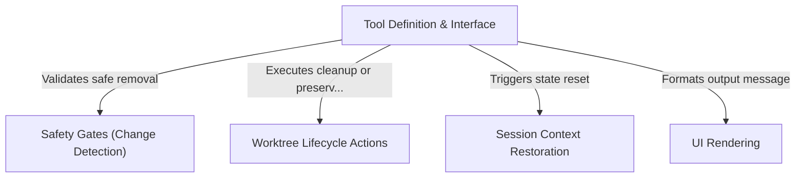

# Tutorial: ExitWorktreeTool

The **ExitWorktreeTool** provides a safe mechanism for an AI agent to conclude a temporary coding session ("worktree"). It allows the agent to either **keep** the changes for later or **remove** them cleanly, while automatically detecting uncommitted work to prevent accidental data loss. Once the session ends, it strictly *restores* the environment (working directory and caches) to its original state.

## Chapters

1. [Tool Definition & Interface](01_tool_definition___interface.md)
2. [Safety Gates (Change Detection)](02_safety_gates__change_detection_.md)
3. [Worktree Lifecycle Actions](03_worktree_lifecycle_actions.md)
4. [Session Context Restoration](04_session_context_restoration.md)
5. [UI Rendering](05_ui_rendering.md)

---

Generated by [Code IQ](https://github.com/adityasoni99/Code-IQ)