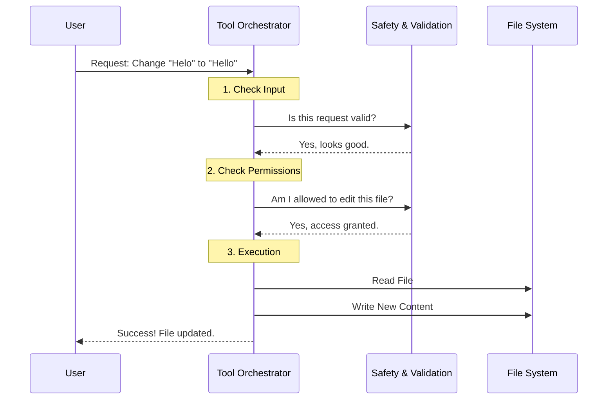

# Chapter 1: Tool Orchestrator

Welcome to the **FileEditTool** project! If you are new here, you are in the right place. We are going to explore how an AI agent actually changes code in your files without breaking things.

## The Motivation: The "General Contractor"

Imagine you are building a house. You don't just grab a hammer and start smashing walls. You need a **General Contractor**.

The General Contractor doesn't necessarily hammer every nail personally. Instead, they:
1.  **Review the Work Order:** "What exactly do you want to change?"
2.  **Check Permits:** "Do we have the legal right to build here?"
3.  **Ensure Safety:** "Is the site safe? Are there hidden electrical wires?"
4.  **Manage the Workers:** Tell the specialists to do the work.
5.  **Report Back:** "The job is done, here is the result."

In our code, the **Tool Orchestrator** (`FileEditTool`) is that General Contractor. It is the central controller that manages the entire lifecycle of a file edit.

### The Use Case

Throughout this tutorial, we will solve a simple problem: **Fixing a typo.**

*   **File:** `hello.txt`
*   **Current Content:** "Helo world"
*   **Goal:** Change it to "Hello world"

Without an Orchestrator, the program might crash if the file doesn't exist, or it might accidentally overwrite your passwords. The Orchestrator prevents this.

---

## High-Level Flow

Before we look at code, let's see what happens when an edit is requested.



## Key Concepts

The Orchestrator is built using the `ToolDef` interface. This is a contract that says, "I am a tool, and here is how you talk to me."

### 1. Defining the Tool
The Orchestrator starts by defining its identity. This tells the AI system (like Claude) that this tool exists and what it does.

```typescript
// File: FileEditTool.ts
// This builds the "General Contractor" object
export const FileEditTool = buildTool({
  name: 'Edit', 
  // A hint for the AI to know when to use this
  searchHint: 'modify file contents in place',
  
  // Describes what the tool does in plain English
  async description() {
    return 'A tool for editing files'
  },
  // ... configuration continues
})
```
*Explanation:* We use `buildTool` to wrap all our logic into one neat package. The `name` and `description` are like the sign on the Contractor's truck.

### 2. The Blueprint (Input Schema)
The Orchestrator needs to know *exactly* what to do. It can't guess. It relies on a strict **Schema**.

```typescript
// File: FileEditTool.ts
// Linking the schema to the tool
get inputSchema() {
  // Returns the strict structure required (path, old_string, new_string)
  // We will cover the details of this in Chapter 2!
  return inputSchema()
},
```
*Explanation:* This points to the Data Contract. If the input doesn't match the rules (e.g., missing a file path), the Orchestrator rejects it immediately.
*   *Learn more in [Data Contracts & Schemas](02_data_contracts___schemas.md).*

### 3. The Safety Inspection (Validation)
Before doing any work, the Orchestrator calls the `validateInput` method. This is where we ensure we aren't about to do something dangerous, like editing a file that is too massive (which could crash the memory).

```typescript
// File: FileEditTool.ts
async validateInput(input, toolUseContext) {
  const { file_path, old_string, new_string } = input
  
  // 1. Check if the change is actually a change
  if (old_string === new_string) {
    return { result: false, message: 'No changes to make.' }
  }

  // 2. Check if file is too big (Safety First!)
  // ... (Code that checks file size against MAX_EDIT_FILE_SIZE) ...

  return { result: true } // Green light!
}
```
*Explanation:* This function runs *before* the main logic. If it returns `result: false`, the job stops, and an error is sent back.
*   *Learn more in [Safety & Validation Layer](04_safety___validation_layer.md).*

### 4. Doing the Job (Execution)
If validation passes, the `call` function is triggered. This is where the Orchestrator coordinates the actual work.

```typescript
// File: FileEditTool.ts
async call(input, context, _, parentMessage) {
  const { file_path, old_string, new_string } = input
  
  // 1. Read the current file from disk
  // We use a helper function to get content, encoding, etc.
  const { content } = readFileForEdit(file_path)

  // 2. Calculate the "Patch" (The difference between old and new)
  // This logic is delegated to the Patch Engine (Chapter 5)
  const { updatedFile } = getPatchForEdit({
    fileContents: content,
    oldString: old_string,
    newString: new_string,
  })

  // 3. Write the new content back to disk
  writeTextContent(file_path, updatedFile)
  
  return { data: { filePath: file_path, status: 'success' } }
}
```
*Explanation:*
1.  **Read:** It grabs the file content.
2.  **Patch:** It doesn't modify the text itself; it asks a utility function (`getPatchForEdit`) to calculate the new file content.
3.  **Write:** It saves the new content to the hard drive.

*   *Learn how text is found in [Intelligent String Matching](03_intelligent_string_matching.md).*
*   *Learn how the patch is created in [Patch Engine & Text Transformation](05_patch_engine___text_transformation.md).*

## Summary

The **Tool Orchestrator** (`FileEditTool`) is the wrapper that holds everything together. It:
1.  **Defines** who it is (`buildTool`).
2.  **Validates** that the work is safe (`validateInput`).
3.  **Executes** the work by coordinating reading, patching, and writing (`call`).

It ensures that we never edit a file blindly. It is the responsible adult in the room!

---

**Next Step:** Now that we know who is in charge, we need to understand exactly *what* information passes between the User and the Orchestrator.

[Next Chapter: Data Contracts & Schemas](02_data_contracts___schemas.md)

---

Generated by [Code IQ](https://github.com/adityasoni99/Code-IQ)