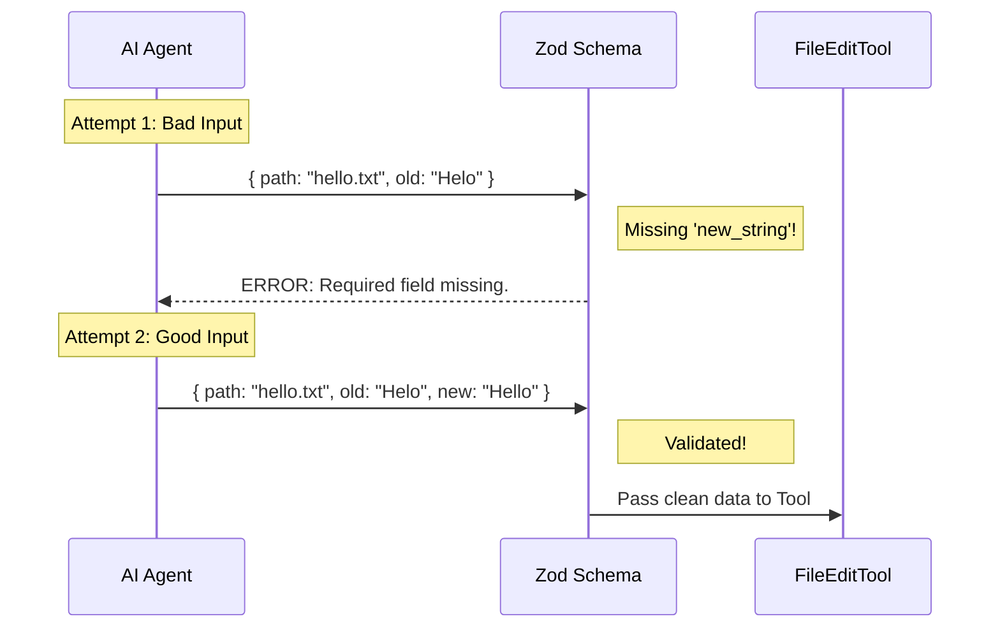

# Chapter 2: Data Contracts & Schemas

In the previous chapter, [Tool Orchestrator](01_tool_orchestrator.md), we introduced the **FileEditTool** as our "General Contractor." But a contractor cannot build a house based on a vague feeling. They need a blueprint.

In this chapter, we explore how we enforce strict rules on what data comes in and goes out of our tool.

## The Problem: "Fix the thing" is not enough

Imagine you are at a restaurant.
*   **Vague Order:** "Bring me food." (The waiter is confused. Soup? Salad? Steak?)
*   **Strict Order:** "I want the #4 Burger, medium-rare, with no pickles."

Large Language Models (like Claude or GPT) are very smart, but they can be vague. If we ask the AI to "fix the typo," it might try to send us:
1.  Just the filename.
2.  The whole new file content (too big!).
3.  Or maybe it formats the request as a poem.

We cannot write code that handles infinite possibilities. We need a **Contract**.

### The Use Case
We are still fixing `hello.txt`.
*   **Desired Change:** Replace "Helo" with "Hello".

To make this happen safely, we need a rigid form that the AI **must** fill out. It must provide:
1.  Where is the file? (`file_path`)
2.  What is the error? (`old_string`)
3.  What is the fix? (`new_string`)

If any of these are missing or wrong (e.g., `file_path` is a number instead of text), we must reject it immediately.

---

## Concept: The Zod "Bouncer"

To enforce this contract, we use a library called **Zod**. Think of Zod as a bouncer at a club. It stands at the door of our function.

*   **You:** "Here is a number: 42."
*   **Zod:** "Sorry, the list says `file_path` must be a STRING. Access denied."

This ensures that inside our actual logic, we never have to worry about weird data types.

---

## The Input Schema (The Blueprint)

Let's look at how we define this contract in `types.ts`. We use `z.object` to define the shape of the data.

### Step 1: Defining the Essentials
We need three strings to perform an edit.

```typescript
// File: types.ts
import { z } from 'zod/v4'

// Define the shape of valid input
const basicSchema = z.object({
  file_path: z.string(),
  old_string: z.string(),
  new_string: z.string(),
})
```
*Explanation:* This tells our program: "I expect an object with exactly these three keys, and they all must be text strings."

### Step 2: Adding Descriptions (Hints for the AI)
The Schema isn't just for validation; it's also documentation. We use `.describe()` to tell the AI *what* to put in those fields.

```typescript
// File: types.ts
z.strictObject({
  file_path: z.string()
    .describe('The absolute path to the file to modify'),
    
  old_string: z.string()
    .describe('The text to replace'),
    
  new_string: z.string()
    .describe('The text to replace it with'),
})
```
*Explanation:* When the AI asks "How do I use this tool?", it reads these descriptions. It's like the label on a form field. `strictObject` means "Do not send me any extra fields I didn't ask for."

### Step 3: Handling Options (The "Replace All" Switch)
Sometimes we want to replace every instance of a typo, not just the first one. This is optional.

```typescript
// File: types.ts
// import { semanticBoolean } ... 

// Inside the object definition:
replace_all: semanticBoolean(
  z.boolean().default(false).optional()
).describe('Replace all occurrences (default false)'),
```
*Explanation:*
*   `optional()`: The AI doesn't *have* to provide this.
*   `default(false)`: If the AI doesn't say anything, we assume `false`.
*   `semanticBoolean`: This is a special helper. AI sometimes says "true" (string) instead of `true` (boolean). This helper fixes that automatically.

---

## The "Gatekeeper" Flow

Before any code edits code, the data flows through this schema.



This automatic rejection is crucial. It protects the [Tool Orchestrator](01_tool_orchestrator.md) from crashing due to bad inputs.

---

## The Output Schema (The Receipt)

Contracts work both ways. When the tool finishes, it returns an object confirming what happened. This helps the AI understand the result of its action.

```typescript
// File: types.ts
const outputSchema = lazySchema(() =>
  z.object({
    filePath: z.string(),
    oldString: z.string(),
    newString: z.string(),
    // Did we actually change anything?
    userModified: z.boolean(),
  }),
)
```
*Explanation:* This guarantees that our tool always replies in a format the AI expects.

### The "Structured Patch"
One of the most important parts of the output is the **Diff** (what lines changed).

```typescript
// File: types.ts
structuredPatch: z
  .array(hunkSchema())
  .describe('Diff patch showing the changes'),
```
*Explanation:* Instead of just saying "Done," we return a visual representation of the change (like you see in GitHub Pull Requests). We will learn how to generate this visual in [User Interface & Diff Visualization](06_user_interface___diff_visualization.md).

---

## Internal Implementation: Typescript Magic

Because we use Zod, we don't need to manually write TypeScript interfaces. Zod can generate them for us! This prevents our code definitions from drifting apart from our runtime validation.

```typescript
// File: types.ts
// Automatically create a TypeScript type from the Zod rules
export type FileEditInput = z.output<typeof inputSchema>

// Now we can use this type in our functions:
// function doEdit(args: FileEditInput) { ... }
```
*Explanation:* `z.output` extracts the Typescript shape. If we update the Zod definition (e.g., adding a new field), our TypeScript types update automatically.

---

## Summary

In this chapter, we learned that **Data Contracts (Schemas)** are the blueprints of our tool.

1.  They act as a **Bouncer**, rejecting bad inputs before they reach the logic.
2.  They act as **Documentation**, telling the AI exactly what arguments to provide.
3.  They define the **Receipt**, ensuring consistent output.

We have defined *what* data we accept (`old_string` and `new_string`). But... text is tricky. What if the file has "Helo" with a capital H, but the AI searched for "helo"?

To handle this, we need to locate that string intelligently.

[Next Chapter: Intelligent String Matching](03_intelligent_string_matching.md)

---

Generated by [Code IQ](https://github.com/adityasoni99/Code-IQ)