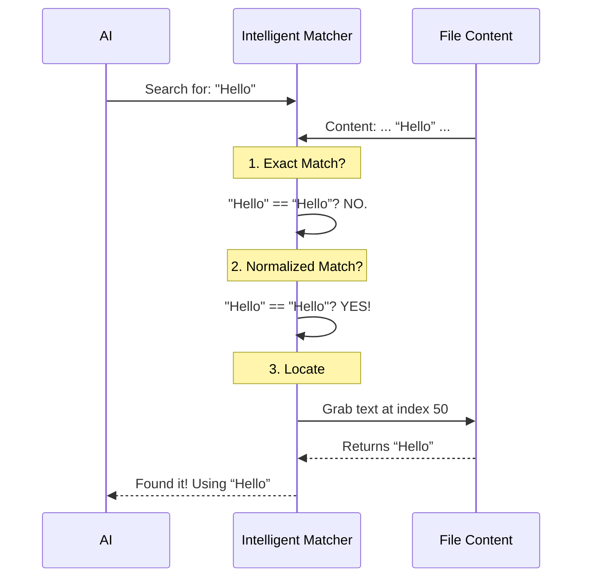

# Chapter 3: Intelligent String Matching

In the previous chapter, [Data Contracts & Schemas](02_data_contracts___schemas.md), we ensured that the AI sends us data in the correct *shape* (e.g., providing a `file_path` and `old_string`).

However, there is a subtle problem. Even if the data is structured correctly, the *content* might not match byte-for-byte.

## The Motivation: The "Exact Match" Problem

Computers are notoriously pedantic. If you ask a standard program to find text, it looks for an **exact** match.

### The Use Case
Imagine a file `story.txt` containing a sentence with "fancy" typography (often created by word processors):

> “Hello world”

Notice those quotes? They are **curly quotes** (`“` and `”`).

Now, imagine the AI tries to edit this. Most coding AIs output standard **straight quotes** (`"`).
*   **File Content:** `“Hello world”`
*   **AI Search:** `"Hello world"`

If we use a standard search, the computer says: **"String not found."** The edit fails, the AI gets confused, and the user gets frustrated.

## The Solution: The Diplomatic Translator

We need a layer of logic that acts as a **Diplomat**. It understands that when the AI says `"Hello"`, it *means* the text in the file, even if the file says `“Hello”`.

We call this **Intelligent String Matching**. It handles three main discrepancies:
1.  **Quote Normalization:** Curly vs. Straight quotes.
2.  **Whitespace:** Invisible trailing spaces.
3.  **Sanitization:** Reconstructing tags hidden by the AI provider.

---

## Concept 1: Quote Normalization

This is the most common issue. We solve it by "normalizing" both sides of the conversation before comparing them.

### How it works
When searching, we temporarily convert everything to straight quotes.

```typescript
// File: utils.ts
export function normalizeQuotes(str: string): string {
  // Replace curly quotes with straight ones
  return str
    .replaceAll('‘', "'") // Left single
    .replaceAll('’', "'") // Right single
    .replaceAll('“', '"') // Left double
    .replaceAll('”', '"') // Right double
}
```
*Explanation:* This function strips away the stylistic differences. It makes `“Hello”` looks like `"Hello"`.

### The Search Logic (`findActualString`)
We don't just want to know *if* it matches; we need to find the **original text** in the file so we can replace it.

```typescript
// File: utils.ts
export function findActualString(fileContent, searchString) {
  // 1. Try an exact match first (Fastest)
  if (fileContent.includes(searchString)) {
    return searchString
  }

  // 2. If that fails, normalize BOTH
  const normFile = normalizeQuotes(fileContent)
  const normSearch = normalizeQuotes(searchString)
  
  // ... continued below
```

If we find a match in the normalized version, we calculate where it is.

```typescript
  // ... continued 
  const index = normFile.indexOf(normSearch)
  
  if (index !== -1) {
    // 3. Extract the ORIGINAL curly-quoted text from the file
    return fileContent.substring(index, index + searchString.length)
  }
  return null
}
```
*Explanation:* This is the magic trick. We match using the "simple" version, but we return the "fancy" version from the file. This ensures our [Patch Engine](05_patch_engine___text_transformation.md) knows exactly what bytes to delete.

---

## Concept 2: Style Preservation

If the AI replaces `“Hello”` (curly) with `"Goodbye"` (straight), the file will end up with mixed quoting styles. That looks messy.

We use a helper called `preserveQuoteStyle`. If the original text used curly quotes, we force the new text to use them too.

```typescript
// File: utils.ts
export function preserveQuoteStyle(oldStr, actualOldStr, newStr) {
  // Check if the file used curly quotes
  const hasDouble = actualOldStr.includes('“') || actualOldStr.includes('”')
  
  if (hasDouble) {
    // Convert the AI's straight quotes to curly quotes
    return applyCurlyDoubleQuotes(newStr)
  }
  return newStr
}
```
*Explanation:* This keeps the user's file typographically consistent, making the AI look much smarter and more respectful of the codebase's style.

---

## Concept 3: De-Sanitization

Some AI models are prevented from outputting specific system tags (like `<error>` or `<system>`) for security reasons. If the file actually contains these tags, the AI might output a "sanitized" version like `<e>`.

We maintain a translation list to fix this.

```typescript
// File: utils.ts
const DESANITIZATIONS = {
  '<e>': '<error>',
  '</e>': '</error>',
  '<o>': '<output>',
  // ... others
}
```

When the AI sends `<e>Code broken</e>`, we automatically translate it back to `<error>Code broken</error>` before applying the edit.

---

## The Matching Flow

Here is how the system decides what text to replace.



---

## Internal Implementation: `normalizeFileEditInput`

This is the main function called by the [Tool Orchestrator](01_tool_orchestrator.md). It bundles all the logic above.

It takes the raw input from the AI and returns a "cleaned" version ready for the Patch Engine.

```typescript
// File: utils.ts
export function normalizeFileEditInput({ file_path, edits }) {
  // 1. Read the file content
  const fileContent = readFileSyncCached(expandPath(file_path))

  // 2. Loop through every edit request
  const newEdits = edits.map(edit => {
    // If exact match works, great! Return as is.
    if (fileContent.includes(edit.old_string)) {
      return edit
    }

    // ... continued below
```

If the exact match fails, it tries the normalization strategies.

```typescript
    // ... continued
    // 3. Try De-sanitization
    const { result } = desanitizeMatchString(edit.old_string)
    
    if (fileContent.includes(result)) {
       // It was a sanitized string! Use the real tag.
       return { ...edit, old_string: result } 
    }
    
    // 4. (Implicitly handled later by findActualString during patching)
    // We return the edit as-is, letting the patch engine handle quotes
    return edit 
  })
  
  return { file_path, edits: newEdits }
}
```

*Explanation:* This function acts as a pre-processor. It attempts to fix "obvious" mismatches (like the sanitized tags) before passing the work to the next layer.

### Whitespace Stripping
There is one more subtle helper used here: `stripTrailingWhitespace`.

Often, an AI will copy a block of code and accidentally add spaces to the end of lines. 
```typescript
const normalizedNewString = isMarkdown
  ? new_string 
  : stripTrailingWhitespace(new_string)
```
*Explanation:* We automatically remove those invisible spaces (unless it's a Markdown file, where spaces have meaning). This keeps the code clean.

---

## Summary

In this chapter, we learned that the gap between "what the AI sees" and "what is on the disk" can be bridged using **Intelligent String Matching**.

1.  **Quote Normalization** allows the AI to use straight quotes while editing files with curly quotes.
2.  **Style Preservation** ensures we don't ruin the file's typography.
3.  **De-sanitization** fixes restricted tags that the AI cannot output.

Now that we have successfully identified *what* text to change and *how* to format it, we must ask a critical question: **Is this change safe?**

Are we accidentally deleting the entire file? Are we editing a file that is too large?

[Next Chapter: Safety & Validation Layer](04_safety___validation_layer.md)

---

Generated by [Code IQ](https://github.com/adityasoni99/Code-IQ)