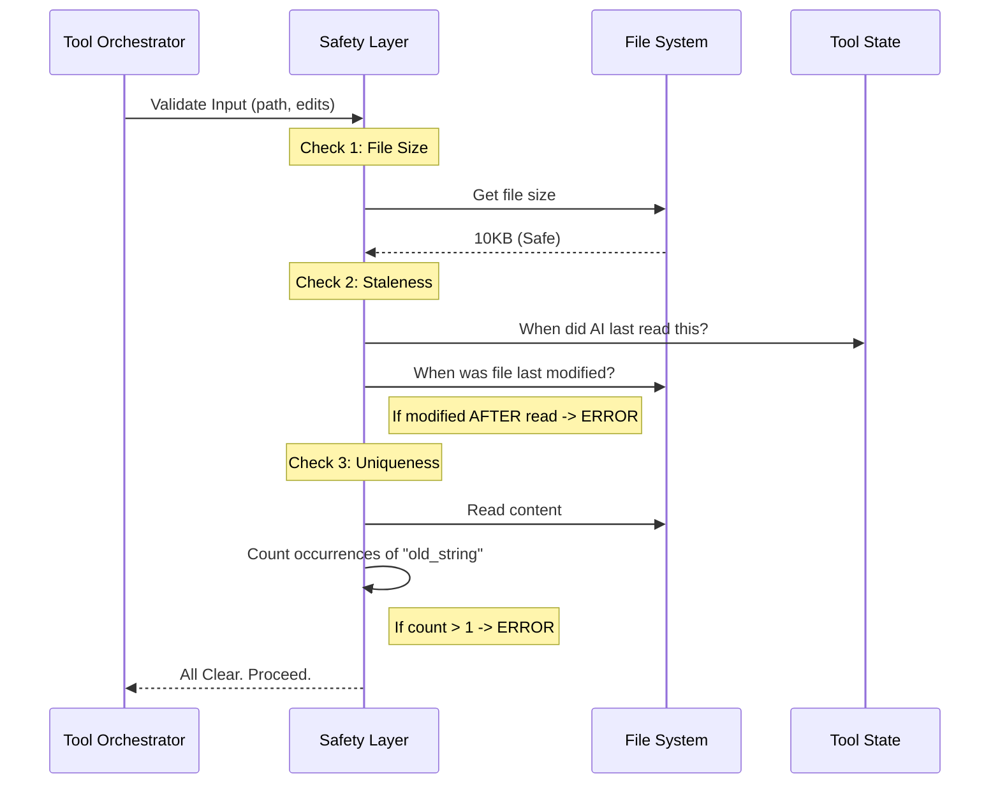

# Chapter 4: Safety & Validation Layer

In the previous chapter, [Intelligent String Matching](03_intelligent_string_matching.md), we taught our tool how to find text even if the quotes or whitespace didn't match perfectly.

Now we know *what* to change. But just because we *can* change a file doesn't mean we *should*.

## The Motivation: The "Pre-Flight Checklist"

Imagine you are a pilot. You have your destination (the `new_string`) and your plane (the `FileEditTool`). Before you take off, you don't just gun the engines. You go through a **Pre-Flight Checklist**.

1.  Is there fuel? (Does the file exist?)
2.  Is the runway clear? (Is the file locked or read-only?)
3.  Do we have the latest map? (Has the file changed since we last looked at it?)

If we skip these checks, we might overwrite code the user just wrote, crash the computer by opening a 50GB file, or replace the wrong line of code.

### The Use Case
We are editing `hello.txt`.
*   **Scenario A:** The file is 10 Gigabytes large.
*   **Scenario B:** You (the human) just saved a change to the file 1 second ago, but the AI hasn't read it yet.
*   **Scenario C:** The file contains the word "Hello" five times, and the AI says "Replace 'Hello' with 'Hi'", but doesn't say *which* one.

The **Safety & Validation Layer** detects these problems and stops the edit immediately.

---

## Concept 1: The "Read-Before-Write" Rule

This is the most critical safety feature for an AI agent.

An AI doesn't see your screen in real-time. It takes a snapshot (reads a file), thinks for 10 seconds, and then suggests an edit. If you modified the file during those 10 seconds, the AI's snapshot is **stale**. If the AI overwrites the file now, your work is lost.

We enforce a strict rule: **You cannot write to a file unless you have read it recently.**

### How it works
1.  We store a timestamp every time the AI reads a file.
2.  When the AI tries to edit, we check the file's current "Last Modified" time on the disk.
3.  **Rule:** `LastReadTime` must be greater than `LastModifiedTime`.

---

## Concept 2: Uniqueness (Preventing Ambiguity)

Computers are bad at guessing context.

**File Content:**
```text
print("Hello")
print("Hello")
```

**AI Request:**
> Replace "Hello" with "Goodbye" (replace_all = false).

Which one? The first or the second? If the tool guesses wrong, it breaks the program. The Safety Layer counts how many times `old_string` appears. If it appears more than once and `replace_all` is false, we reject the request.

---

## Concept 3: Resource Protection

Opening a massive file can consume all the computer's RAM, causing a crash. We set a hard limit (e.g., 1GB) to ensure the tool remains stable.

---

## High-Level Flow

Here is how the `validateInput` function acts as the safety inspector.



---

## Internal Implementation: The Code

Let's look at `FileEditTool.ts` to see how these checks are implemented. This happens inside the `validateInput` method, which runs *before* the main logic.

### 1. The Size Check
First, we ensure we aren't lifting something too heavy.

```typescript
// File: FileEditTool.ts
// MAX_EDIT_FILE_SIZE is set to ~1 GB
const { size } = await fs.stat(fullFilePath)

if (size > MAX_EDIT_FILE_SIZE) {
  return {
    result: false,
    message: `File is too large to edit (${formatFileSize(size)}).`,
    errorCode: 10,
  }
}
```
*Explanation:* We check the file stats (metadata) before reading the content. If it's too big, we bail out immediately.

### 2. The Staleness Check (Read-Before-Write)
We verify the AI isn't working with outdated information.

```typescript
// File: FileEditTool.ts
// Get the timestamp of when the AI last read this file
const readTimestamp = toolUseContext.readFileState.get(fullFilePath)

// If the AI has NEVER read it, stop them.
if (!readTimestamp) {
  return {
    result: false,
    message: 'File has not been read yet. Read it first.',
    errorCode: 6,
  }
}
```
*Explanation:* The `toolUseContext` keeps a memory of the AI's actions. No read record means no permission to write.

But what if they read it yesterday?

```typescript
// File: FileEditTool.ts
const lastWriteTime = getFileModificationTime(fullFilePath)

// Check if file changed on disk AFTER the AI read it
if (lastWriteTime > readTimestamp.timestamp) {
  return {
    result: false,
    message: 'File has been modified since read. Read it again.',
    errorCode: 7,
  }
}
```
*Explanation:* This comparison ensures the AI's "map" matches the "territory."

### 3. The Uniqueness Check
We ensure the edit target is obvious. We use the helper `findActualString` (from [Intelligent String Matching](03_intelligent_string_matching.md)) to normalize quotes before counting.

```typescript
// File: FileEditTool.ts
// Load the file content
const file = fileContent

// Find the string (handling quote normalization)
const actualOldString = findActualString(file, old_string)
// Count how many times it appears
const matches = file.split(actualOldString).length - 1
```

If the count is messy, we return a helpful error message guiding the AI to be more specific.

```typescript
// File: FileEditTool.ts
if (matches > 1 && !replace_all) {
  return {
    result: false,
    message: `Found ${matches} matches... provide more context.`,
    errorCode: 9,
  }
}
```
*Explanation:* If `replace_all` is true, ambiguity doesn't matter (we change them all). If it is false, we require a unique match.

### 4. The "No-Op" Check
Sometimes the AI gets confused and tries to change "Hello" to "Hello". This is a waste of resources.

```typescript
// File: FileEditTool.ts
if (old_string === new_string) {
  return {
    result: false,
    message: 'No changes to make: strings are exactly the same.',
    errorCode: 1,
  }
}
```
*Explanation:* A simple sanity check to save time.

---

## Summary

The **Safety & Validation Layer** is the responsible guardian of the file system.

1.  It ensures the file is **Small Enough** to handle.
2.  It ensures the AI's knowledge is **Fresh** (Read-Before-Write).
3.  It ensures the request is **Unambiguous** (Uniqueness Check).

By passing these checks, we guarantee that the edit operation is safe to perform. We have the file, we have the permissions, and we know exactly where to apply the change.

Now comes the fun part: actually calculating the new text and creating the "Patch" that will be written to disk.

[Next Chapter: Patch Engine & Text Transformation](05_patch_engine___text_transformation.md)

---

Generated by [Code IQ](https://github.com/adityasoni99/Code-IQ)