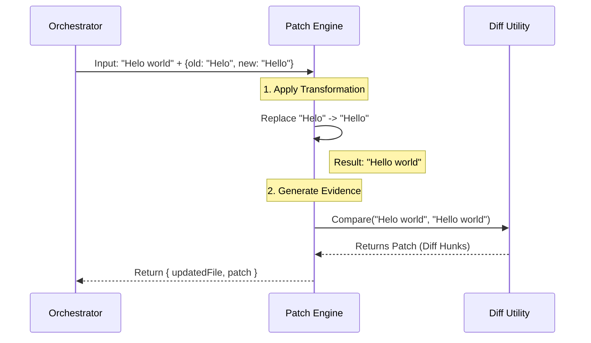

# Chapter 5: Patch Engine & Text Transformation

In the previous chapter, [Safety & Validation Layer](04_safety___validation_layer.md), we acted as the "Safety Inspector." We confirmed that the file exists, the edit is safe, and we aren't about to crash the system.

Now that we have the "Green Light," it is time to perform the actual surgery on the file.

## The Motivation: The "Copy Editor"

Imagine you are a **Copy Editor** for a newspaper. An author hands you a manuscript and a sticky note that says: *"Change 'color' to 'colour' on page 5."*

You have two jobs:
1.  **The Edit:** You actually white-out the old word and write in the new one.
2.  **The Redline:** You create a document showing exactly what changed (crossed out text and new text) so the boss can approve it.

In our tool, simply replacing text isn't enough. We need to generate that "Redline" (called a **Patch**) so the user—and the AI—can verify the work.

### The Use Case

We are still working on `hello.txt`:
*   **Original:** "Helo world"
*   **Request:** Replace "Helo" with "Hello".

If we just run a basic find-and-replace, we get the new file. But we also need a standard format to say: *"Line 1 changed. Removed 'Helo', Added 'Hello'."*

This is the job of the **Patch Engine**.

---

## High-Level Flow

The Patch Engine takes the original content and the requested edits, performs the transformation, and calculates the difference.



---

## Concept 1: The Transformation (Cut & Paste)

The first step is applying the edit. While this looks simple, we must handle the `replace_all` flag.

If `replace_all` is `true`, we fix every typo. If `false`, we only fix the first one found.

### The Code

We use a helper function called `applyEditToFile`.

```typescript
// File: utils.ts
export function applyEditToFile(content, oldStr, newStr, replaceAll = false) {
  // Define the replacement logic
  const replaceFunc = replaceAll
    ? (text, search, replace) => text.replaceAll(search, replace)
    : (text, search, replace) => text.replace(search, replace)

  // Execute the replacement
  return replaceFunc(content, oldStr, newStr)
}
```
*Explanation:* We dynamically choose between `replace` (replace first) and `replaceAll` (replace globally) based on the user's instructions.

---

## Concept 2: The Loop (Multiple Edits)

Sometimes, the AI wants to fix three different typos in the same file at once. The Patch Engine must apply these strictly in order.

However, there is a catch! If Edit #1 changes a sentence, Edit #2 might not find its target anymore if it was looking for the *old* version of that sentence.

### The Implementation

We iterate through the list of edits, updating the file content step-by-step.

```typescript
// File: utils.ts -> getPatchForEdits
let updatedFile = fileContents

for (const edit of edits) {
  const previousContent = updatedFile
  
  // Apply the current edit to the ALREADY MODIFIED content
  updatedFile = applyEditToFile(
    updatedFile, 
    edit.old_string, 
    edit.new_string, 
    edit.replace_all
  )
  
  // Verify something actually changed
  if (updatedFile === previousContent) {
    throw new Error('String not found in file.')
  }
}
```
*Explanation:* We treat `updatedFile` like a canvas. We paint the first change, then paint the second change *over* the result of the first. If an edit fails to find its target, we throw an error immediately.

---

## Concept 3: The Patch (The Redline)

Now that we have the `updatedFile`, we need to prove what we did. We calculate a "Diff."

A **Diff** is a standard way for computers to describe changes. It uses "Hunks" (chunks of lines).

### Visualizing a Hunk
A hunk looks like this:
```diff
@@ -1,1 +1,1 @@
-Helo world
+Hello world
```
*   `-` means "This line was removed."
*   `+` means "This line was added."
*   `@@` tells us the line numbers.

### Generating the Patch
We use the `diff` library (specifically `structuredPatch`) to compare the original file against our new `updatedFile`.

```typescript
// File: utils.ts -> getPatchForEdits
import { getPatchFromContents } from '../../utils/diff.js'

// ... after applying edits ...

// Compare the very beginning state vs the very end state
const patch = getPatchFromContents({
  filePath,
  oldContent: convertLeadingTabsToSpaces(fileContents),
  newContent: convertLeadingTabsToSpaces(updatedFile),
})

return { patch, updatedFile }
```
*Explanation:* We hand the "Before" and "After" versions to the diff utility. It does the heavy math to figure out the minimal set of changes required to turn "Before" into "After."

**Note:** You might notice `convertLeadingTabsToSpaces`. We normalize tabs to spaces to ensure the diff displays correctly in various user interfaces. This is part of being a "Intelligent" Copy Editor.

---

## Internal Implementation: `getPatchForEdits`

This function is the heart of this chapter. It resides in `utils.ts`. It combines everything we just discussed into one robust pipeline.

Here is the simplified logic flow:

1.  **Initialize:** Start with `updatedFile = originalFile`.
2.  **Safety Check:** Handle empty files or empty edits.
3.  **Loop:** Apply every edit in the list.
4.  **Verify:** Ensure the file actually changed (if `updatedFile === originalFile`, the edit failed).
5.  **Diff:** Generate the patch object.
6.  **Return:** Send back both the new file content (to save to disk) and the patch (to show the user).

### Why do we verify at the end?
In [Intelligent String Matching](03_intelligent_string_matching.md), we tried to find the string. But sometimes, weird things happen—like hidden characters or overlapping edits.

By checking `if (updatedFile === fileContents)` at the very end, we have a final "sanity check." If the file didn't change, we shouldn't tell the user "Success."

```typescript
// File: utils.ts
if (updatedFile === fileContents) {
  throw new Error(
    'Original and edited file match exactly. Failed to apply edit.',
  )
}
```

---

## Summary

In this chapter, we explored the **Patch Engine**. It is the "Copy Editor" that:
1.  **Transforms** the text using precise cut-and-paste operations (`applyEditToFile`).
2.  **Chains** multiple edits together in a loop.
3.  **Generates** a "Redline" (Patch) showing exactly what changed.

We now have a `patch` object containing `hunks` of data. But raw data like `@@ -1,1 +1,1 @@` is hard for humans to read quickly.

We need to take this dry data and turn it into a beautiful, easy-to-read visual for the user.

[Next Chapter: User Interface & Diff Visualization](06_user_interface___diff_visualization.md)

---

Generated by [Code IQ](https://github.com/adityasoni99/Code-IQ)