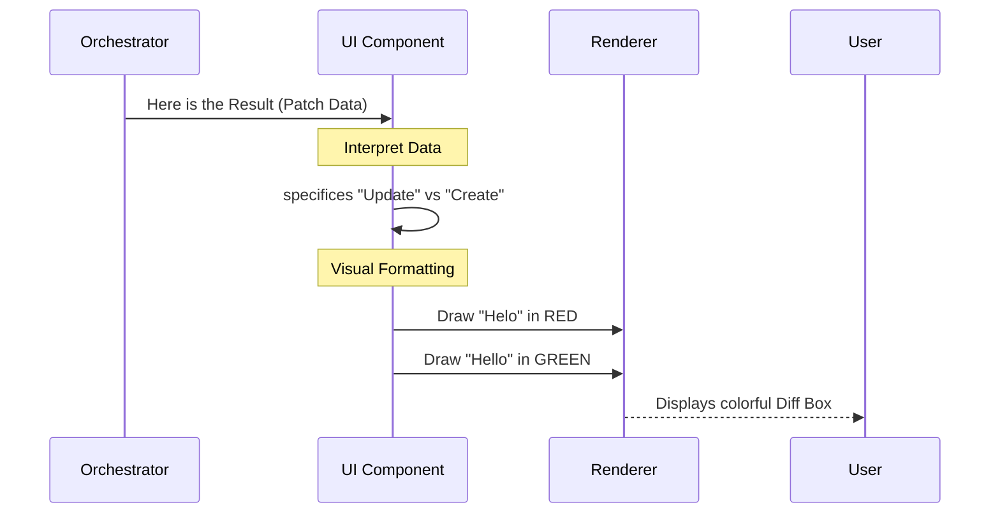
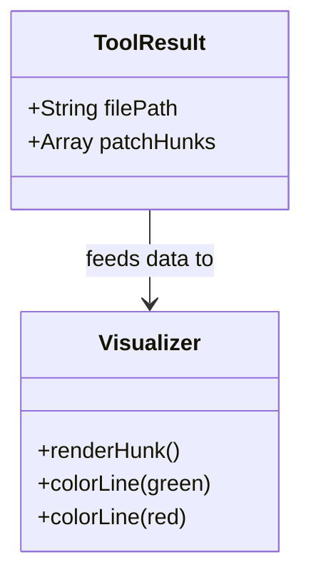

# Chapter 6: User Interface & Diff Visualization

Welcome to the final chapter of the **FileEditTool** tutorial!

In the previous chapter, [Patch Engine & Text Transformation](05_patch_engine___text_transformation.md), we successfully performed surgery on the file. We calculated exactly which bytes to remove and which to add.

However, a raw computer "Patch" looks like this:
`@@ -1,1 +1,1 @@ -Helo +Hello`

If you show that to a human user, they will squint and ask, "So... did it work?"

## The Motivation: The "Dashboard"

Imagine driving a car. The engine (Chapter 5) does the hard work of moving the wheels. But you, the driver, need a **Dashboard**.
*   **Green Light:** "System Normal. Speed 60mph."
*   **Red Light:** "Check Engine! Oil pressure low."

The **User Interface (UI)** is that dashboard. It translates the raw data from the engine into visual cues that humans understand instantly.

### The Use Case
We successfully changed "Helo" to "Hello".
*   **Without UI:** The tool outputs `{ status: "success" }`. The user has to open the file manually to verify.
*   **With UI:** The tool displays a box showing:
    *   <span style="color:red">- Helo world</span> (Red: Removed)
    *   <span style="color:green">+ Hello world</span> (Green: Added)

This builds trust. The user sees exactly what the AI did.

---

## High-Level Flow

The UI component doesn't change files. It takes the *results* of the change and paints a picture.



---

## Concept 1: The Success View (Rendering the Result)

When the [Tool Orchestrator](01_tool_orchestrator.md) finishes a job successfully, it hands the `structuredPatch` (the math describing the change) to the UI.

We use a React component called `FileEditToolUpdatedMessage`. Its job is to render the "After Action Report."

### The Code
We keep it simple. We pass the file path and the patch data to the renderer.

```typescript
// File: UI.tsx
export function renderToolResultMessage({ filePath, structuredPatch, originalFile }) {
  // Check if this is a special "Plan" file
  const isPlanFile = filePath.startsWith(getPlansDirectory())

  return (
    <FileEditToolUpdatedMessage 
      filePath={filePath} 
      structuredPatch={structuredPatch} 
      fileContent={originalFile} 
      previewHint={isPlanFile ? '/plan to preview' : undefined} 
    />
  )
}
```
*Explanation:* This component acts as a container. It takes the raw data and decides how to present it (e.g., adding a hint if it's a specific type of file).

---

## Concept 2: The Rejection View (The Warning Light)

Sometimes, the [Safety & Validation Layer](04_safety___validation_layer.md) says "Stop!" Maybe the file changed while the AI was thinking, or the request was ambiguous.

In this case, we don't just show an error text. We try to show a **Preview** of what the AI *tried* to do, so the user can understand why it failed or manually approve it.

### Calculating the Preview
To show a preview of a rejected edit, the UI has to temporarily act like the Engine. It calculates what the patch *would have looked like*.

```typescript
// File: UI.tsx -> loadRejectionDiff
// 1. Get the context (lines surrounding the target)
const ctx = await readEditContext(filePath, oldString, CONTEXT_LINES)

// 2. Pretend to apply the patch to generate the Diff
const { patch } = getPatchForEdit({
  filePath,
  fileContents: ctx.content, // Only using the context snippet
  oldString: actualOld,
  newString: actualNew,
})

return { patch, firstLine: null }
```
*Explanation:* Even though the edit failed, we run the logic from Chapter 5 on a small chunk of the file (`ctx.content`) just to generate the red/green lines for the user to see.

---

## Concept 3: Context Windows

When you change one line in a 1,000-line file, you don't want to see the entire file in the dashboard. You only care about the **Context**.

*   **Context:** The 3 lines before and the 3 lines after the change.

The UI handles this optimization.

```typescript
// File: UI.tsx
// Define how many lines around the change to show
import { CONTEXT_LINES } from '../../utils/diff.js' 

// Read only the necessary slice of the file
const ctx = await readEditContext(filePath, oldString, CONTEXT_LINES)
```
*Explanation:* This ensures the UI remains snappy and clean, focusing the user's attention solely on the relevant change.

---

## Internal Implementation: The "Diff" Component

How do we actually color the lines? We use a helper component called `EditRejectionDiff` (for rejections) or `FileEditToolUpdatedMessage` (for success).

Under the hood, they rely on a shared structure.



### Handling "New Files"
If the AI creates a brand new file, there is no "Red" (removed) text. The UI detects this special case.

```typescript
// File: UI.tsx
const isNewFile = oldString === ''

if (isNewFile) {
  // Show a "Write" preview instead of a "Diff"
  return <FileEditToolUseRejectedMessage 
    file_path={filePath} 
    operation="write" 
    content={newString} 
  />
}
```
*Explanation:* We switch modes. Instead of comparing A vs. B, we just display B (the new content).

---

## Summary of the Project

Congratulations! You have completed the **FileEditTool** tutorial. Let's recap the journey of our "Hello World" fix:

1.  **[Tool Orchestrator](01_tool_orchestrator.md):** The "General Contractor" received the order.
2.  **[Data Contracts](02_data_contracts___schemas.md):** We verified the order form was filled out correctly.
3.  **[Intelligent Matching](03_intelligent_string_matching.md):** We located the text "Helo", ignoring curly quotes or whitespace.
4.  **[Safety Layer](04_safety___validation_layer.md):** We checked that the file wasn't too big and hadn't been changed by someone else.
5.  **[Patch Engine](05_patch_engine___text_transformation.md):** We performed the text surgery and generated the `patch`.
6.  **[User Interface](06_user_interface___diff_visualization.md):** (This chapter) We displayed the beautiful Green/Red diff to the user.

You now understand how an AI agent safely, intelligently, and visually modifies code in your filesystem.

**End of Tutorial.**

---

Generated by [Code IQ](https://github.com/adityasoni99/Code-IQ)