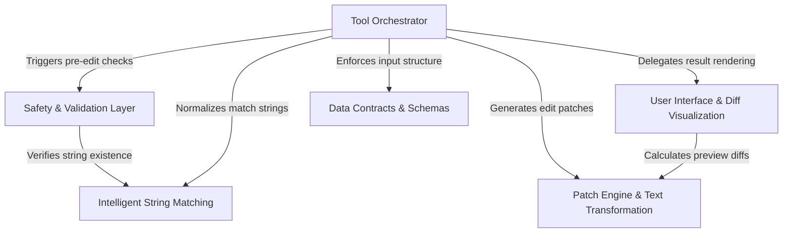

# Tutorial: FileEditTool

The `FileEditTool` serves as a robust mechanism for safely modifying file contents, bridging the gap between AI-generated intent and the file system. It uses a central **Orchestrator** to manage the editing workflow, relying on **Intelligent Matching** to handle nuances like curly quotes and whitespace without strict byte-for-byte exactness. The tool ensures integrity through a **Safety Layer** and **Data Contracts**, calculates precise text updates via a **Patch Engine**, and displays clear changes to the user through a **Diff Visualization** interface.

## Chapters

1. [Tool Orchestrator](01_tool_orchestrator.md)
2. [Data Contracts & Schemas](02_data_contracts___schemas.md)
3. [Intelligent String Matching](03_intelligent_string_matching.md)
4. [Safety & Validation Layer](04_safety___validation_layer.md)
5. [Patch Engine & Text Transformation](05_patch_engine___text_transformation.md)
6. [User Interface & Diff Visualization](06_user_interface___diff_visualization.md)

---

Generated by [Code IQ](https://github.com/adityasoni99/Code-IQ)