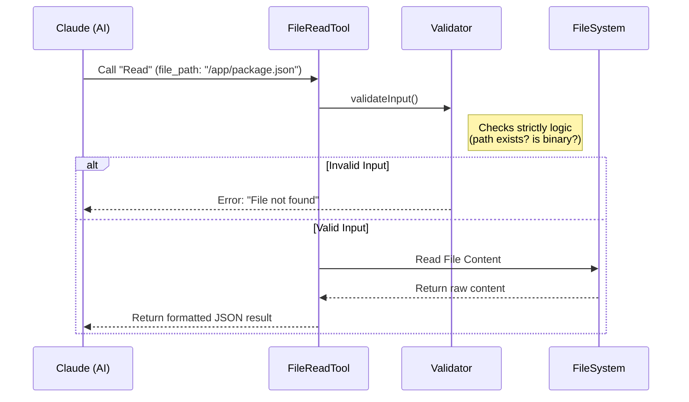

# Chapter 1: Tool Definition & Interface

Welcome to the first chapter of the **FileReadTool** tutorial!

Before we dive into reading complex code, let's understand the high-level goal. You are building a tool that allows an Artificial Intelligence (like Claude) to read files from a user's computer.

But how does the AI know it *can* read files? How does it know *how* to ask for a file?

This is where the **Tool Definition & Interface** comes in. Think of this as the "API Contract" or the "Instruction Manual" you hand to the AI.

### The Use Case

Imagine the user asks the AI:
> "Can you check my `package.json` file to see what dependencies I have installed?"

For the AI to solve this, it needs a specific tool defined in a way it understands. It needs to know:
1.  **Name:** "I have a tool called `Read`."
2.  **Input:** "I need to provide the absolute `file_path`."
3.  **Output:** "I will receive the text content of that file."

---

### 1. Defining the Tool Identity

In our project, we use a helper function called `buildTool`. This creates the object that represents our tool.

The first step is giving the tool an identity.

```typescript
// File: FileReadTool.ts
import { buildTool } from '../../Tool.js'
import { FILE_READ_TOOL_NAME, DESCRIPTION } from './prompt.js'

export const FileReadTool = buildTool({
  name: FILE_READ_TOOL_NAME, // 'Read'
  searchHint: 'read files, images, PDFs, notebooks',
  description: async () => DESCRIPTION,
  // ... rest of the definition
})
```
**Explanation:**
*   `name`: This is how the AI calls the tool (e.g., `<tool_use><name>Read</name>...</tool_use>`).
*   `description`: A short summary telling the AI what this tool is for.

### 2. The Instruction Manual (The Prompt)

The `description` is short, but the AI needs detailed rules. For example, it needs to know it can read images or specific pages of a PDF. We provide this via a `prompt` function.

```typescript
// File: prompt.ts
export function renderPromptTemplate(
  lineFormat: string,
  maxSizeInstruction: string,
  offsetInstruction: string,
): string {
  return `Reads a file from the local filesystem...
  Usage:
  - The file_path parameter must be an absolute path
  - By default, it reads up to 2000 lines...
  ${offsetInstruction}
  ${lineFormat}`
}
```
**Explanation:**
This template generates a text block that is injected into the AI's context. It acts like a "System Prompt" specifically for this tool, guiding the AI on best practices (like using offsets for large files).

### 3. The Contract: Input & Output Schemas

To prevent the AI from sending nonsense (like a number instead of a file path), we define a strict "schema" using a library called **Zod**. This acts as a gatekeeper.

#### The Input Schema
This defines exactly what parameters the AI is allowed to send.

```typescript
// File: FileReadTool.ts
const inputSchema = lazySchema(() =>
  z.strictObject({
    file_path: z.string().describe('The absolute path to the file'),
    offset: z.number().optional().describe('Start line number'),
    limit: z.number().optional().describe('Number of lines to read'),
    pages: z.string().optional().describe('Page range for PDFs'),
  })
)
```
**Explanation:**
*   `file_path`: Required. Must be a string.
*   `offset`/`limit`: Optional. Used for reading huge files in chunks (we will cover the limits logic in [Resource Governance & Limits](02_resource_governance___limits.md)).
*   `pages`: Optional. Specific to PDFs.

#### The Output Schema
This tells the system what format the tool will return. Since we can read text, images, or PDFs, the output is a "Union" (it can be one of several types).

```typescript
// File: FileReadTool.ts
const outputSchema = lazySchema(() => {
  return z.discriminatedUnion('type', [
    z.object({ type: z.literal('text'), /* ... text details */ }),
    z.object({ type: z.literal('image'), /* ... base64 data */ }),
    z.object({ type: z.literal('pdf'), /* ... pdf data */ }),
    // ... other types like notebooks
  ])
})
```
**Explanation:**
By defining this strictly, we ensure that the rest of our application (and the AI) knows exactly how to handle the result, whether it's a string of text or a base64 encoded image.

---

### Internal Implementation: How it Works

When the AI calls the `Read` tool, the request goes through a specific flow defined by our interface.

#### Sequence Diagram



#### Step-by-Step Walkthrough

1.  **Tool Selection:** The AI decides to use the `Read` tool based on the `description` and `prompt` we defined.
2.  **Input Validation:** Before we even try to read the file, the tool runs a `validateInput` function. This is a safety check defined in the interface.
3.  **Execution:** If validation passes, the `call` function is executed.
4.  **Result:** The tool packages the file content into the JSON format defined by the `outputSchema`.

#### Deep Dive: Input Validation

The `validateInput` method is part of the interface that runs *before* the main logic. It's a great place to catch simple errors without wasting resources.

```typescript
// File: FileReadTool.ts (Simplified)
async validateInput({ file_path, pages }, context) {
  // 1. Expand path (e.g., turn "~" into "/home/user")
  const fullFilePath = expandPath(file_path)

  // 2. Check for "Deny" rules (Security)
  if (isPathDenied(fullFilePath)) {
    return { result: false, message: 'Access denied' }
  }

  // 3. Check for binary files that aren't images/PDFs
  if (isBinary(fullFilePath) && !isSupportedMedia(fullFilePath)) {
    return { result: false, message: 'Cannot read binary file' }
  }
  
  return { result: true }
}
```
**Explanation:**
This code ensures we don't accidentally try to read a music file as text, or read a file the user has explicitly blocked. This layer of security is crucial before we perform any file operations.

### Understanding the `call` Method

The `call` method is the heart of the interface. It receives the inputs validated above and coordinates the actual work.

```typescript
// File: FileReadTool.ts (Simplified)
async call(input, context) {
  const { file_path } = input;
  
  // 1. Expand the path
  const fullPath = expandPath(file_path);

  // 2. Discover "Skills" (Contextual help)
  // If this file is part of a framework, load relevant docs
  await discoverSkills(fullPath);

  // 3. Perform the read (The logic moves to internal functions)
  try {
    return await callInner(fullPath, input.offset, input.limit, ...);
  } catch (error) {
    // Handle "File Not Found" gracefully
    throw new Error(`File does not exist: ${file_path}`);
  }
}
```

**Explanation:**
The `call` method acts as a coordinator. It prepares the path, checks for extra context (skills), and then delegates the heavy lifting to `callInner`. 

The `callInner` function is where the logic splits based on file type (Text vs Image vs PDF). We will explore that specific logic in [Content Type Dispatcher](03_content_type_dispatcher.md).

### Summary

In this chapter, we established the **Interface** of the `FileReadTool`.
1.  We gave the tool a **Name** and **Description**.
2.  We defined the **Prompt** to teach the AI how to use it.
3.  We created strict **Zod Schemas** for Inputs and Outputs.
4.  We implemented **Validation** to reject bad requests early.

This structure ensures the AI interacts with the filesystem safely and predictably.

**What's Next?**
Now that the AI knows *how* to call the tool, we need to ensure it doesn't crash the system by reading a 10GB file or running out of memory. We will cover safeguards in the next chapter.

[Next Chapter: Resource Governance & Limits](02_resource_governance___limits.md)

---

Generated by [Code IQ](https://github.com/adityasoni99/Code-IQ)