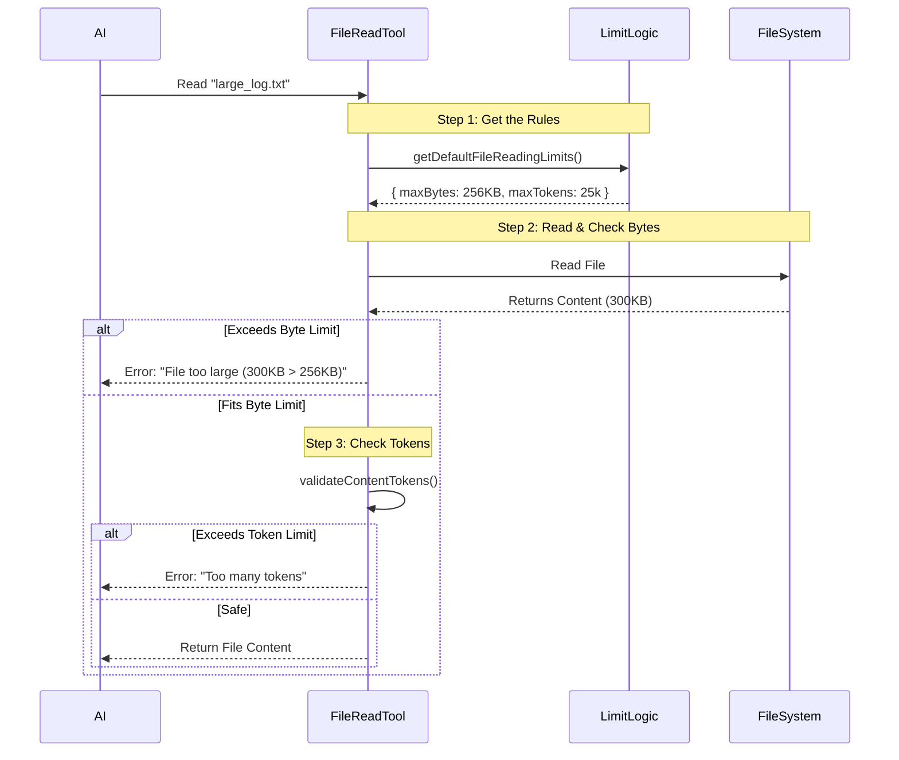

# Chapter 2: Resource Governance & Limits

Welcome to the second chapter of the **FileReadTool** tutorial!

In the previous chapter, [Tool Definition & Interface](01_tool_definition___interface.md), we defined the "Instruction Manual" that tells the AI how to ask for a file.

However, there is a danger. What if the AI asks to read a 10GB server log file?
1.  **Memory Crash:** The application might run out of RAM trying to load it.
2.  **Context Explosion:** The AI's "brain" (context window) has a limit. Feeding it too much text will cause it to crash or forget previous instructions.
3.  **Cost:** AI models often charge by the "token." Reading a massive file could be expensive.

We need a system to prevent this. We call this **Resource Governance**.

### The Motivation: The "Bouncer" Analogy

Think of your `FileReadTool` as an exclusive club.
*   **The Data:** The guests trying to get in.
*   **The AI:** The VIP inside the club.
*   **Resource Governance:** The **Bouncer**.

The Bouncer stands at the door with a strict checklist. If a file is too "fat" (too many bytes) or talks too much (too many tokens), it gets turned away before it can bother the VIP.

---

### 1. The Rulebook: Determining Limits

The first step in governance is deciding what the rules are. In our project, rules aren't just hardcoded constants. We use a **Hierarchy of Authority** to decide the limit.

We check these sources in order:
1.  **Environment Variables:** Did the user explicitly set `CLAUDE_CODE_FILE_READ_MAX_OUTPUT_TOKENS`?
2.  **Feature Flags:** Is there an experiment running (via GrowthBook) to test larger/smaller limits?
3.  **Defaults:** If neither of the above exists, use the safe hardcoded default.

Here is how we implement this hierarchy in `limits.ts`:

```typescript
// File: limits.ts
export const getDefaultFileReadingLimits = memoize((): FileReadingLimits => {
  // 1. Check for Feature Flags (Experiments)
  const override = getFeatureValue('tengu_amber_wren', {})

  // 2. Check for User Environment Variables (Highest Priority for tokens)
  const envMaxTokens = getEnvMaxTokens()

  // 3. calculate the final token limit
  const maxTokens = envMaxTokens ?? override.maxTokens ?? 25000 

  return { maxTokens, /* ... other limits */ }
})
```
**Explanation:**
This function is the "Brain" of the Bouncer. It gathers strictness levels from different sources and returns the final set of rules.

---

### 2. The Use Case: Stopping a Notebook Read

Let's look at a concrete example. The user asks the AI:
> "Read `data_analysis.ipynb`"

The file exists, but it contains thousands of generated charts and is **5MB** in size. Our limit is set to **256KB**.

Here is how the tool enforces this limit inside the main logic.

```typescript
// File: FileReadTool.ts (Inside callInner function)

// 1. Convert notebook content to text
const cellsJson = jsonStringify(cells)
const cellsJsonBytes = Buffer.byteLength(cellsJson)

// 2. The Bouncer checks the ID card (Size in Bytes)
if (cellsJsonBytes > maxSizeBytes) {
  throw new Error(
    `Notebook content (${formatFileSize(cellsJsonBytes)}) exceeds ` +
    `maximum allowed size (${formatFileSize(maxSizeBytes)}).`
  )
}
```

**Explanation:**
By throwing an error *here*, we stop the process immediately. We tell the AI: "This file is too big. Try reading just a small part of it using a different tool (like `jq`)."

---

### 3. The Two Guardians: Bytes vs. Tokens

We actually have two different limits, and they protect against different things.

#### Guardian A: `maxSizeBytes` (The Fast Check)
*   **What it checks:** The file size on the hard drive.
*   **When:** *Before* or *during* the file read.
*   **Why:** To prevent the Node.js process from crashing out of memory. It's very fast to check.

#### Guardian B: `maxTokens` (The Precise Check)
*   **What it checks:** The "information density" for the AI.
*   **When:** *After* reading the text, but *before* sending it to the AI.
*   **Why:** AI Context Windows are limited. A small 500KB file could contain compressed text worth 100,000 tokens.

Here is the implementation of the Token Guardian:

```typescript
// File: FileReadTool.ts
async function validateContentTokens(content: string, ext: string, maxTokens: number) {
  // 1. Make a cheap rough estimate first
  const estimate = roughTokenCountEstimationForFileType(content, ext)
  if (estimate <= maxTokens / 4) return // Safe!

  // 2. If it looks close, do a precise count (calls an API)
  const exactCount = await countTokensWithAPI(content)

  if (exactCount > maxTokens) {
    throw new MaxFileReadTokenExceededError(exactCount, maxTokens)
  }
}
```
**Explanation:**
We don't want to run the expensive `countTokensWithAPI` on every tiny file. We use a heuristic (a rough guess) first. If the file seems small, we let it through. If it's borderline, we measure exactly.

---

### Internal Implementation: The Governance Flow

When a `call()` is made, the tool orchestrates these checks.



### 4. Code Deep Dive: Applying Limits in `call`

Now let's see where this fits into the main `call` method we introduced in Chapter 1.

```typescript
// File: FileReadTool.ts
async call(input, context) {
  // 1. Load the rules
  const defaults = getDefaultFileReadingLimits()
  
  // Allow context to override defaults (e.g. for testing)
  const maxSizeBytes = context.fileReadingLimits?.maxSizeBytes 
                       ?? defaults.maxSizeBytes
  const maxTokens = context.fileReadingLimits?.maxTokens 
                    ?? defaults.maxTokens

  // ... (Resolve file path) ...

  // 2. Pass these limits down to the worker function
  return await callInner(
    fullFilePath,
    /* ... inputs ... */,
    maxSizeBytes, // <--- Passing the Bouncer's Byte rule
    maxTokens,    // <--- Passing the Bouncer's Token rule
    /* ... other args ... */
  )
}
```

**Explanation:**
The `call` function acts as the manager. It looks up the current laws (limits) and hands them to the worker (`callInner`) along with the file path. This ensures that `callInner` doesn't need to know *how* limits are calculated, only *what* they are.

### Summary

In this chapter, we added a safety layer to our tool:
1.  We established a **Hierarchy of Limits** (Env Vars > Flags > Defaults).
2.  We created **Two Guardians**: one for file size (Bytes) and one for AI capacity (Tokens).
3.  We implemented these checks to reject unsafe requests with helpful error messages.

**What's Next?**
We have secured the door. Now, once a file is allowed inside, we need to figure out *what* it is. Is it a text file? An image? A PDF? A Jupyter Notebook?

In the next chapter, we will build the machinery to identify and handle these different formats.

[Next Chapter: Content Type Dispatcher](03_content_type_dispatcher.md)

---

Generated by [Code IQ](https://github.com/adityasoni99/Code-IQ)