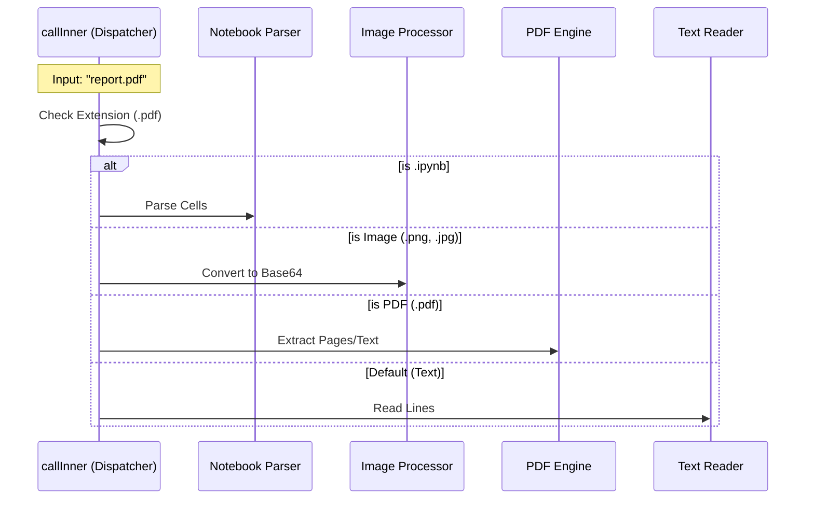

# Chapter 3: Content Type Dispatcher

Welcome to the third chapter of the **FileReadTool** tutorial!

In the previous chapter, [Resource Governance & Limits](02_resource_governance___limits.md), we set up a "Bouncer" to stop files that are too large from crashing our system.

Now that the file has passed security and is allowed inside, we have a new problem: **Not all files are the same.**
*   If you try to read a **PDF** like a text file, you get a mess of strange symbols.
*   If you read an **Image** as text, it's just binary gibberish.
*   A **Jupyter Notebook** is technically text (JSON), but it's hard for a human to read without formatting.

We need a system to sort these files. We call this the **Content Type Dispatcher**.

---

### The Motivation: The "Mail Sorting Room"

Imagine a corporate mailroom.
1.  A letter arrives? It goes to the **Mail Clerk**.
2.  A heavy box arrives? It goes to the **Warehouse**.
3.  A suspicious ticking package? It goes to **Security**.

The **Content Type Dispatcher** acts exactly like this mailroom. It looks at the file extension (the label on the package) and routes the file to the correct specialized department.

### The Use Case

The user asks:
> "Read `chart.png` and `analysis.ipynb`."

Without the dispatcher, the tool would try to open the image as text, failing miserably.
With the dispatcher:
1.  It sees `.png` -> Routes to the **Image Processor**.
2.  It sees `.ipynb` -> Routes to the **Notebook Parser**.

---

### Internal Implementation: The Dispatch Logic

This logic lives inside the `callInner` function (which we briefly touched on in Chapter 1). This function acts as the central traffic hub.

#### Sequence Diagram

Here is how the Dispatcher decides where to send a file request.



---

### Code Deep Dive: Building the Switchboard

Let's look at how this is implemented in code. We simply check the file extension (`ext`) and use `if/else` blocks to handle the routing.

#### 1. Handling Jupyter Notebooks (.ipynb)

Jupyter notebooks are actually JSON files full of metadata. If we just read them as raw text, the AI gets confused by all the brackets and quotes. We parse them into a clean format first.

```typescript
// File: FileReadTool.ts (Inside callInner)

if (ext === 'ipynb') {
  // 1. Read and parse the complex JSON structure
  const cells = await readNotebook(resolvedFilePath)
  
  // 2. Return a specific "notebook" type object
  return { 
    data: {
      type: 'notebook',
      file: { filePath: file_path, cells }
    }
  }
}
```
**Explanation:**
If the file ends in `.ipynb`, we hand it off to `readNotebook`. This helper function strips away the noise and gives us just the code and markdown cells the AI cares about.

#### 2. Handling Images

If the file is an image, we can't send "text" to the AI. We need to send the image data encoded as a Base64 string (a way of representing binary data as text).

```typescript
// File: FileReadTool.ts

if (IMAGE_EXTENSIONS.has(ext)) {
  // 1. Read the image and maybe resize it if it's too big
  const data = await readImageWithTokenBudget(resolvedFilePath, maxTokens)

  // 2. Return an "image" type object
  return {
    data: data // contains base64 string
  }
}
```
**Explanation:**
We check a list called `IMAGE_EXTENSIONS` (like `.png`, `.jpg`). If it matches, we call `readImageWithTokenBudget`. We will learn how that image processing works in [Media Processing Engine](04_media_processing_engine.md).

#### 3. Handling PDFs

PDFs are the most complex. Sometimes we want text, sometimes we want images of specific pages.

```typescript
// File: FileReadTool.ts

if (isPDFExtension(ext)) {
  // 1. Check if the user asked for specific pages (e.g., "1-5")
  if (pages) {
    const extractResult = await extractPDFPages(resolvedFilePath, pages)
    return { data: extractResult.data }
  }

  // 2. Otherwise, read the whole document
  const pdfData = await readPDF(resolvedFilePath)
  
  return { data: pdfData }
}
```
**Explanation:**
The dispatcher checks for `.pdf`. It also checks if the user provided a `pages` argument (defined in our Interface in [Tool Definition & Interface](01_tool_definition___interface.md)). It then routes to the appropriate PDF helper function.

#### 4. The Default: Text Files

If the file isn't a Notebook, Image, or PDF, we assume it is text (code, markdown, logs, etc.). This is the "General Delivery" of our mailroom.

```typescript
// File: FileReadTool.ts

// Fallthrough: Handle as standard text
const { content, lineCount } = await readFileInRange(
  resolvedFilePath,
  offset, // Start line
  limit   // Number of lines
)

return {
  data: {
    type: 'text',
    file: { content, numLines: lineCount, ... }
  }
}
```
**Explanation:**
This acts as the `else` block. It calls `readFileInRange`, which handles reading plain text, including logic to read only specific lines (offsets) to save memory.

---

### Connecting to the Interface

In Chapter 1, we defined an **Output Schema** (the contract). The Dispatcher ensures we fulfill that contract.

*   If the Dispatcher chooses **Text**, it returns `{ type: 'text', ... }`.
*   If the Dispatcher chooses **Image**, it returns `{ type: 'image', ... }`.

This ensures that the code receiving the result (and the AI) knows exactly what format to expect.

### Summary

In this chapter, we built the **Content Type Dispatcher**:
1.  We identified the need to treat different files differently.
2.  We implemented a central "Switchboard" in `callInner`.
3.  We routed requests to specialized handlers for **Notebooks**, **Images**, **PDFs**, and **Text**.

**What's Next?**
We have routed the images and PDFs to their special handlers, but how do we actually read them? How do we resize a 4K image so it doesn't cost a fortune in AI tokens?

In the next chapter, we will explore the heavy machinery behind handling binary files.

[Next Chapter: Media Processing Engine](04_media_processing_engine.md)

---

Generated by [Code IQ](https://github.com/adityasoni99/Code-IQ)