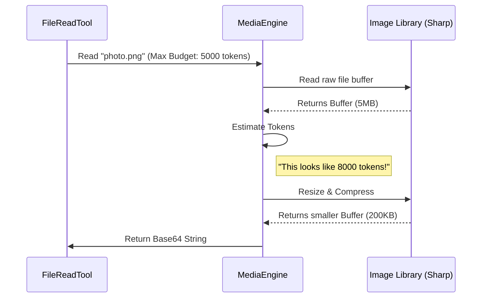

# Chapter 4: Media Processing Engine

Welcome to the fourth chapter of the **FileReadTool** tutorial!

In the previous chapter, [Content Type Dispatcher](03_content_type_dispatcher.md), we built a "Switchboard" that routes files based on their type. We decided that `.png` and `.jpg` files go to the **Image Processor**.

But here is the problem: **AIs cannot "see" files on your hard drive.**
You cannot just point the AI to a file path. You must convert that image into a stream of text data (Base64). Furthermore, high-resolution images are "expensive" in terms of AI memory (tokens).

We need a factory that takes raw images, shrinks them to fit the budget, and packages them for delivery. We call this the **Media Processing Engine**.

---

### The Motivation: The "Universal Adapter"

Imagine you are traveling to a different country. Your hairdryer plug doesn't fit the wall socket. You need a **Universal Adapter**.

*   **Input:** Your hairdryer (A raw, massive 5MB PNG file).
*   **The Wall Socket:** The AI Model (It accepts specific text-based formats and has strict size limits).
*   **The Media Engine:** The Adapter.

Regardless of whether the input is a JPEG, PNG, or WebP, and regardless of whether it is 100 pixels wide or 10,000 pixels wide, the Media Engine ensures the output is standardized, resized, and ready for the AI to view.

---

### 1. Abstracting Dependencies: The "Digital Darkroom"

To process images in Node.js, we usually use a library called `sharp`. However, sometimes our tool runs in a standalone application where we might use a different, native processor.

We don't want our main code to worry about *which* processor is installed. We create a helper function `getImageProcessor` that acts as a smart selector.

```typescript
// File: imageProcessor.ts
import { isInBundledMode } from '../../utils/bundledMode.js'

export async function getImageProcessor() {
  // 1. Are we in a special standalone app?
  if (isInBundledMode()) {
    try {
      return await import('image-processor-napi')
    } catch {
      console.warn('Native processor failed, falling back...')
    }
  }

  // 2. Default: Use the standard 'sharp' library
  const sharp = await import('sharp')
  return sharp.default || sharp
}
```
**Explanation:**
This function checks the environment. If we are running in a bundled mode, it tries to load a high-performance native module. If that fails (or if we are just running normal Node.js code), it falls back to `sharp`. This prevents the app from crashing just because one library is missing.

---

### 2. The Token Budget: Putting Images on a Diet

In [Resource Governance & Limits](02_resource_governance___limits.md), we learned that we have a **Token Limit** (e.g., 25,000 tokens).

Images consume tokens based on their resolution. A 4K screenshot might cost 5,000 tokens! If we send five screenshots, we blow the budget.

The Media Engine must:
1.  **Measure:** Estimate how many tokens the image effectively costs.
2.  **Compress:** If it's too "expensive," shrink the dimensions or lower the quality.

---

### Internal Implementation: The Processing Flow

When the `FileReadTool` asks for an image, the Media Engine goes through a strict pipeline to ensure the image is safe to send.

#### Sequence Diagram



---

### 3. Code Deep Dive: `readImageWithTokenBudget`

This function is the workhorse of the engine. It ensures the image fits the AI's "budget."

#### Step A: Reading and Detecting

First, we read the raw bytes from the disk and figure out what kind of image it is.

```typescript
// File: FileReadTool.ts (Simplified)
export async function readImageWithTokenBudget(filePath, maxTokens) {
  // 1. Read the raw binary data
  const imageBuffer = await fs.readFileBytes(filePath)
  const originalSize = imageBuffer.length

  // 2. Detect format (e.g., is this a PNG or JPEG?)
  const detectedFormat = detectImageFormatFromBuffer(imageBuffer)
  
  // ... continued below
}
```

#### Step B: The First Pass (Standard Resize)

We try a "polite" resize first. We assume standard dimensions are fine.

```typescript
// ... continued
  try {
    // 3. Resize to reasonable dimensions (e.g., max 1024px)
    const resized = await maybeResizeAndDownsampleImageBuffer(
      imageBuffer, 
      originalSize, 
      detectedFormat
    )
    
    // 4. Create the result object
    var result = createImageResponse(resized.buffer, ...)
  } catch (e) {
    // If resize fails, just use the original
    result = createImageResponse(imageBuffer, ...)
  }
```

#### Step C: The Budget Check (Aggressive Compression)

This is the critical step. We calculate the cost. If the standard resize is *still* too big for the AI's token budget, we get aggressive.

```typescript
// ... continued
  // 5. Estimate token cost (Rule of thumb: 1 byte ~= X tokens)
  const estimatedTokens = Math.ceil(result.file.base64.length * 0.125)

  if (estimatedTokens > maxTokens) {
    // 6. Aggressive: Force compression to fit the budget
    const compressed = await compressImageBufferWithTokenLimit(
      imageBuffer,
      maxTokens,
      detectedFormat
    )
    
    return {
      type: 'image',
      file: { base64: compressed.base64, ... }
    }
  }

  return result
}
```
**Explanation:**
By calculating `estimatedTokens`, we protect the AI context window. If the image is too detailed, `compressImageBufferWithTokenLimit` will drastically lower the JPEG quality or resolution until it fits.

---

### 4. Handling PDFs (A Special Case)

While not strictly "images," PDFs are handled by this engine because we often convert PDF pages *into* images so the AI can "read" them visually.

We use a tool called `poppler` (via `extractPDFPages`) to turn a PDF page into a JPEG, then feed it through the same resizing logic.

```typescript
// File: FileReadTool.ts
if (pages) {
  // 1. Convert PDF pages to temporary .jpg files
  const extractResult = await extractPDFPages(resolvedFilePath, pages)
  
  // 2. Loop through every generated image
  const imageBlocks = await Promise.all(imageFiles.map(async f => {
    // 3. Treat each page like a normal image read
    const imgBuffer = await readFileAsync(f)
    const resized = await maybeResizeAndDownsampleImageBuffer(imgBuffer)
    return { type: 'image', source: resized.base64 }
  }))
}
```
**Explanation:**
This effectively turns a document reader into a visual scanner. The AI reads the PDF by "looking" at pictures of the pages.

### Summary

In this chapter, we built the **Media Processing Engine**.
1.  We created a **Dependency Abstraction** to switch between `sharp` and native processors.
2.  We implemented **Token Budgeting** to ensure images don't exhaust the AI's memory.
3.  We built a **Compression Pipeline** that aggressively shrinks images if they are too "expensive."

We have now successfully read the file, validated it, routed it, and processed it into a format the AI understands.

**What's Next?**
We have a pile of data (text, JSON, or Base64 images). How do we actually show this to the user? How do we format the output so the AI knows it succeeded?

In the final chapter, we will cover how to present these results.

[Next Chapter: User Interface Presentation](05_user_interface_presentation.md)

---

Generated by [Code IQ](https://github.com/adityasoni99/Code-IQ)