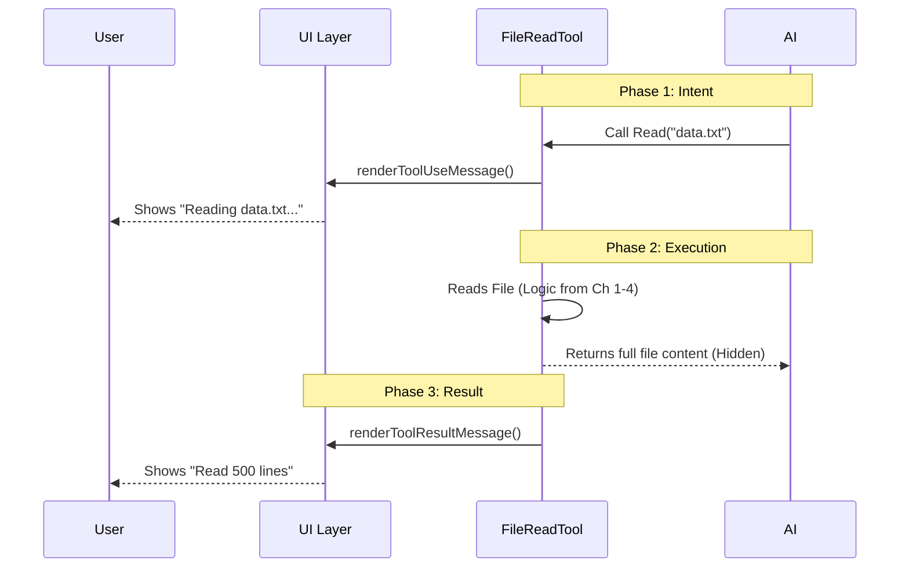

# Chapter 5: User Interface Presentation

Welcome to the final chapter of the **FileReadTool** tutorial!

In the previous chapter, [Media Processing Engine](04_media_processing_engine.md), we did the heavy lifting of reading files, compressing images, and converting PDFs into data the AI can understand.

However, we have a usability problem.
*   **The AI** needs the raw data (e.g., a 5MB string of text or a massive Base64 image code).
*   **The User** (you) definitely **does not** want to see a wall of 50,000 lines of text scrolling past your screen.

We need a way to separate what the "Engine" consumes from what the "Driver" sees. This is the **User Interface Presentation** layer.

---

### The Motivation: The Car Dashboard

Think of this tool like a modern car.
*   **The Engine (The AI):** It needs fuel, air intake values, and precise timing data to run.
*   **The Dashboard (The User Interface):** The driver doesn't see "Fuel Injector Pressure: 400 PSI." They just see a simple gauge saying **"Speed: 60 MPH"**.

If we showed the user exactly what the AI sees, the application would be unusable. The **UI Presentation** layer acts as the dashboard, converting complex data into clean, human-readable summaries.

### The Use Case

Imagine the user says:
> "Read `logo.png` and `server.log`."

**Without UI Presentation:**
The chat window fills with garbage text: `IVBORw0KGgoAAAANSUhEUgAAA...` for pages and pages.

**With UI Presentation:**
The user sees:
> 📖 **Read** `logo.png`
> ✅ Read image (42 KB)
>
> 📖 **Read** `server.log`
> ✅ Read 150 lines

The AI still gets the full file content silently in the background, but the user keeps a clean workspace.

---

### 1. The Concept: Split Reality

To achieve this, our system allows us to define two different messages for every tool action:
1.  **The Payload:** The actual data sent to the AI (covered in previous chapters).
2.  **The Render:** The React component shown to the human.

We use a file called `UI.tsx` to control the visual side.

---

### Internal Implementation: The UI Lifecycle

When the AI decides to use a tool, the UI updates in two distinct stages: **Intent** (I am about to do this) and **Result** (I finished doing this).

#### Sequence Diagram



---

### 2. Displaying Intent: "What am I doing?"

When the AI calls the tool, we want to show the user which file is being accessed. We use `renderToolUseMessage`.

We don't just show the path string; we use a helper `<FilePathLink>` to make it clickable!

```tsx
// File: UI.tsx (Simplified)
export function renderToolUseMessage(input, { verbose }) {
  const { file_path } = input;
  
  // 1. Get a pretty version of the path (e.g., truncate long paths)
  const displayPath = getDisplayPath(file_path);

  // 2. Render a clickable link
  return (
    <FilePathLink filePath={file_path}>
      {displayPath}
    </FilePathLink>
  );
}
```

**Explanation:**
This code grabs the `file_path` from the input (defined in [Tool Definition & Interface](01_tool_definition___interface.md)) and wraps it in a React component. Now, if the user hovers over the filename in the chat, they can see exactly where it is.

---

### 3. Displaying Results: The Summary Switch

This is the most important part. Once the tool finishes, we receive the `Output` object (the one with the `type` discriminator we created in [Content Type Dispatcher](03_content_type_dispatcher.md)).

We switch on that type to decide what summary to show.

#### Case A: Text Files

For text files, the most useful metric is the **Line Count**.

```tsx
// File: UI.tsx
case 'text': {
  const { numLines } = output.file;
  
  return (
    <MessageResponse height={1}>
      <Text>
        Read <Text bold>{numLines}</Text>{' '}
        {numLines === 1 ? 'line' : 'lines'}
      </Text>
    </MessageResponse>
  );
}
```
**Explanation:**
Instead of dumping the text, we look at `numLines`. The user sees: "Read **50** lines".

#### Case B: Images

For images, line count makes no sense. We show the **File Size**.

```tsx
// File: UI.tsx
case 'image': {
  const { originalSize } = output.file;
  const formattedSize = formatFileSize(originalSize);

  return (
    <MessageResponse height={1}>
      <Text>Read image ({formattedSize})</Text>
    </MessageResponse>
  );
}
```
**Explanation:**
The variable `originalSize` comes from the `image` object created in [Media Processing Engine](04_media_processing_engine.md). The user sees: "Read image (2.5 MB)".

#### Case C: Notebooks

Jupyter notebooks are split into "cells." That is the metric that matters to a data scientist.

```tsx
// File: UI.tsx
case 'notebook': {
  const { cells } = output.file;
  
  return (
    <MessageResponse height={1}>
      <Text>
        Read <Text bold>{cells.length}</Text> cells
      </Text>
    </MessageResponse>
  );
}
```

---

### 4. Handling Errors Gracefully

Sometimes things go wrong. Maybe the file doesn't exist. We want to show a friendly error, not a stack trace.

```tsx
// File: UI.tsx
export function renderToolUseErrorMessage(result) {
  // Check specifically for our "File not found" marker
  if (result.includes(FILE_NOT_FOUND_CWD_NOTE)) {
    return (
      <MessageResponse>
        <Text color="error">File not found</Text>
      </MessageResponse>
    );
  }

  // Fallback for other errors
  return <Text color="error">Error reading file</Text>;
}
```
**Explanation:**
We check the error string. If it matches our specific "Not Found" error, we render a clean red text message.

---

### Conclusion

Congratulations! You have completed the **FileReadTool** tutorial.

Let's recap the journey of a single file request:
1.  **[Tool Definition & Interface](01_tool_definition___interface.md):** The AI understood *how* to ask for the file.
2.  **[Resource Governance & Limits](02_resource_governance___limits.md):** The Bouncer checked if the file was too big or expensive.
3.  **[Content Type Dispatcher](03_content_type_dispatcher.md):** The Mailroom sorted it (Image vs. Text vs. Notebook).
4.  **[Media Processing Engine](04_media_processing_engine.md):** The Factory processed/compressed the binary data.
5.  **User Interface Presentation (This Chapter):** The Dashboard showed the user a clean summary ("Read 50 lines").

You now understand the architecture of a robust, production-grade AI tool. You moved from raw inputs to processed data, all while keeping the user experience clean and friendly.

**End of Tutorial.**

---

Generated by [Code IQ](https://github.com/adityasoni99/Code-IQ)