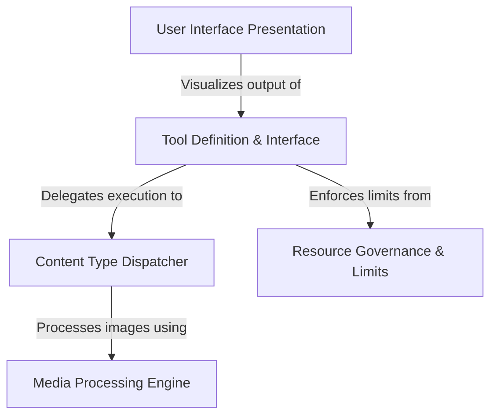

# Tutorial: FileReadTool

The **FileReadTool** acts as a versatile bridge between the local filesystem and the AI, allowing it to *safely* read and interpret various file formats. It intelligently switches between different processing modes to handle **text**, **PDFs**, **Jupyter Notebooks**, and **images**, while strictly enforcing **resource limits** to ensure system stability and cost control.

## Chapters

1. [Tool Definition & Interface](01_tool_definition___interface.md)
2. [Resource Governance & Limits](02_resource_governance___limits.md)
3. [Content Type Dispatcher](03_content_type_dispatcher.md)
4. [Media Processing Engine](04_media_processing_engine.md)
5. [User Interface Presentation](05_user_interface_presentation.md)

---

Generated by [Code IQ](https://github.com/adityasoni99/Code-IQ)