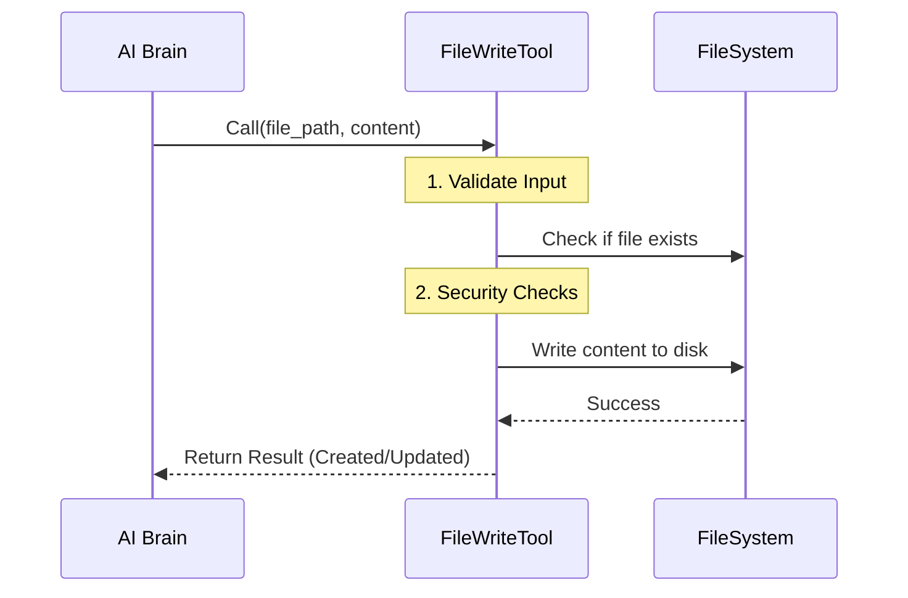

# Chapter 1: Tool Definition & Execution

Welcome to the `FileWriteTool` project! 

Imagine you are building a robot. The AI (Large Language Model) is the **brain**—it can think, plan, and write code. However, a brain in a jar cannot build a house. It needs hands.

The **FileWriteTool** is that hand. It is the mechanical link that allows the AI to reach out from its digital thought process and actually change files on your hard drive.

In this first chapter, we will explore the core engine: how we define this tool and how it executes a write command.

## The Motivation: From Thought to Action

**The Central Use Case:**
You ask the AI Agent: *"Please create a Python script named `hello.py` that prints 'Hello World'."*

The AI knows *what* code to write, but it doesn't know *how* to save a file to your disk. It needs a structured way to send that intent to the system.

This abstraction solves three problems:
1.  **Contract:** It tells the AI exactly what data to provide (path and content).
2.  **Execution:** It handles the low-level filesystem operations (Node.js `fs`).
3.  **Feedback:** It tells the AI if the operation succeeded or failed.

## Key Concept 1: The Blueprint (Schema)

Before the AI can use the tool, we must define the "contract" using a **Schema**. This is like a form the AI must fill out. We use a library called `zod` to define this strict shape.

For writing a file, the AI essentially needs to provide two things:
1.  Where to write it (`file_path`).
2.  What to write (`content`).

Here is the input schema definition:

```typescript
// Define what the AI must provide
const inputSchema = lazySchema(() =>
  z.strictObject({
    file_path: z.string().describe('Absolute path to file'),
    content: z.string().describe('The content to write'),
  }),
)
```

**Explanation:**
*   `z.strictObject`: The AI cannot add random extra fields.
*   `.describe(...)`: These descriptions are actually sent to the AI! They act as instructions on how to fill the form.

## Key Concept 2: The Builder Pattern

We don't write a raw class from scratch. Instead, we use a helper called `buildTool`. This allows us to configure the tool's behavior using a clean, declarative object.

Think of `buildTool` as a factory. We give it the specs, and it builds the runnable tool.

```typescript
export const FileWriteTool = buildTool({
  name: 'tengu_write_file', // The internal ID
  userFacingName,           // What the user sees in UI
  
  // Link the schema we defined above
  get inputSchema() {
    return inputSchema()
  },
  
  // ... implementation details follow
})
```

## Key Concept 3: The Execution Flow (`call`)

When the AI fills out the form correctly, the system triggers the `call` method. This is where the magic happens.

Let's look at the high-level flow of what happens when the tool is executed:



### 1. Expanding the Path
First, we ensure the computer understands exactly where the file is. Relative paths (like `./script.js`) can be dangerous or ambiguous, so we resolve them to absolute paths.

```typescript
// Inside the call() method
async call({ file_path, content }, context, _, parentMessage) {
  // Convert relative path to absolute
  const fullFilePath = expandPath(file_path)
  
  // Get the directory so we can ensure it exists
  const dir = dirname(fullFilePath)
```

### 2. Ensuring the Directory Exists
If you try to write a file into a folder that doesn't exist, the operation usually fails. Our tool is smart enough to create the directory structure automatically.

```typescript
  // Create directory if missing (e.g., mkdir -p)
  await getFsImplementation().mkdir(dir)

  // Track history for undo functionality (See Chapter 3)
  if (fileHistoryEnabled()) {
    await fileHistoryTrackEdit(..., fullFilePath, ...)
  }
```

### 3. The Atomic Write
Now we perform the actual write operation. This is the critical moment where the hard drive is modified.

```typescript
  // Detect encoding and prepare for write
  const enc = meta?.encoding ?? 'utf8'

  // Write the new content with specific Line Feed (LF) settings
  writeTextContent(fullFilePath, content, enc, 'LF')
```

**Explanation:**
*   We force `LF` (Line Feed) endings to ensure consistency across operating systems (Linux/Mac/Windows), preventing "cr/crlf" formatting bugs.

### 4. Returning the Result
The AI needs to know what happened. Did it create a new file? Did it update an old one? We calculate a "diff" (difference) to show exactly what changed.

```typescript
  // Construct the return object
  const data = {
    type: oldContent ? 'update' : 'create',
    filePath: file_path,
    content,
    // structuredPatch shows the visual +/- diff
    structuredPatch: oldContent ? getPatchForDisplay(...) : [],
  }

  return { data }
} // End of call()
```

## Implementation Deep Dive

The code involves several safety checks and side effects (like updating VS Code or tracking metrics). While we will cover those in [Safety & State Validation](03_safety___state_validation.md) and [Ecosystem Integration (Side Effects)](04_ecosystem_integration__side_effects_.md), it is important to understand that `FileWriteTool` is the orchestrator.

### The `validateInput` Guard
Before `call` is ever run, `buildTool` runs a `validateInput` function. This acts like a bouncer at a club.

```typescript
async validateInput({ file_path, content }, context) {
  // Check for secrets/passwords in the content
  const secretError = checkTeamMemSecrets(fullFilePath, content)
  if (secretError) return { result: false, message: secretError }

  // Check if file was modified since we last read it (Staleness)
  // ... (Detailed in Chapter 3)

  return { result: true }
}
```

If `validateInput` returns `false`, the `call` method (the actual disk writing) is **never executed**. This prevents the AI from accidentally overwriting code you changed manually.

## Conclusion

You now understand the engine of the `FileWriteTool`.
1.  **Schema:** Defines the contract (Path + Content).
2.  **Builder:** Wraps the logic into a standard tool format.
3.  **Execution:** Resolves paths, ensures directories exist, and writes the bytes to disk.

However, having a tool is useless if the AI doesn't know *how* or *when* to ask for it. How do we describe this tool to the AI so it uses it correctly?

[Next Chapter: LLM Prompt Strategy](02_llm_prompt_strategy.md)

---

Generated by [Code IQ](https://github.com/adityasoni99/Code-IQ)