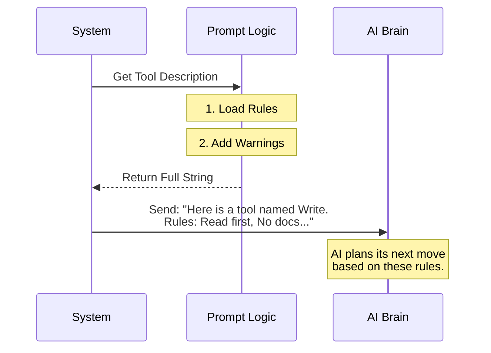

# Chapter 2: LLM Prompt Strategy

Welcome back! In the previous chapter, [Tool Definition & Execution](01_tool_definition___execution.md), we built the "hand" of our robot—the mechanical ability to write files to a disk.

But having a hand isn't enough. If you hand a hammer to a robot without instructions, it might try to fix a window by smashing it.

This chapter is about **LLM Prompt Strategy**. If the Tool Definition is the **hardware**, the Prompt Strategy is the **safety manual**. It tells the AI *how*, *when*, and *why* to use the tool.

## The Motivation: Context is Everything

**The Central Use Case:**
You ask the AI: *"Update my `server.js` file to add a new route."*

Without a prompt strategy, the AI sees the `FileWriteTool` and thinks: *"Great! I can write files. I will overwrite `server.js` with just the new route."*

**The Disaster:** The AI overwrites your 500-line server file with a 3-line file containing only the new route. You lost all your old code.

We need a way to tell the AI: *"Hey! Before you write to an existing file, you MUST read it first so you don't lose data."*

## Key Concept 1: The Description Function

When the AI model starts up, we send it a list of available tools. This isn't just computer code; it includes natural language descriptions.

The `FileWriteTool` has a special property called `prompt`. This isn't a static string; it's a function that returns the "Instruction Manual."

```typescript
// Inside FileWriteTool.ts
export const FileWriteTool = buildTool({
  name: FILE_WRITE_TOOL_NAME,
  
  // This is the instruction manual
  async prompt() {
    return getWriteToolDescription()
  },
  
  // ... rest of tool definition
})
```

**Explanation:**
*   When the system prepares the AI's context, it calls `prompt()`.
*   We delegate the actual text generation to a helper function `getWriteToolDescription` to keep our code clean.

## Key Concept 2: The Rules of Engagement

Let's look at the actual text we send to the AI. This is defined in `prompt.ts`. This text acts as "In-Context Learning"—we are teaching the AI how to behave just before it starts working.

### Rule A: The "Read First" Safety Lock

The most critical rule prevents the data loss scenario we described earlier.

```typescript
// Inside prompt.ts
function getPreReadInstruction(): string {
  return `\n- If this is an existing file, you MUST use the Read tool first...`
}
```

By telling the AI "You MUST use the Read tool first," we force it to create a mental plan:
1.  Check if file exists.
2.  **Call ReadTool** (get current content).
3.  Combine current content + new code.
4.  **Call WriteTool** (save result).

### Rule B: Reducing Noise (No Docs)

AI models love to be helpful. Sometimes, they are *too* helpful and start writing `README.md` files explaining what they just did. We usually don't want this clutter.

So, we add a specific negative constraint:

```typescript
// Inside prompt.ts
// ...
- NEVER create documentation files (*.md) or README files unless explicitly requested.
// ...
```

This acts like a filter, ensuring the AI focuses only on the code you asked for.

## Internal Implementation: How it Works

When the user asks a question, the system gathers all tool definitions and their prompts to build the "System Prompt."

Here is the flow of information:



### The Code Implementation

Let's look at how the `getWriteToolDescription` function puts these pieces together in `prompt.ts`.

```typescript
// prompt.ts
export function getWriteToolDescription(): string {
  return `Writes a file to the local filesystem.

Usage:
- This tool will overwrite the existing file... ${getPreReadInstruction()}
- Prefer the Edit tool for modifying existing files...
- NEVER create documentation files (*.md)...`
}
```

**Explanation:**
1.  **Usage:** It defines the high-level purpose.
2.  **Constraints:** It injects `getPreReadInstruction()`.
3.  **Best Practices:** It suggests using the "Edit" tool (which creates patches) instead of "Write" (which overwrites everything) for small changes.

## Why this matters for Beginners

If you are building an AI tool, you might spend hours writing perfect Typescript code for the tool's execution. But if you don't write a good **Prompt Strategy**, the AI will misuse your tool.

*   **Code** defines capability.
*   **Prompt Strategy** defines behavior.

## Conclusion

We have now defined the tool (Chapter 1) and taught the AI the rules for using it (Chapter 2).

But what happens if the AI ignores our advice? What if it tries to write to a file it hasn't read, or tries to overwrite a file that you just changed manually? We can't trust the AI's "brain" alone; we need hard code validation.

In the next chapter, we will look at how we enforce these rules programmatically.

[Next Chapter: Safety & State Validation](03_safety___state_validation.md)

---

Generated by [Code IQ](https://github.com/adityasoni99/Code-IQ)