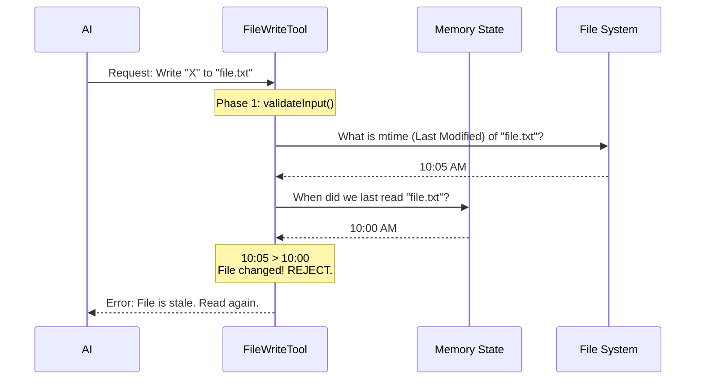

# Chapter 3: Safety & State Validation

Welcome to Chapter 3! In the previous chapter, [LLM Prompt Strategy](02_llm_prompt_strategy.md), we taught the AI the "rules of the road" via text prompts. We politely asked it to read files before writing them.

But as any parent knows, asking politely doesn't always work. Sometimes mistakes happen.

This chapter is about **Safety & State Validation**. If Chapter 1 was the "Hand" and Chapter 2 was the "Instruction Manual," this chapter is the **Reflex System**. It is the hard-coded logic that automatically stops the hand from touching a hot stove.

## The Motivation: The "Stale" Write Problem

**The Central Use Case:**
Imagine this scenario:
1.  You ask the AI to refactor `app.js`.
2.  The AI reads `app.js`.
3.  **While the AI is thinking**, you realize a typo in `app.js` and quickly fix it yourself.
4.  The AI finishes thinking and writes its new version.

**The Problem:** The AI's version was based on the *old* file. If it writes now, it will **delete** the typo fix you just made. This is called a "Stale Write."

**The Solution:** We need a mechanism that acts like a bank teller. Before finalizing a transaction, the teller checks: "Has the account balance changed since I last looked?"

## Key Concept 1: The Guard Phase (`validateInput`)

In [Chapter 1](01_tool_definition___execution.md), we saw the `call()` method. But there is another method that runs *before* `call()`: `validateInput`.

Think of `validateInput` as a nightclub bouncer. It checks your ID before you are allowed inside to dance (execute code). If the bouncer says "No," the `call()` method is never touched.

```typescript
// Conceptual Flow
if (await validateInput(input)) {
  return await call(input) // Write to disk
} else {
  return Error("Validation Failed") // Stop!
}
```

## Key Concept 2: Permissions & Secrets

The first job of the bouncer is checking if the AI is allowed to be here.

1.  **Secret Protection:** We don't want the AI writing passwords or API keys into shared team memory files.
2.  **Access Control:** Is the AI trying to write to a system folder or a directory the user has explicitly blocked?

```typescript
// Inside validateInput
const fullFilePath = expandPath(file_path)

// 1. Check for secrets
if (checkTeamMemSecrets(fullFilePath, content)) {
  return { result: false, message: "Contains secrets!" }
}

// 2. Check user permissions
if (matchingRuleForInput(fullFilePath, ..., 'deny')) {
  return { result: false, message: "Permission denied." }
}
```

**Explanation:**
*   `expandPath`: Converts `~` or relative paths into the real location on the disk.
*   `checkTeamMemSecrets`: Scans the text for patterns that look like passwords.

## Key Concept 3: Staleness Checks (Time Travel Prevention)

This is the most critical safety feature. We need to ensure the file hasn't changed since the AI last read it.

We track this using **Timestamps**.
*   **Last Read Time:** When did the AI last see this file?
*   **Last Write Time:** When was the file actually modified on the hard drive?

If the **Last Write Time** is *newer* than the **Last Read Time**, the AI is looking at a ghost. We must reject the write.

```typescript
// Inside validateInput
const lastRead = readFileState.get(fullFilePath)

// If the AI never read the file, stop it!
if (!lastRead) {
    return { result: false, message: 'Read it first!' }
}

// If file on disk is newer than our memory of it
if (fileMtimeMs > lastRead.timestamp) {
    return { result: false, message: 'File modified since read!' }
}
```

## Internal Implementation: The Safety Sequence

Let's visualize the flow of data when the AI tries to write a file.



### Deep Dive: Handling the "Race Condition"

Even with `validateInput`, there is a tiny risk. What if the user saves the file in the split second *after* `validateInput` passes but *before* `call` writes?

To solve this, we perform a "Double Check" inside the `call` method, right before the write happens. This makes the operation **Atomic**.

**Step 1: The Initial Check (in `validateInput`)**
This catches 99% of errors and gives the AI a helpful error message without attempting to write.

```typescript
// src/tools/FileWriteTool.ts

// Get the timestamp from our internal state
const readTimestamp = toolUseContext.readFileState.get(fullFilePath)

// Compare against the actual file system
if (lastWriteTime > readTimestamp.timestamp) {
  return {
    result: false,
    message: 'File has been modified since read...',
    errorCode: 3,
  }
}
```

**Step 2: The Atomic Guard (in `call`)**
Just before we commit to disk, we check one last time.

```typescript
// src/tools/FileWriteTool.ts -> inside call()

// Read metadata one last time
const meta = readFileSyncWithMetadata(fullFilePath)

// If content on disk is different from what we expect
if (meta.content !== lastRead.content) {
  // ABORT!
  throw new Error(FILE_UNEXPECTEDLY_MODIFIED_ERROR)
}

// If we survive this line, it is safe to write
writeTextContent(fullFilePath, content, enc, 'LF')
```

**Explanation:**
*   We use `readFileSyncWithMetadata` to peek at the file on disk.
*   We compare the *actual content* strings. If they differ, we throw an error immediately.
*   This ensures that we never overwrite work that the AI doesn't know about.

## Why this matters for Beginners

When building tools for AI, it is easy to trust the AI too much. You might think, "I told it to read the file first, so it will."

But in software engineering, **Trust but Verify** is the golden rule.
1.  **Trust:** The Prompt Strategy (Chapter 2).
2.  **Verify:** The State Validation (Chapter 3).

By layering these two approaches, we create a tool that is robust, safe, and trustworthy enough to run on a user's local machine.

## Conclusion

We have now secured our tool.
1.  We check **Permissions** (Bouncer).
2.  We check **Staleness** (Bank Teller).
3.  We double-check **Atomicity** (Race Conditions).

Now that the write operation is safe and complete, the job isn't quite done. Writing a file impacts the rest of the world—IDEs need to refresh, linters need to run, and git needs to track changes.

[Next Chapter: Ecosystem Integration (Side Effects)](04_ecosystem_integration__side_effects_.md)

---

Generated by [Code IQ](https://github.com/adityasoni99/Code-IQ)