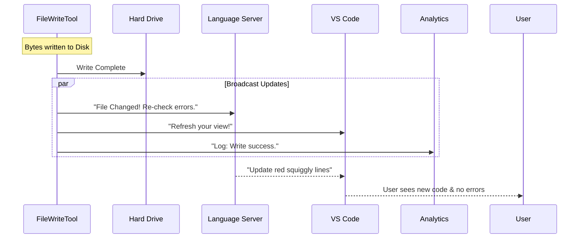

# Chapter 4: Ecosystem Integration (Side Effects)

Welcome to Chapter 4!

In the previous chapter, [Safety & State Validation](03_safety___state_validation.md), we acted as the security guard. We ensured that the AI didn't accidentally overwrite your work or touch forbidden files.

Now, assume the security check passed. The file has been successfully written to your hard drive. **Is the job done?** Not quite.

A file change doesn't happen in a vacuum. It happens inside a complex ecosystem of tools: your code editor (VS Code), your error checkers (Linters/LSP), and your version control (Git).

This chapter is about **Ecosystem Integration**. It acts like a **Town Crier**. When a renovation happens (file write), this system immediately alerts the neighbors (VS Code), the building inspector (LSP), and the archives (Analytics) so everyone stays in sync.

## The Motivation: Why write bytes isn't enough

**The Central Use Case:**
You are working in VS Code. You have a TypeScript file open that has a red syntax error because a function is missing.
1.  You ask the AI to fix it.
2.  The AI writes the missing function to the file on the disk.

**The Problem:**
If we *only* update the hard drive, VS Code doesn't automatically know the file changed instantly. The red error line might persist until you click the file or manually reload the window. This makes the AI feel "laggy" or "broken."

**The Solution:**
We need to actively push notifications to these external systems: *"Hey! I just updated `script.ts`. Please re-scan it for errors and refresh the screen!"*

## Key Concept 1: The Building Inspector (LSP Integration)

Modern coding tools use something called the **Language Server Protocol (LSP)**. This is the engine that powers features like "Go to Definition" and those red/yellow squiggly error lines.

When the `FileWriteTool` modifies a file, we must tell the LSP two things:
1.  `didChange`: The content has changed.
2.  `didSave`: The file has been saved to disk.

This triggers the LSP to re-run its checks immediately.

```typescript
// Inside the call() method
const lspManager = getLspServerManager()

if (lspManager) {
  // 1. Tell the server the content changed
  lspManager.changeFile(fullFilePath, content)

  // 2. Tell the server the file was saved
  lspManager.saveFile(fullFilePath)
}
```

**Explanation:**
*   `getLspServerManager`: We grab the reference to the running language server.
*   `changeFile` / `saveFile`: These function calls effectively force the "inspector" to re-examine the building immediately.

## Key Concept 2: The Neighbors (VS Code & UI)

If you have the file open in a tab, you want to see the new code appear instantly. We communicate with the editor (VS Code) to ensure the view is synchronized.

```typescript
// Notify VSCode about the file change
notifyVscodeFileUpdated(
    fullFilePath, 
    oldContent, 
    content
)
```

**Explanation:**
*   This sends a message to the editor extension.
*   It allows VS Code to refresh the active tab and potential update any "Diff Views" (comparisons) the user is looking at.

## Key Concept 3: The Archives (Analytics & Logging)

Finally, for the purpose of debugging and improving the AI, we need to log that an action took place. We don't necessarily log *what* code was written (to protect privacy), but we log *operational data*.

```typescript
// Log the operation for metrics
logFileOperation({
  operation: 'write',
  tool: 'FileWriteTool',
  filePath: fullFilePath,
  type: oldContent ? 'update' : 'create',
})
```

**Explanation:**
*   `logFileOperation`: This adds an entry to our internal telemetry. It helps us answer questions like "How many files does the average user create per session?"

## Internal Implementation: The Notification Chain

Let's visualize what happens immediately **after** the bytes are written to the disk. The `FileWriteTool` acts as a broadcaster.



### Deep Dive: Managing the Side Effects

All of this logic happens at the very end of the `call()` method in `FileWriteTool.ts`. It is crucial that these happen *after* the write is confirmed successful, but *before* we return the final success message to the AI.

**1. Clearing Old Diagnostics**
Before we ask the LSP to check for *new* errors, we should clear the *old* ones so the user isn't confused by stale error messages.

```typescript
// Clear previously delivered diagnostics
clearDeliveredDiagnosticsForFile(`file://${fullFilePath}`)
```

**2. Tracking Lines Changed**
We also perform a quick calculation of how many lines changed. This isn't just for logs; it helps the AI understand the magnitude of its own edit.

```typescript
// If updating an existing file
if (oldContent) {
  // Calculate the visual diff (Green/Red lines)
  const patch = getPatchForDisplay(...)
  
  // Count lines for stats
  countLinesChanged(patch)
}
```

**3. Updating Internal Memory**
Remember the "Staleness Check" from [Chapter 3](03_safety___state_validation.md)? We need to update our own internal memory (`readFileState`) so that if the AI tries to edit this file *again* in 5 seconds, it knows about the change we just made.

```typescript
// Update read timestamp to prevent false "stale" errors later
readFileState.set(fullFilePath, {
  content,
  timestamp: getFileModificationTime(fullFilePath),
  offset: undefined,
  limit: undefined,
})
```

## Why this matters for Beginners

When building software, it is easy to focus only on the core task (writing the file). But good software engineering is about **Integration**.

If you built a robot that painted a wall but didn't tell anyone "Wet Paint," people would ruin their clothes.
*   **Core Task:** Paint the wall (Write to Disk).
*   **Integration:** Put up a sign (Notify LSP/VS Code).

By handling these side effects, we make the tool feel "magical" and responsive to the user.

## Conclusion

We have now covered the entire lifecycle of the `FileWriteTool`:
1.  **Definition:** We built the tool and schema ([Chapter 1](01_tool_definition___execution.md)).
2.  **Prompting:** We taught the AI how to use it ([Chapter 2](02_llm_prompt_strategy.md)).
3.  **Safety:** We secured it against accidents ([Chapter 3](03_safety___state_validation.md)).
4.  **Integration:** We connected it to the wider ecosystem (Chapter 4).

The tool has done its job. It has written the file and notified the system. The final step is closing the loop with the human user. How do we tell the AI (and the human) that the job is done?

[Next Chapter: User Interface & Feedback](05_user_interface___feedback.md)

---

Generated by [Code IQ](https://github.com/adityasoni99/Code-IQ)