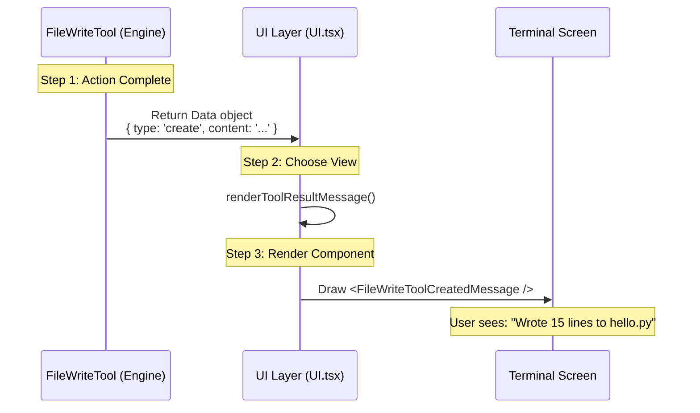

# Chapter 5: User Interface & Feedback

Welcome to the final chapter of the `FileWriteTool` tutorial!

In the previous chapter, [Ecosystem Integration (Side Effects)](04_ecosystem_integration__side_effects_.md), we ensured that when a file is written, the rest of your system (like VS Code and Linters) gets notified.

However, there is one final entity that needs to know what happened: **You**.

If the AI writes a file and the terminal just says `Task Completed`, you are left guessing. *Did it write the whole file? Did it fix the bug or delete my code?*

This chapter is about **User Interface & Feedback**. We will explore how we turn raw data into a beautiful, readable dashboard that shows you exactly what the AI did.

## The Motivation: Trust through Visibility

**The Central Use Case:**
You ask the AI: *"Refactor `utils.js` to improve performance."*

**The Problem:**
The AI changes 5 lines of code in a 200-line file.
*   **Bad UI:** The terminal prints the *entire* 200-line file. You have to scroll up and down to find what changed.
*   **Good UI:** The terminal shows a "Diff"—a compact view showing only the lines that were removed (in red) and added (in green).

**The Solution:**
We use a library called **Ink** (which lets us use React for Command Line Interfaces) to render different "Views" based on the action performed.

## Key Concept 1: The Switchboard (`renderToolResultMessage`)

The core of our UI logic is a function that acts like a traffic cop. It looks at the result coming from the tool and decides which visual component to display.

The tool output (`Output`) generally has a `type`: either `'create'` (new file) or `'update'` (modified file).

```typescript
// src/tools/FileWriteTool/UI.tsx

export function renderToolResultMessage(output: Output, ...args) {
  // Check the type of operation
  switch (output.type) {
    case 'create':
      // Render the "New File" view
      return <FileWriteToolCreatedMessage {...output} />
      
    case 'update':
      // Render the "Diff" view
      return <FileEditToolUpdatedMessage {...output} />
  }
}
```

**Explanation:**
*   This function is the entry point for the UI.
*   It keeps our code clean by separating the logic for "New Files" from "Updated Files."

## Key Concept 2: Visualizing Creation

When the AI creates a brand new file, we don't need a "Diff" (because there was nothing there before). Instead, we want to see the content.

However, if the AI creates a 5,000-line log file, we don't want to flood your terminal.

**The Strategy:**
1.  Show the filename.
2.  Show the number of lines written.
3.  Show a "Syntax Highlighted" preview (colored code).
4.  **Truncate** the output if it is too long.

```typescript
// Inside FileWriteToolCreatedMessage component
function FileWriteToolCreatedMessage({ filePath, content, verbose }) {
  const numLines = countLines(content)
  
  // Only show the first 10 lines to save space
  const preview = content.split("\n").slice(0, 10).join("\n")

  return (
    <Box flexDirection="column">
      <Text>Wrote {numLines} lines to {filePath}</Text>
      <HighlightedCode code={preview} filePath={filePath} />
    </Box>
  )
}
```

**Explanation:**
*   `HighlightedCode`: This is a custom component that colors the text (like blue for keywords, green for strings) based on the file extension.
*   `slice(0, 10)`: This acts as a "preview," ensuring the UI stays clean.

## Key Concept 3: Visualizing Updates (The Diff)

When an existing file is changed, seeing the *whole* file is useless. You only care about the change.

We use a "Structured Patch" (a fancy word for a Diff) to render this.

**Visualizing the Output:**
Instead of code, think of it as a receipt of changes:
*   <span style="color:red">- const old = "slow"</span> (Red: Removed)
*   <span style="color:green">+ const new = "fast"</span> (Green: Added)

```typescript
// Inside renderToolResultMessage 'update' case
case 'update': {
  return (
    <FileEditToolUpdatedMessage 
      filePath={filePath}
      // Pass the diff data calculated in Chapter 1
      structuredPatch={structuredPatch} 
      fileContent={originalFile} 
    />
  )
}
```

**Why this is beginner-friendly:**
The user instantly sees *impact*. If they see a huge block of red text, they know the AI deleted a lot of code and can react immediately (perhaps checking if it was a mistake).

## Internal Implementation: The Feedback Loop

Let's look at how the data flows from the engine to your screen.



### Deep Dive: Calculating Lines

To give accurate feedback (e.g., "Wrote 15 lines"), we need a helper function. Computers see "lines" just as special characters (`\n`).

```typescript
// src/tools/FileWriteTool/UI.tsx

const EOL = '\n'; // End Of Line character

export function countLines(content: string): number {
  // Split the huge string into an array of lines
  const parts = content.split(EOL);
  
  // Adjust count if the file ends with a newline
  return content.endsWith(EOL) ? parts.length - 1 : parts.length;
}
```

**Explanation:**
*   This might seem trivial, but accurate line counts give the user a sense of scale. Creating a 1-line config file is very different from creating a 1000-line logic file.

### Deep Dive: Handling Rejections

Sometimes, the tool fails (maybe due to the Safety checks in [Chapter 3](03_safety___state_validation.md)). The UI handles this gracefully too.

```typescript
// src/tools/FileWriteTool/UI.tsx

export function renderToolUseRejectedMessage({ file_path, content }) {
  // Show the user what the AI *tried* to do
  return (
    <WriteRejectionDiff 
      filePath={file_path} 
      content={content} 
    />
  )
}
```

**Explanation:**
*   Even if the write was blocked (e.g., "Stale Write"), we show the user a diff of what the AI *wanted* to do. This helps the user decide if they should manually apply the change or ignore it.

## Conclusion

Congratulations! You have completed the **FileWriteTool** tutorial.

We have built a complete, production-grade AI tool from scratch:
1.  **Engine:** We defined the schema and file operations ([Chapter 1](01_tool_definition___execution.md)).
2.  **Instruction:** We taught the AI how to use it safely ([Chapter 2](02_llm_prompt_strategy.md)).
3.  **Safety:** We added guards against data loss ([Chapter 3](03_safety___state_validation.md)).
4.  **Ecosystem:** We integrated with VS Code and Linters ([Chapter 4](04_ecosystem_integration__side_effects_.md)).
5.  **Interface:** We visualized the results for the human user (This Chapter).

You now understand that an AI Tool is not just a function call—it is a full application stack that bridges the gap between an AI's "thought" and a computer's "action."

**End of Tutorial.**

---

Generated by [Code IQ](https://github.com/adityasoni99/Code-IQ)